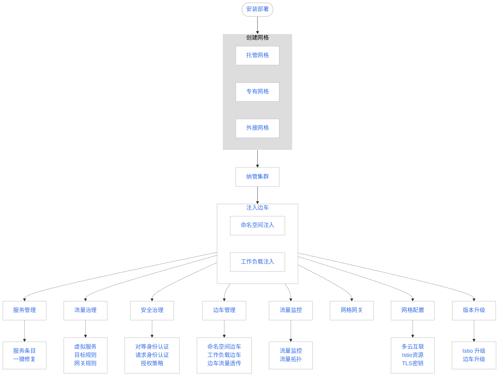

---
hide:
  - toc
---

# 什么是服务网格

服务网格是基于 Istio 开源技术构建的面向云原生应用的下一代服务网格。

服务网格是一种具备高性能、高易用性的全托管服务网格产品，通过提供完整的非侵入式的微服务治理方案，能够统一治理多云多集群的复杂环境，
以基础设施的方式为用户提供服务流量治理、安全性治理、服务流量监控以及传统微服务（SpringCloud、Dubbo）功能。

DCE 5.0 的服务网格兼容社区原生 Istio 开源服务网格，提供原生 Istio 接入管理能力。在较高的层次上，服务网格有助于降低服务治理的复杂性，减轻开发运维团队的压力。

服务网格作为 DCE 5.0 产品的体系一员，无缝对接[容器管理](../../kpanda/intro/index.md)平台，可以为用户提供开箱即用的上手体验，
并作为基础设施为[微服务引擎](../../skoala/intro/index.md)提供容器微服务治理支持，方便用户通过单一平台对各类微服务系统做统一管理。

## 产品优势

DCE 5.0 服务网格相比其他产品具备以下优势：

- 简单易用

    无需修改任何业务代码，也无需手动安装代理，只需开启服务网格功能，即可体验丰富的无侵入服务治理能力。

- 策略化的智能路由与弹性流量管理

    支持为服务配置负载均衡、服务路由、故障注入、离群检测等治理规则。
    结合一站式治理系统；提供实时的、可视化的微服务流量管理；
    支持无侵入智能流量治理，应用无需任何改造，即可进行动态的智能路由和弹性流量管理。

  - 权重、内容、TCP/IP 等路由规则。
  - HTTP 会话保持，满足业务处理持续性诉求。
  - 限流、离群检测，实现服务间链路稳定、可靠。
  - 网络长连接管理降低资源损耗，提升网络吞吐量。
  - 服务安全认证：认证、鉴权、审计等，提供服务安全保障基石。

- 图形化应用全景拓扑，流量治理可视化

    服务网格提供了可视化的流量监控，包括链路信息、服务异常响应、超长响应时延等信息，通过图表以及拓扑等多样化形式全面展现业务运行情况。

    服务网格可以结合应用运维管理、应用性能管理服务，提供详细的微服务级流量监控、异常响应流量报告以及调用链信息，能够更快速、更准确的定位问题。

- 性能增强，可靠性增强

    服务网格控制面和数据面基于社区版本的基础上进行更可靠的加固和性能优化。

- 多云多集群、多基础设施

    提供免运维的托管控制面，提供多云多集群的全局统一的服务治理、安全和服务运行监控能力，还提供对容器和虚拟机（VM）等多种基础设施的统一服务发现和管理。

- 协议扩展

    支持 Dubbo 协议。

- 传统 SDK 集成

    提供 Spring Cloud、Dubbo 等传统微服务 SDK 的集成解决方案，传统微服务 SDK 开发的业务无需大量代码改造即可快速迁移到云原生容网格运行环境上运行。

## 学习路径

服务网格的学习路径如下：

[下载 DCE 5.0](../../download/index.md){ .md-button .md-button--primary }
[安装 DCE 5.0](../../install/index.md){ .md-button .md-button--primary }
[申请社区免费体验](../../dce/license0.md){ .md-button .md-button--primary }
