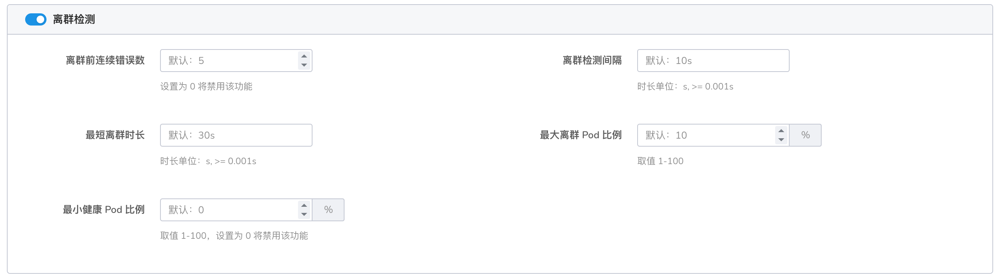
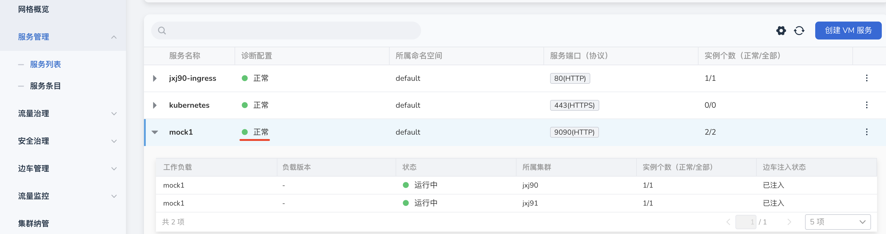
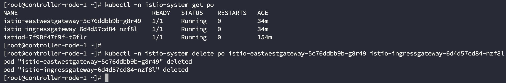

# 跨集群互联问题

## 情况 1

### 跨集群服务存在访问卡顿 10s 的现象

故障案例：托管网格有 2 个集群，集群均存在相同测试服务，通过入口网关访问测试服务，但会出现时不时卡顿 10s。

### 原因分析

1. 集群已纳管，服务已被发现，但是因为未开启多云互联，网络未打通，请求访问失败后继续访问本集群的测试服务，所以会出现一段时间卡顿
2. 集群已开启互联，互联集群创建在同一网络分组，但互联集群 Pod 间的通讯网络未打通
3. 东西网关状态异常
4. 部分集群宕机。多云互联实现了工作集群之间的网络打通，但是多云互联不会解决单个服务异常的策略，所以需要配置离群实例摘除策略。

### 解决方案

1. 开启多云互联
2. 创建多个网络分组，将集群放在不同分组，重启所有 Pod
3. 确定东西网关异常的原因，修复
4. 在目标规则中，启用离群检测策略：

    

    配置成功后，当出现集群宕机时，会自动摘除宕机集群的实例，不会出现卡顿现象。

## 情况 2

### 网格的流量只打到部分集群上的测试服务

故障案例：托管网格有 2 个集群，已开启多云互联，成功配置后；
通过入口网关持续访问测试服务，流量只打到一部分集群的测试服务。

### 原因分析

1. 部分测试服务状态异常，检查服务状态
2. 部分测试服务未注入边车，检查服务边车注入状态
3. 部分测试服务的配置不正确，检查服务配置，如 svc 的端口、端口名称等
4. 测试服务创建后才开启的多云互联

### 解决方案

1. 检查服务异常原因，让服务状态恢复正常
2. 注入边车
3. 所有测试服务的 svc 配置一致，可通过`服务管理` -> `服务列表`的诊断功能协助观察
   
    

4. 重启所有网关，包括自建以及数据面集群的南北以及东西网关

    
