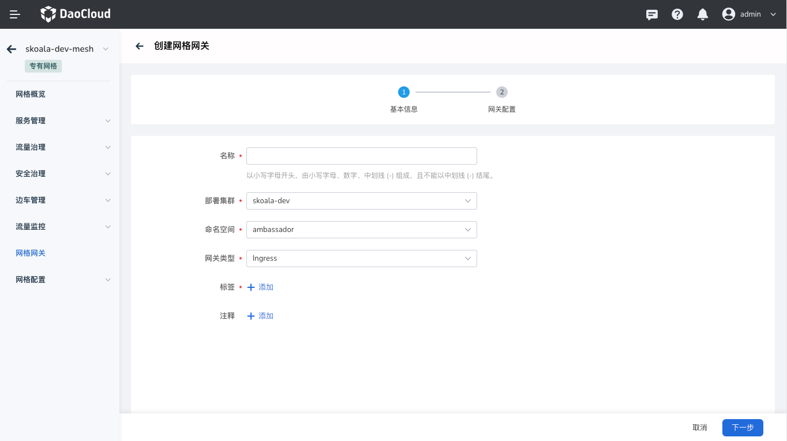
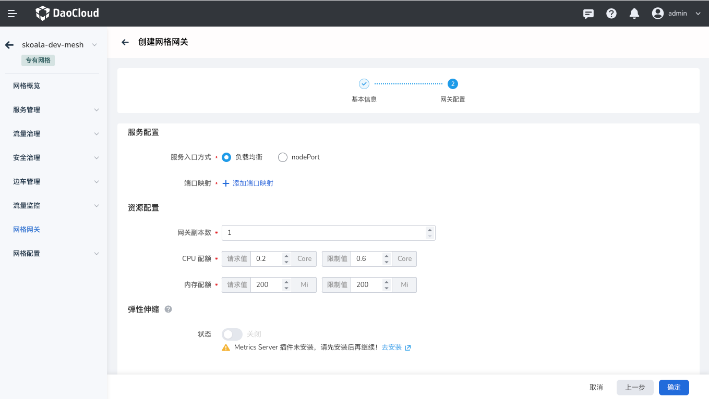

---
hide:
  - toc
---

# 管理网格网关

## 网关介绍

网格网关模块，提供了网格网关实例的生命周期管理，包含创建、更新、删除等管理能力，
用户可以在该页面管理当前网格内的全部托管的网关实例。

网格网关分为 Ingress（入站）和 Egress（出站）两类。

* Ingress 网关用于定义服务网格内应用的流量入口，所有进入服务网格内应用的流量应对经过 Ingress 网关。
* Egress 网关用于定义了网格内应用的流量出口，可以让外部服务的流量统一经过 Egress 网关，从而实现更精确的流量控制。

网关实例运行的也是 Envoy，但与边车不同，网格以具体的实例单独运行。

## 创建网格网关

创建网格网关的操作步骤如下。

1. 在左侧导航栏中点击`网格网关`，进入网关列表，点击右上角的`创建`按钮。

    

2. 在`创建网格网关`窗口中，按提示配置各项参数后点击`确定`。

    
    

3. 返回网格网关列表，屏幕右上角提示创建成功。刚创建的网格网关状态为`创建中`。

    

4. 几秒后刷新页面，状态将变为`运行中`，表示网关成功配置。点击列表右侧的 `...`，可以执行编辑和删除操作。

    

!!! info

    如有任何异常，请查看异常提示尝试解决问题。
    更多参阅[视频教程](../../../videos/mspider.md)。
