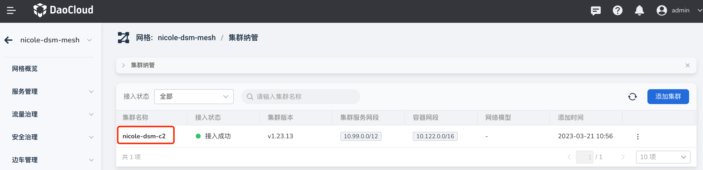
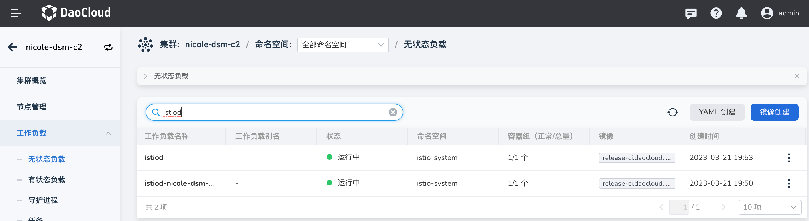
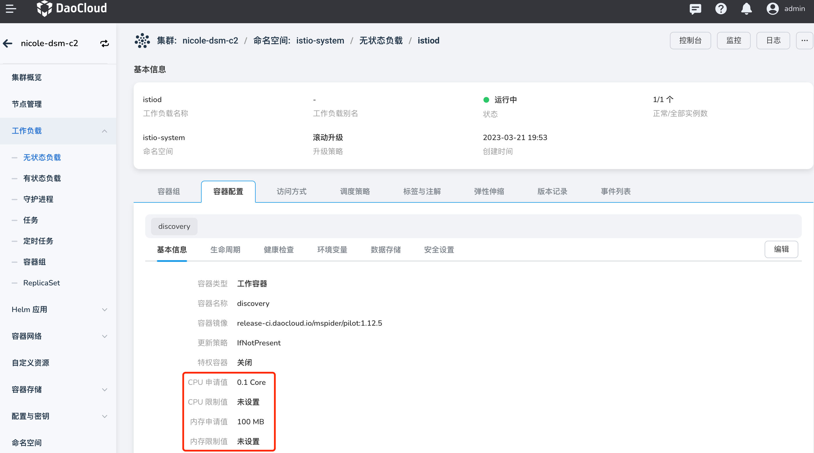
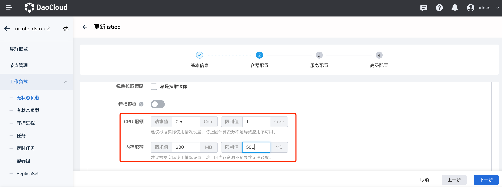
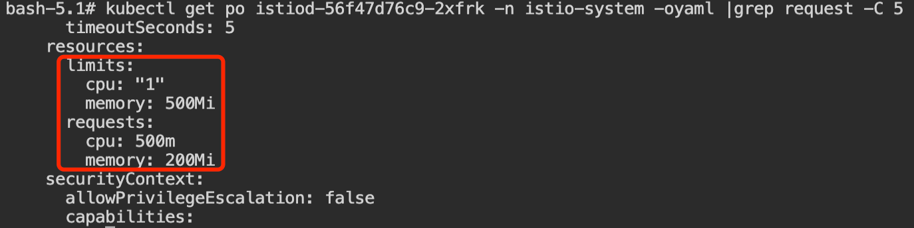

# 服务网格组件资源自定义配置

本文介绍如何对通过[容器管理](../../../kpanda/user-guide/workloads/create-deployment.md)自定义网格组件资源。
服务网格的控制面组件如下：

| 组件名称                     | 位置         | 描述           | 默认资源设置             |
| ---------------------------- | ------------ | ---------------------------- | ---------------- |
| mspider-ui                   | 全局管理集群 | 服务网格界面                                                                                         | requests: CPU: 未设置；内存: 未设置  limits: CPU: 未设置；内存: 未设置 |
| mspider-ckube                | 全局管理集群 | Kubernetes API Server  的加速组件，用于调用全局集群相关的资源                                        | requests: CPU: 未设置；内存: 未设置  limits: CPU: 未设置；内存: 未设置 |
| mspider-ckube-remote         | 全局管理集群 | 用于调用远程集群的 Kubernetes， 聚合多集群资源，并且加速                                            | requests: CPU: 未设置；内存: 未设置  limits: CPU: 未设置；内存: 未设置 |
| mspider-gsc-controller       | 全局管理集群 | 服务网格管理组件，用于网格创建，网格配置等网格控制面生命周期管理，以及权限管理等 Mspider  控制面能力 | requests: CPU: 未设置；内存: 未设置  limits: CPU: 未设置；内存: 未设置 |
| mspider-api-service          | 全局管理集群 | 为 Mspider 后台 API 交互，等控制行为提供接口                                                     | requests: CPU: 未设置；内存: 未设置  limits: CPU: 未设置；内存: 未设置 |
| 托管网格                     |              |                                                                                                      |                                                                        |
| istiod-{meshID}-hosted       | 控制面集群   | 用于托管网格的策略管理                                                                               | requests: CPU: 100m；内存: 100m  limits: CPU: 未设置；内存: 未设置 |
| mspider-mcpc-ckube-remote    | 控制面集群   | 调用远程的网格工作集群，加速并且聚合多集群资源                                                       | requests: CPU: 100m；内存: 50m limits: CPU: 500m；内存: 500m     |
| mspider-mcpc-mcpc-controller | 控制面集群   | 聚合网格多集群相关数据面信息                                                                         | requests: CPU: 100m；内存: 0  limits: CPU: 300m；内存: 1.56G      |
| {meshID}-hosted-apiserver    | 控制面集群   | 托管控制面虚拟集群  API Server                                                                       | requests: CPU: 未设置；内存: 未设置  limits: CPU: 未设置；内存: 未设置 |
| istiod                       | 工作集群     | 主要用于所在集群的边车生命周期管理                                                                   | requests: CPU: 100；内存: 100  limits: CPU: 未设置；内存: 未设置  |
| 专有网格                     |              |                                                                                                      |                                                                        |
| istiod                       |              | 用于策略创建、下发、边车生命周期管理的工作                                                           | requests: CPU: 100；内存: 100  limits: CPU: 未设置；内存: 未设置  |
| mspider-mcpc-ckube-remote    | 工作集群     | 调用远程的网格工作集群                                                                               | requests: CPU: 100m；内存: 50m  limits: CPU: 500m；内存: 500m     |
| mspider-mcpc-mcpc-controller | 工作集群     | 收集集群数据面信息                                                                                   | requests: CPU: 100m；内存: 0  limits: CPU: 300m；内存: 1.56G      |
| 外接网格                     |              |                                                                                                      |                                                                        |
| mspider-mcpc-ckube-remote    | 工作集群     | 调用远程的网格工作集群                                                                               | requests: CPU: 100m；内存: 50m  limits: CPU: 500m；内存: 500m     |
| mspider-mcpc-mcpc-controller | 工作集群     | 收集集群数据面信息                                                                                   | requests: CPU: 100m；内存: 0  limits: CPU: 300m；内存: 1.56G      |

服务网格的各控制面组件预设资源设置如上表所示，用户可以在【容器管理】模块查找相应的工作负载，为工作负载自定义 CPU、内存资源。

## 前提条件

集群已被服务网格纳管，网格组件已正常安装；
登录账号具有全局管理集群及工作集群中命名空间 istio-system 的 admin 或 editor 权限；

## 设置操作

以托管网格下工作集群上 istiod 为例，具体操作如下：

1. 服务网格下查看托管网格 nicole-dsm-mesh 的接入集群为 nicole-dsm-c2，如下图所示。

    

2. 点击集群名称，跳转至`容器管理`模块中集群页面，点击进入`工作负载` -> `无状态负载`页面查找 istiod；

    

3. 点击工作负载名称进入`容器配置` -> `基本信息`标签页；

    

4. 点击编辑按钮，修改 CPU 和内存配额，点击`下一步`、`确定`。

    

5. 查看该工作负载下的 Pod 资源信息，可见已变更.

    
