# 多云网络互联

多云网络互联用于解决网格下复杂多样的多云网络环境通信问题，通过东西网关帮助用户实现运行于不同云平台的集群间网络互联，该功能目前仅支持托管网格。

## 名词解释

- 网络分组：
    - 相同网络类型的集群分组，来自相同网络类型（云平台）、并且可以保持互通的集群，可以划分在同一个网络分组中；
    - 网络分组至少要包含一个集群，如需加入互联，需至少包含一个东西网关；
    - 每个网络分组具备唯一的网络 ID，该网络 ID 会写入服务网格的`globalmesh`中；
- 东西网关：
    - 用于不同网络分组间通信互联，一个网络分组内可以创建多个。
    - 用户可以在网络分组下任意集群创建东西网关，当移动集群至其他网络分组时，东西网关也会随之迁移；
    - 东西网关所用负载均衡 IP 通常有集群所在的云平台自动分配，也可以由用户配置设定。
- 基本设置：创建用于东西网关的`网关规则`配置，该配置将开放 15443 端口用于网络分组间的通信，用户可以在`网关规则`列表中查看 CRD 文件详细内容，但不建议修改，可能会导致网络通信失败。
- 网络分组列表：
    - 展示当前创建的网络分组及分组下集群、东西网关信息；
    - 在该列表下用户可以对网络分组、分组下集群及东西网关执行增删操作，并可以在网络分组间迁移集群。
- 互联列表：
    - 包含至少一个东西网关的网络分组可以加入互联列表，加入互联的网络分组可已和其他网络分组通信；
    - 已加入互联的网络分组可以修改负载均衡 IP，但如需修改其他配置（例如：增删集群、东西网关），需要先移除`网络分组互联`列表；
    - 加入互联和移除互联会引起网格控制面的重启，建议谨慎操作。

## 操作流程

建议操作流程如下图所示

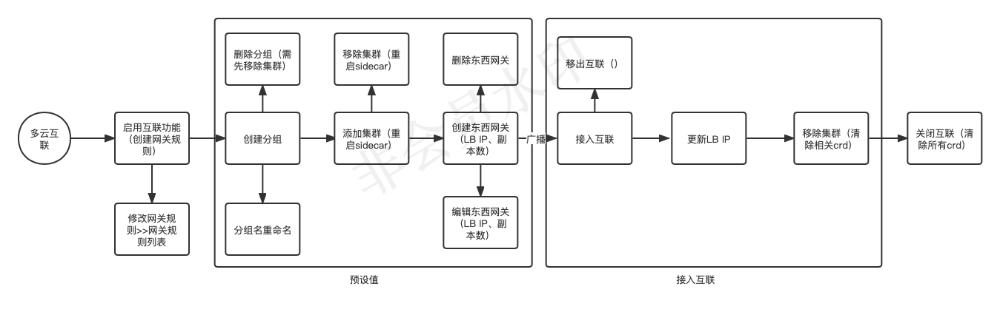

## 操作步骤

1. 进入某个网格，点击启用开关，将自动创建用于东西网关的`网关规则`。

    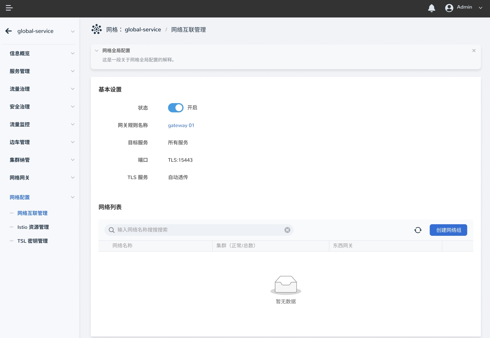

1. 点击`创建网络分组`按钮，为网络分组添加至少一个集群。

    

    为网络分组填入名称，并添加至少一个集群。

    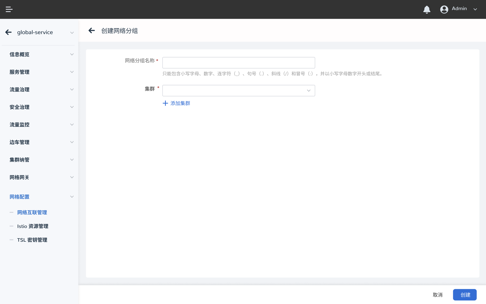

    !!! note

        网络分组名称创建后无法修改。

1. 增删集群。

    创建网络分组后，即可为分组内添加更多的集群，同一分组的集群需确保处于同一网络类型并可以互通，否则可能造成互联失败。

    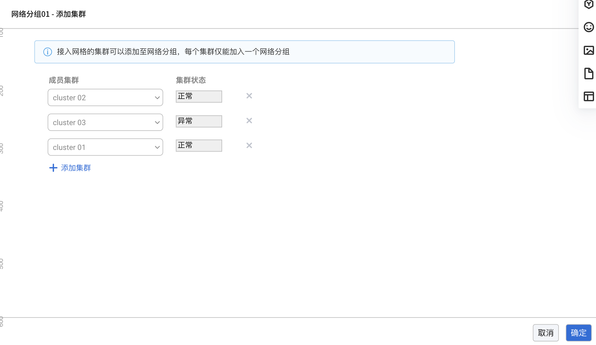

    添加完成后即可在网络分组下看到多个集群。

    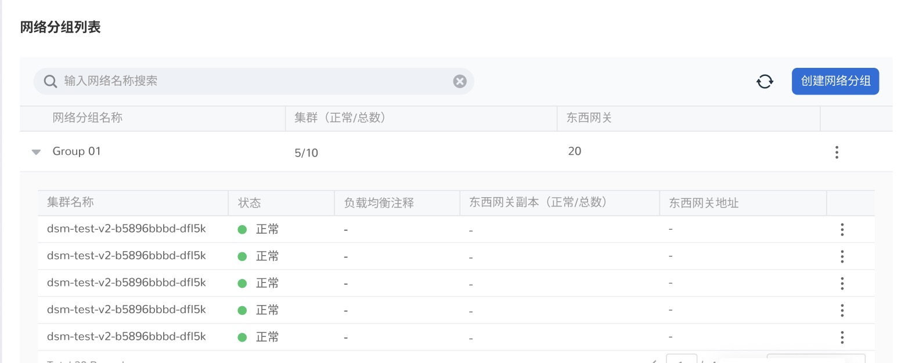

    !!! note

        网络分组中至少要保留一个集群，如需移除所有集群，请删除网络分组。

1. 创建/删除东西网关。

    东西网关用于网络分组间通信，可以在分组内的任一集群上创建一个或多个网关。点击一个集群右侧的 `⋮`，选择`编辑东西网关`：

    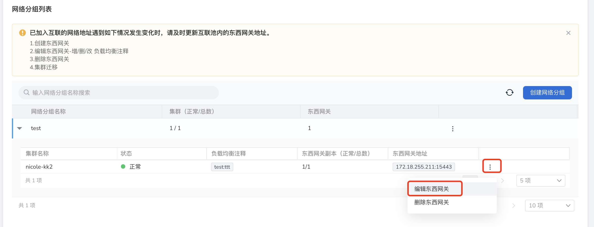

    创建配置项如下：

    - `负载均衡注释`为可选设置，部分云平台会以注释方式提供负载均衡 IP 分配，请参考云平台提供的技术文档；
    - `东西网关副本数`默认为 1，如果需要提高网关可用性，可创建多个副本；点击`确定`；

        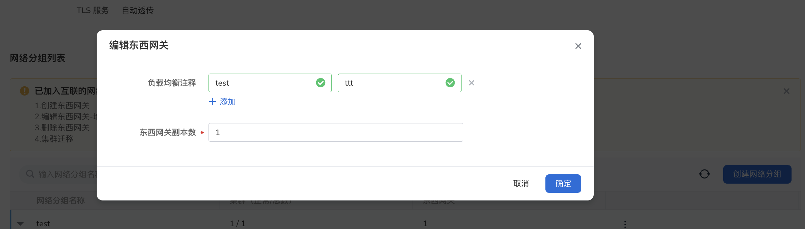

        选择一个东西网关，点击操作中的`删除东西网关`，可以删除该网关，如图所示：

        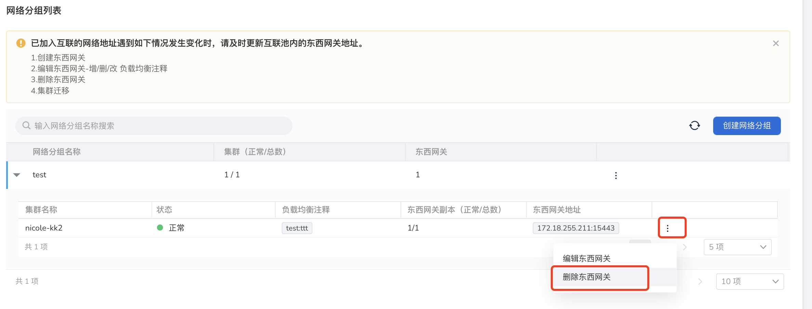

    !!! note

    每个网络分组至少需要创建一个东西网关，否则无法加入互联。

1. 网络分组互联

    1. 如果要将一个网络分组加入互联，点击`加入互联`按钮。

        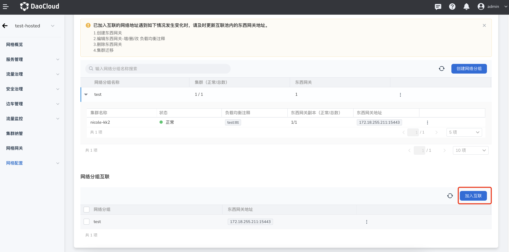

    1. 勾选一个网络分组，点击`下一步`。

        

    1. 选择可用的`东西网关地址`，点击`确定`。

        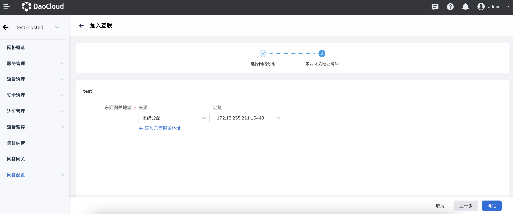

    1. 在互联列表中可以看到新加入的网络分组，列表内的分组之间彼此建立了通信。

    !!! note

        - 没有东西网关的网络分组无法加入互联；
        - 加入分组互联操作会引起网格控制面重启，建议加入互联前确保网络分组配置无误；

## 其他操作

1. 更新东西网关地址。

    用户可以对处于互联状态的网络分组增删东西网关地址。在互联列表中勾选一个分组，点击`更新东西网关地址`。

    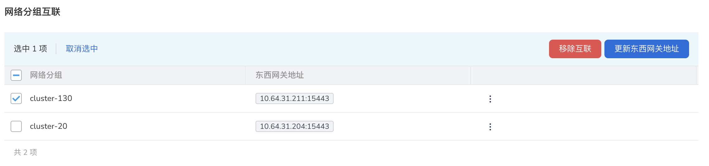

    更新地址后点击`确定`。

    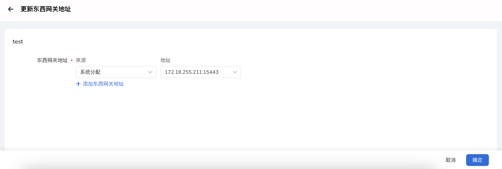

1. 移除互联

    如果网络分组不再需要和其他网络分组建立互联，或需要调整分组内集群及东西网关设置，可以移除互联。选择需要移除的网络分组，点击`移除互联`按钮，出现下图对话框。

    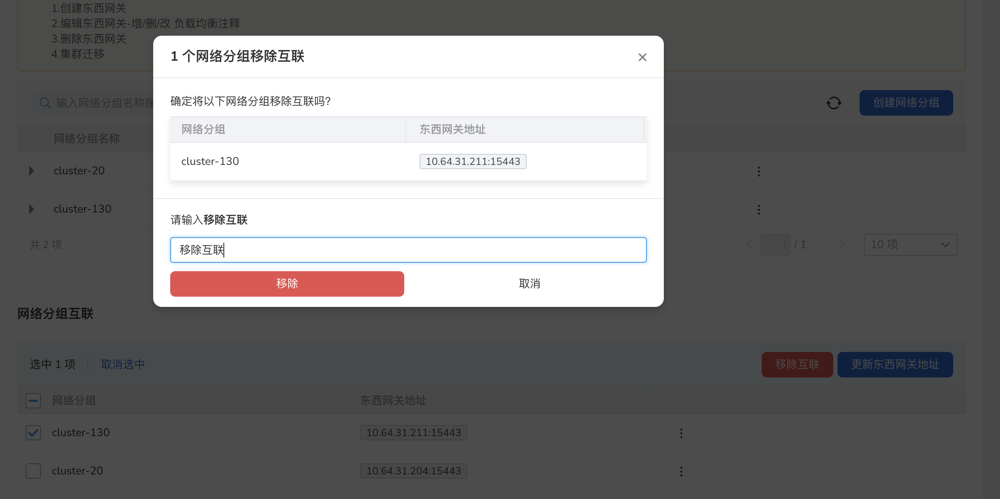

    经过二次确认，网络分组即可移除互联列表。

1. 删除网络分组

    在需要删除的网络分组操作下拉框中点击`删除网络分组`，即可删除所选网络分组。

    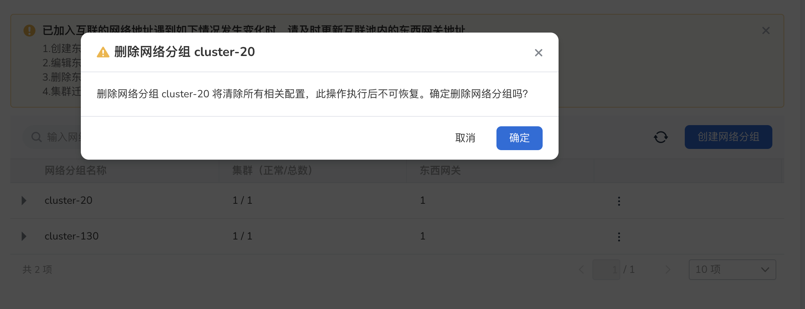

1. 关闭`多云网络互联`功能

    当不再需要在跨云多集群间建立通信时可以关闭多云网络互联功能，但关闭该功能前需要先删除所有网络分组：

    

    移除分组后，即可关闭互联功能：

    

    完成二次确认后，即关闭互联功能：

    
