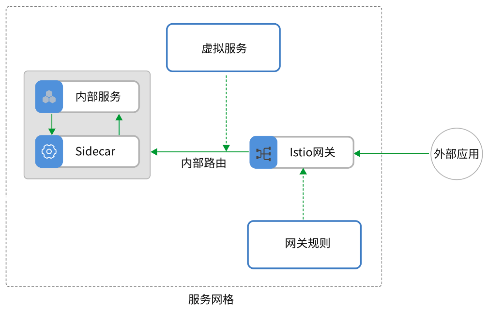
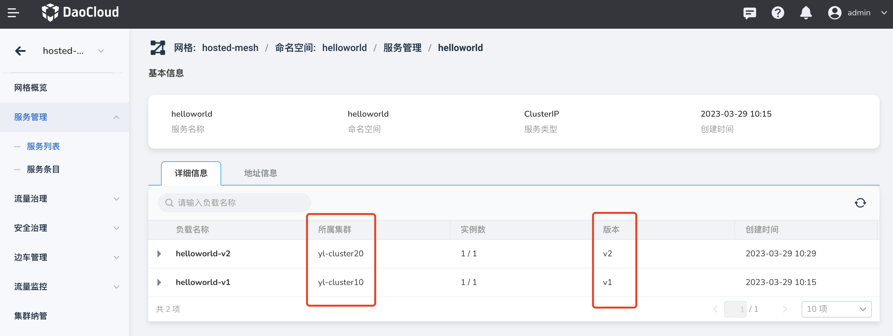
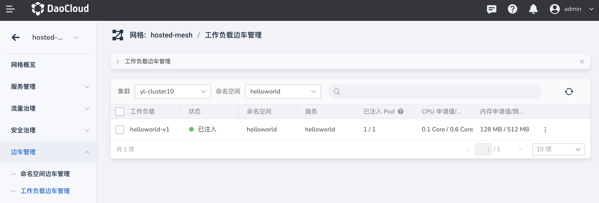
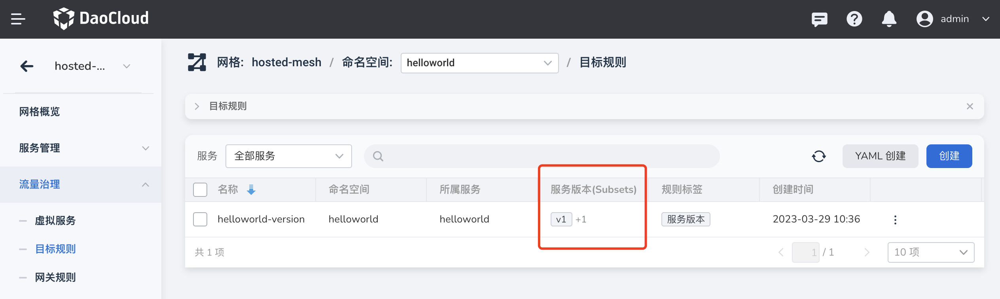
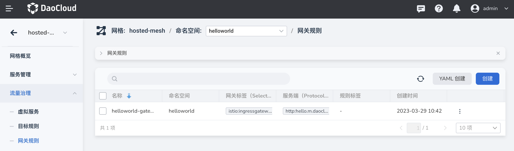
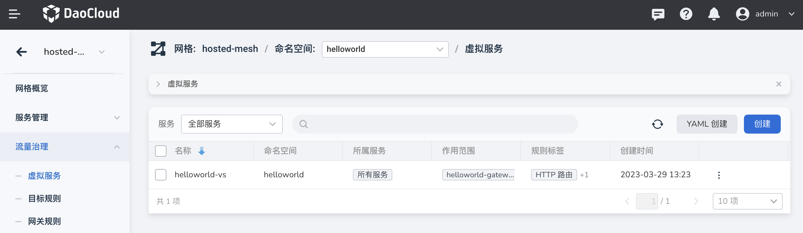
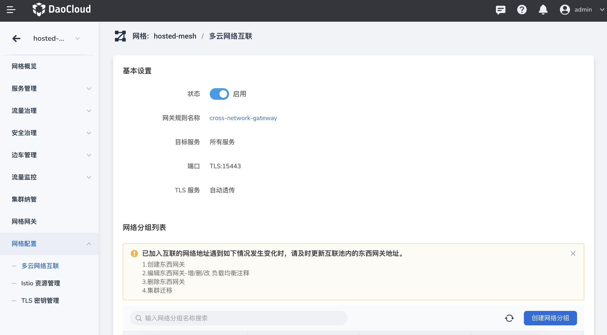
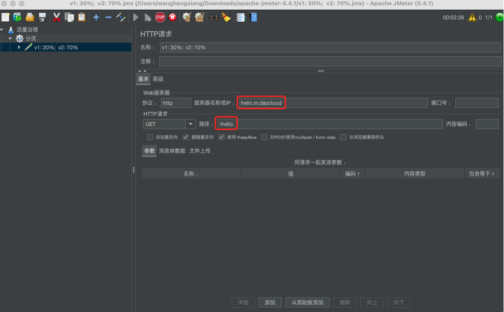
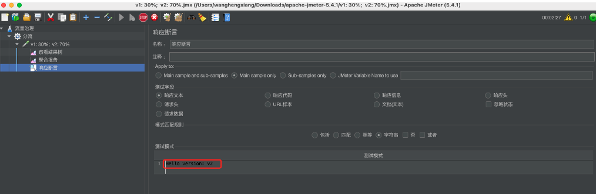
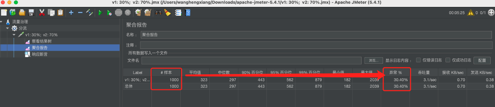

# 网格下多云网络流量分流配置

本文讲述如何在多云网络中为工作负载配置不同的流量。

前置条件：

- 服务 `helloworld` 运行于网格 `hosted-mesh` 的命名空间 `helloworld` 下
- 开启多云网络互联
- 网格提供 ingressgatway 网关实例

配置步骤：

1.  基于所属集群，对请求流量做权重分流；

    

1. 为两个集群的 `helloworld` 工作负载分别添加标签：

    | 所属集群     | 标签    | 值  |
    | ------------ | ------- | --- |
    | yl-cluster10 | version | v1  |
    | yl-cluster20 | version | v2  |

    

1. 在左侧导航栏点击`边车管理` -> `工作负载边车管理`，为两个集群的 helloworld 工作负载注入边车。

    

    

1. 在左侧导航栏点击`流量治理` -> `目标规则` -> `创建`，创建两个服务版本。

    

    对应的 YAML 如下：

    ```yaml
    apiVersion: networking.istio.io/v1beta1
    kind: DestinationRule
    metadata:
      name: helloworld-version
      namespace: helloworld
    spec:
      host: helloworld
      subsets:
        - labels:
    ​      version: v1
    ​      name: v1
        - labels:
    ​      version: v2
          name: v2
    ```

1. 在左侧导航栏点击`流量治理` -> `网关规则` -> `创建`，创建网关规则。

    

    对应的 YAML 如下：

    ```yaml
    apiVersion: networking.istio.io/v1beta1
    kind: Gateway
    metadata:
      name: helloworld-gateway
      namespace: helloworld
    spec:
      selector:
        istio: ingressgateway
      servers:
        - hosts:
    ​      - hello.m.daocloud
          port:
    ​        name: http
    ​        number: 80
    ​        protocol: http
    ```

1. 在左侧导航栏点击`流量治理` -> `虚拟服务` -> `创建`，创建路由规则，基于权重比例把流量分流至两个集群：

    

    对应的 YAML 如下：

    ```yaml
    apiVersion: networking.istio.io/v1beta1
    kind: VirtualService
    metadata:
      name: helloworld-version
      namespace: helloworld
    spec:
      gateways:
        - helloworld-gateway
      hosts:
        - helloworld.helloworld.svc.cluster.local
      http:
        - match:
          - uri:
            exact: /hello
          name: helloworld-routes
          route:
            - destination:
              host: helloworld
              port:
                number: 5000
              subset: v1
              weight: 30
            - destination:
              host: helloworld
              port:
                number: 5000
                subset: v2
              weight: 70
    ```

1. 在左侧导航栏点击`网格配置` -> `多云网络互联`，开启多云网络互联。

    

1. 通过 JMeter 发起 1000 次 get 请求，设置断言

    

    

1. 查看请求聚合报告（设置断言 helloworld v2），成功率 70%，异常率比例接近 30%。

    
