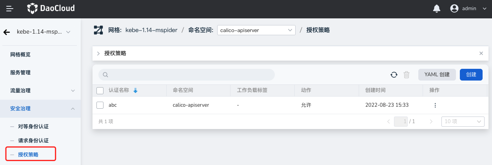
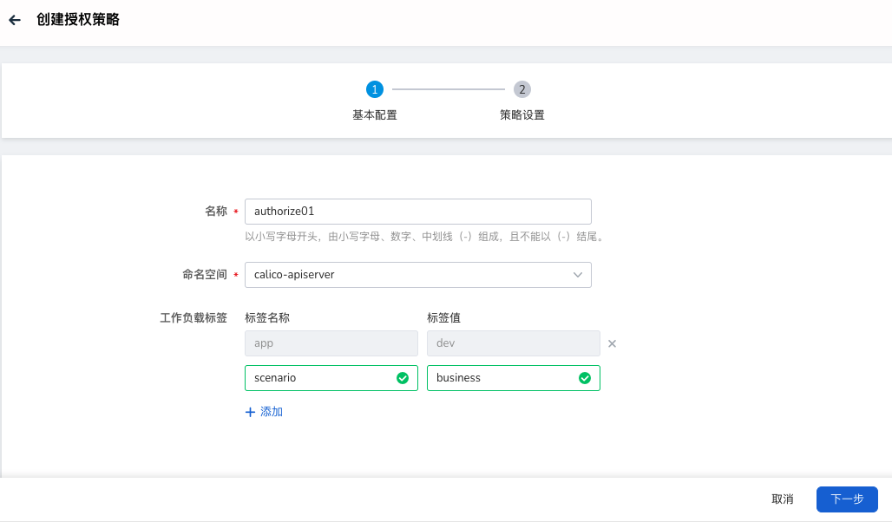
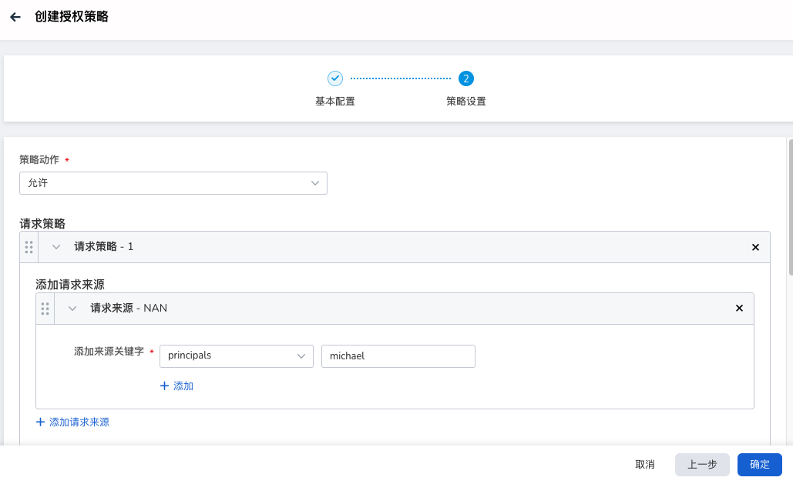
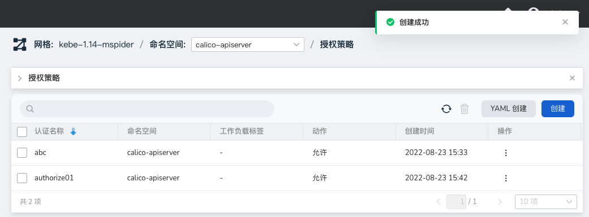
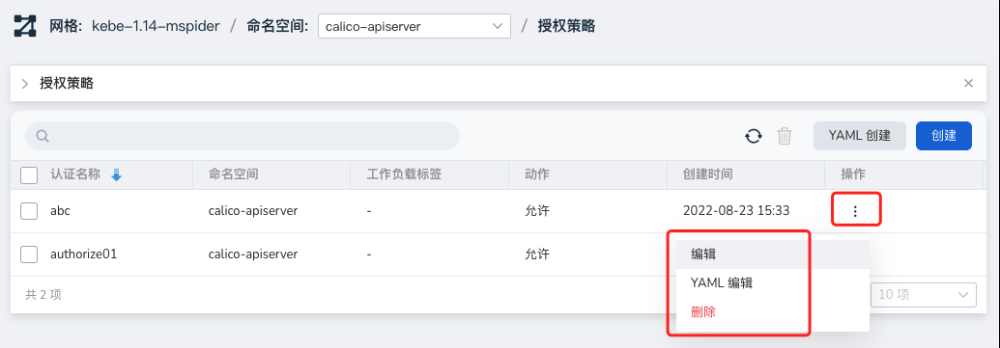

---
hide:
  - toc
---

# 授权策略

授权策略类似于一种四层到七层的“防火墙”，它会像传统防火墙一样，对数据流进行分析和匹配，然后执行相应的动作。无论是来自内部还是外部的请求，都适用授权策略。

服务网格提供了两种创建方式：向导和 YAML。通过向导创建的具体操作步骤如下：

1. 在左侧导航栏点击`安全治理` -> `授权策略`，点击右上角的`创建`按钮。

    

2. 在`创建授权策略`界面中，先进行基本配置后点击`下一步`。

    

3. 按屏幕提示进行策略设置后，点击`确定`。

    

4. 返回授权列表，屏幕提示创建成功。

    

5. 在列表右侧，点击操作一列的 `⋮`，可通过弹出菜单进行更多操作。

    

!!! note

    - 具体参数的配置，请参阅[安全治理参数配置](./params.md)。
    - 更直观的操作演示，可参阅[视频教程](../../../videos/mspider.md)。
