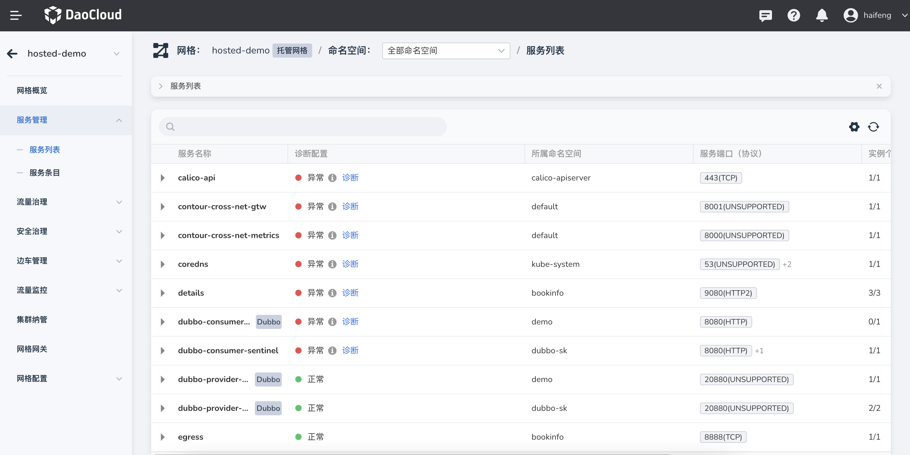
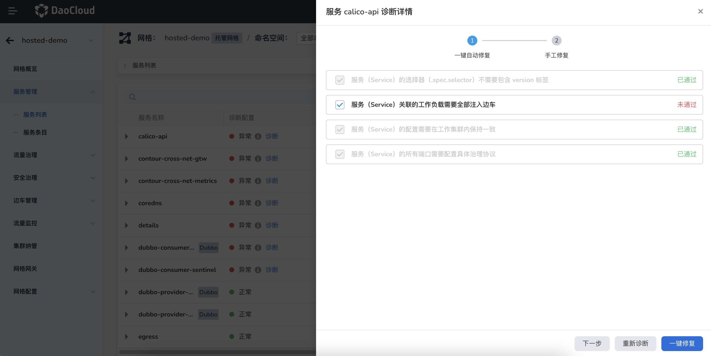

# 一键诊断和修复

DCE 5.0 服务网格针对纳管的服务，内置了一键诊断和修复功能，可以通过图形化界面进行操作。

1. 进入某个服务网格后，点击`服务管理` -> `服务列表`。在`诊断配置`列中，状态`异常`的服务旁会出现`诊断`字样，点击`诊断`。

    

1. 从右侧滑入一个诊断的弹窗，按照内置的 checklist 进行检查。绿色`已通过`表示正常，红色`未通过`表示需要修复。

    勾选`未通过`的条目，点击`一键修复`按钮。也可以点击`重新诊断`刷新 checklist。

    

<!-- 目前有 bug，暂时不加到 navigation.yaml -->