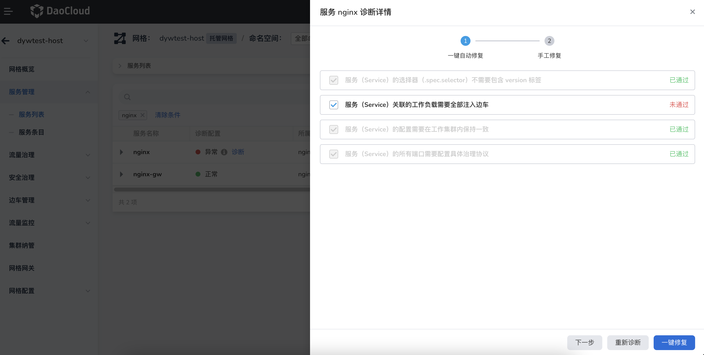
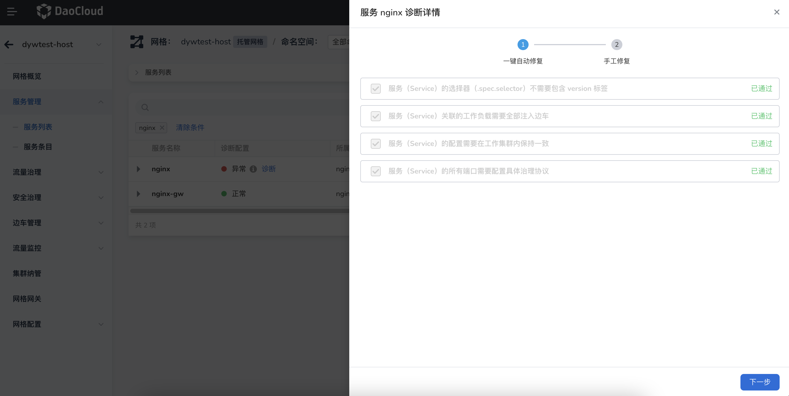
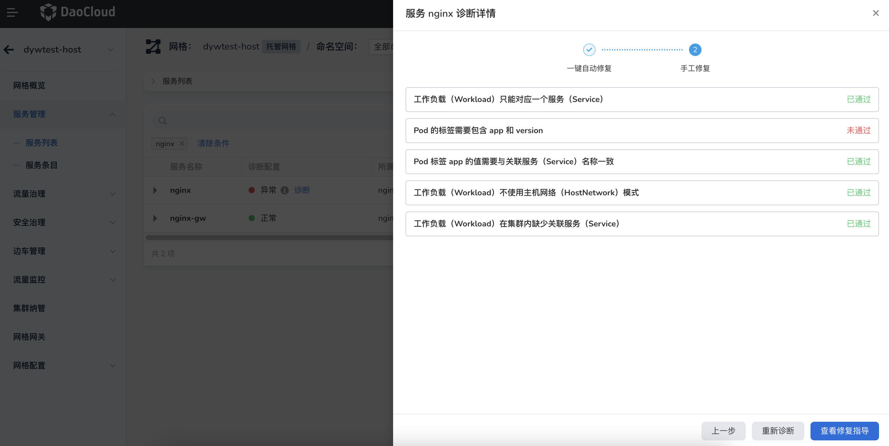

# 一键诊断和修复

DCE 5.0 服务网格针对纳管的服务，内置了一键诊断和修复功能，可以通过图形化界面进行操作。

1. 进入某个服务网格后，点击`服务管理` -> `服务列表`。在`诊断配置`列中，状态`异常`的服务旁会出现`诊断`字样，点击`诊断`。

    

1. 从右侧滑入一个诊断的弹窗，按照内置的 checklist 进行检查。已通过表示正常，未通过表示需要修复。

    勾选未通过的条目，点击`一键修复`按钮。可以点击`重新诊断`刷新 checklist，通常会在几分钟内完成修复。

    

1. 成功修复之后，checklist 各项将变灰且全部显示为已通过，点击`下一步`。

    

1. 列出了需要`手工修复`的检查项，您可以点击`查看修复指导`阅读对应的文档页面，手动修复检查项。

    

!!! note

    对于 `kube-system` 命名空间中的 coredns、calico、insight-agent 等系统组件，不建议使用一键修复。
