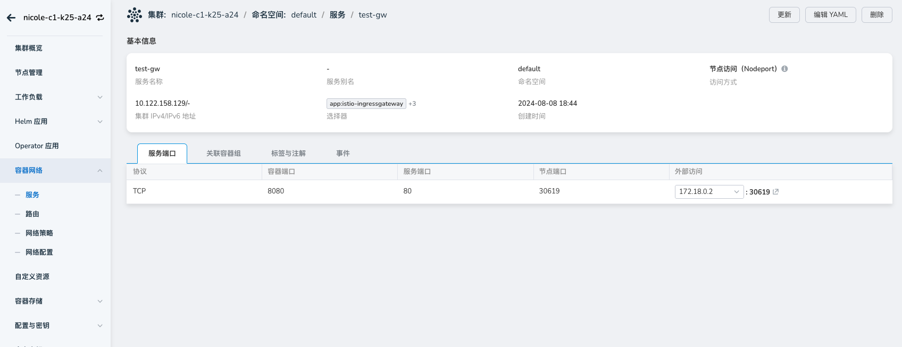
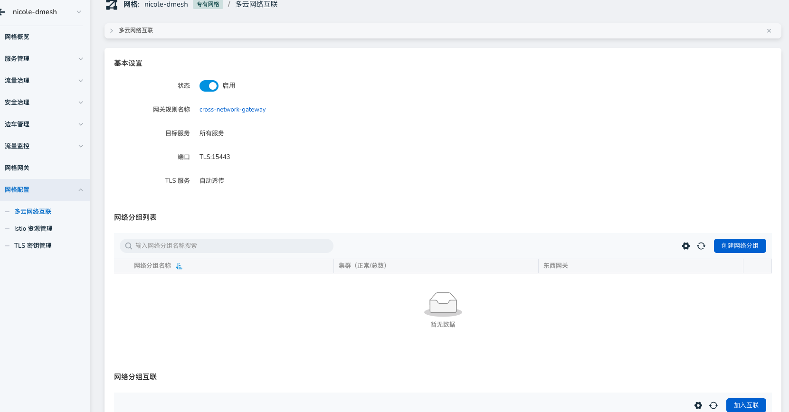
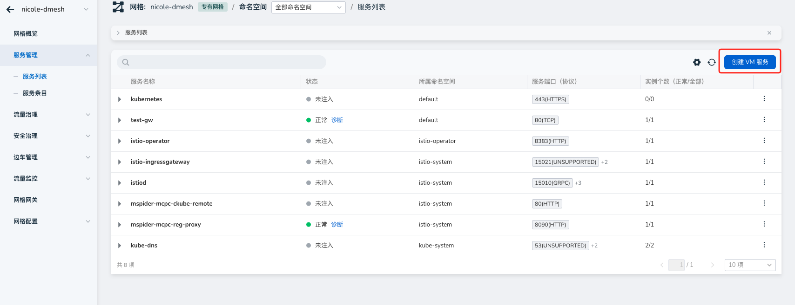
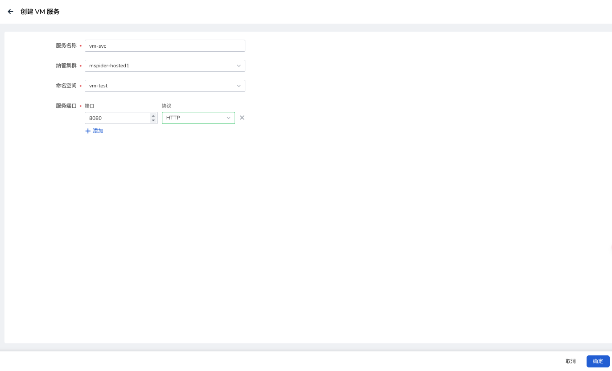
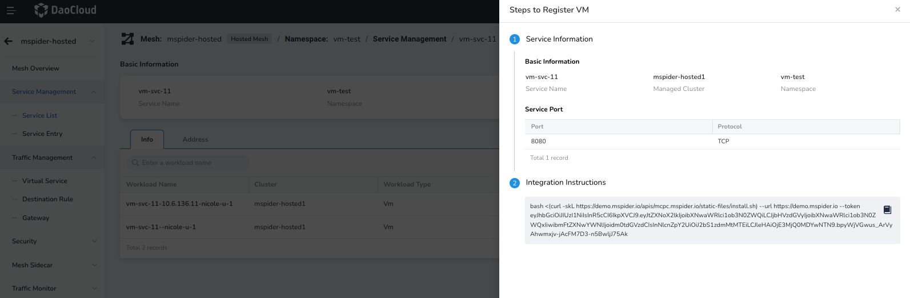
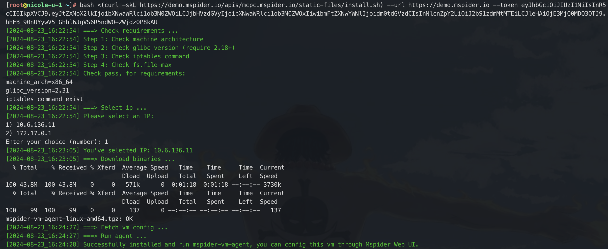

# 服务网格接入虚拟机

服务网格提供虚拟机接入能力，能够打通虚拟机与集群之间流量并且进行流量治理。

## 前提条件

虚拟机需要能够访问控制面 Istiod 服务与东西网关服务。

- 暴露控制面 Istiod，用于虚拟机连接（Istiod 默认为 LoadBalancer 服务，控制面集群需要支持分配负载均衡 IP）

    

- 网格需要开启多云互联模式

    

## 创建虚拟机服务



服务端口与协议需要与接入虚拟机一致



## 接入虚拟机

选择对应虚拟机服务，接入虚拟机，复制命令行去虚拟机执行：





## 查看虚拟机运行状态

1. 通过控制平台，检查相应虚拟机工作状态是否健康
2. 在虚拟机上查看虚拟机运行状态

```bash
# 查看 mspider vm agent 运行状态
systemctl status mspider-vm-agent.service
```

查看 Istio 边车日志：

```bash
# 查看虚拟机 istio 边车运行日志
tail /var/log/istio/istio.err.log /var/log/istio/istio.log -Fq -n 100
```

## 手动更新 Istio 虚拟机代理配置

当用户需要自定义边车配置时，可以进行如下操作：

!!! note

    手动更改配置请谨慎，更改不当将导致代理无法运行。


```bash
# mspider 默认目录 /var/local/mspider
[root@nicole-u-1 /var/local/mspider]# tree
.
├── bin
│   ├── docker-start.sh
│   ├── envoy
│   ├── install.sh
│   ├── istio-start.sh
│   ├── mspider-vm-agent
│   ├── pilot-agent
│   └── postinstall.sh
├── certs
├── conf
│   ├── config.yaml
│   └── istio
│       ├── cert-chain.pem
│       ├── cluster.env
│       ├── hosts
│       ├── istio-token
│       ├── key.pem
│       ├── mesh.yaml
│       └── root-cert.pem
└── istio
    ├── config
    │   └── mesh
    ├── envoy
    ├── envoy_bootstrap_tmpl.json
    ├── proxy
    │   ├── envoy-rev.json
    │   ├── grpc-bootstrap.json
    │   └── XDS
    └── sidecar.env
    
    ## 用户可以根据需要更改配置
    
    # 重启 mspider-vm-agent
    systemctl restart mspider-vm-agent.service
```

## 卸载虚拟机

虚拟机停用 agent：

```bash
systemctl stop mspider-vm-agent.service
systemctl disable mspider-vm-agent.service

rm /lib/systemd/system/mspider-vm-agent.service
systemctl daemon-reload

rm -rf /var/local/mspider
```

手动移除虚拟机相关资源：

```bash
# 虚拟机对应工作集群 删除 wg
 kubectl get workloadgroup -n <vm-ns> 
 kubectl delete workloadgroup -n <vm-ns> <vm-wg>
 
# 托管集群，istio-system/ hostd- api-service 的 pod shell
kubectl get wls -n <vm-ns> 
kubectl delete wls -n <vm-ns>  <[cluster]-[vmName]> 
```
