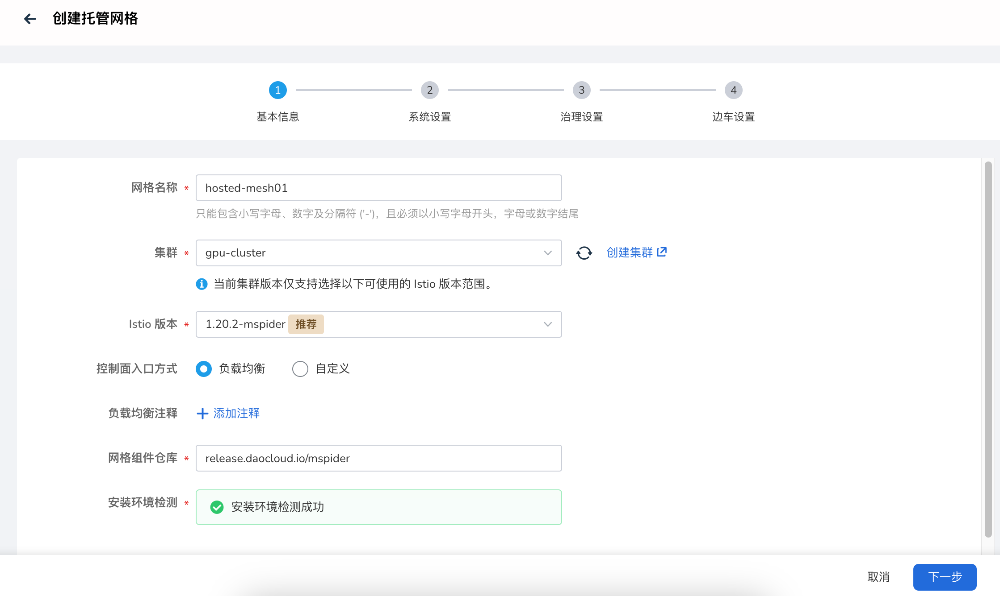
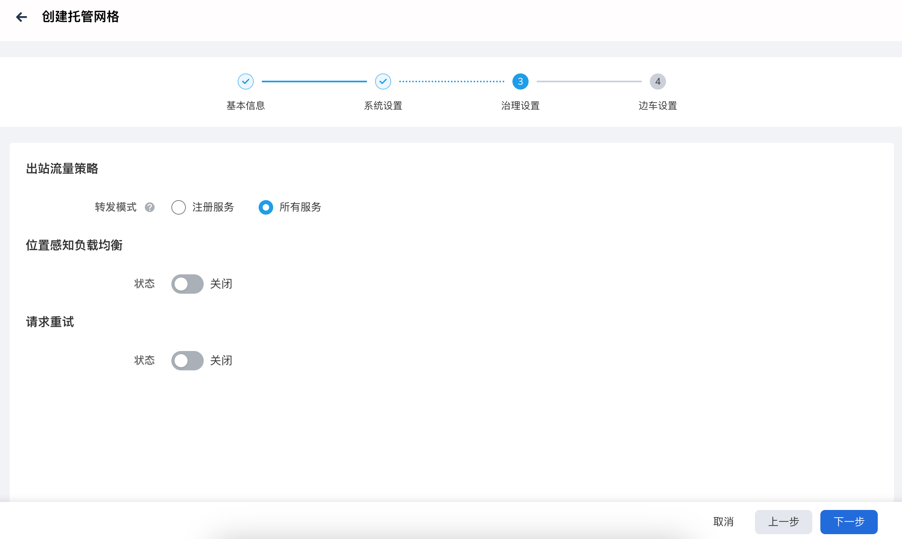
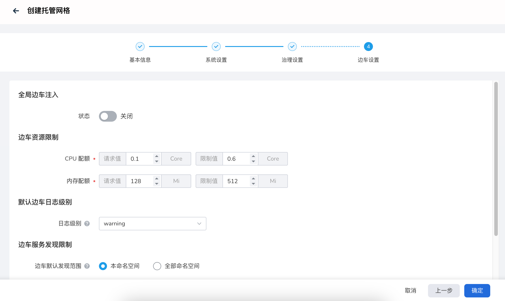
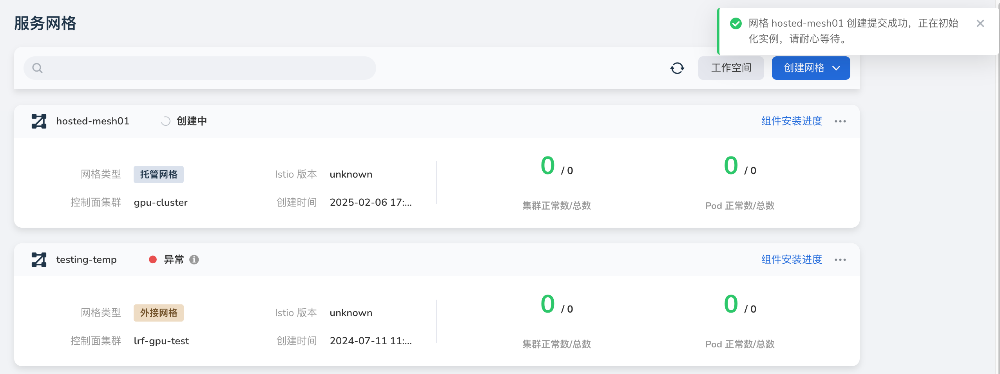

---
hide:
  - toc
---

# 创建托管网格

1. 在网格列表页面的右上角，点击 __创建网格__ 按钮，在下拉列表中选择 **创建托管网格**

    

2. 系统会自动检测安装环境，检测成功后填写以下基本信息，点击 __下一步__

    - 网格名称：以小写字母开头，由小写字母、数字、中划线 `-` 组成，且不能以中划线 `-` 结尾
    - 集群：这是运行网格控制面的集群，集群下拉列表中展示了每个集群的版本及其健康状态
    - Istio 版本：对于托管网格，所有被纳管集群的 Istio 都将使用此版本
    - 控制面入口方式：支持负载均衡和自定义
    - 负载均衡注释：以键值对的形式添加 Annotation
    - 网格组件仓库：包含数据面组件镜像的镜像仓库地址，默认为 `release.daocloud.io/mspider`
  
    

3. 系统设置。配置是否上报链路追踪，设置网格规模，选择存储配置后点击 __下一步__

    

    !!! note

        - 存储配置仅适用于托管网格
        - 当控制面所在集群为 OCP 时，可选安装 OCP 组件

4. 治理设置。设置出站流量策略、位置感知负载均衡、请求重试等。参阅[请求重试参数说明](./params.md#max-retries)。

    

5. 边车设置。设置全局边车、边车资源限制、默认边车日志级别、边车服务发现限制和边车镜像拉取设置，点击 __确定__ 。参阅[日志级别说明](./params.md#_2)。

    

6. 自动返回网格列表，新创建的网格默认位于第一个，一段时间后状态将从 __创建中__ 变为 __运行中__ 。点击右侧的 __...__ 可以编辑网格基本信息、添加集群、进入控制台操作等。

    

!!! info

    创建托管网格后，还未接入任何托管的集群，此时网格处于 __未就绪__ 状态。
    用户可以[添加集群](../cluster-management/README.md)，等待集群接入完成后，选择需要服务治理的集群接入。
