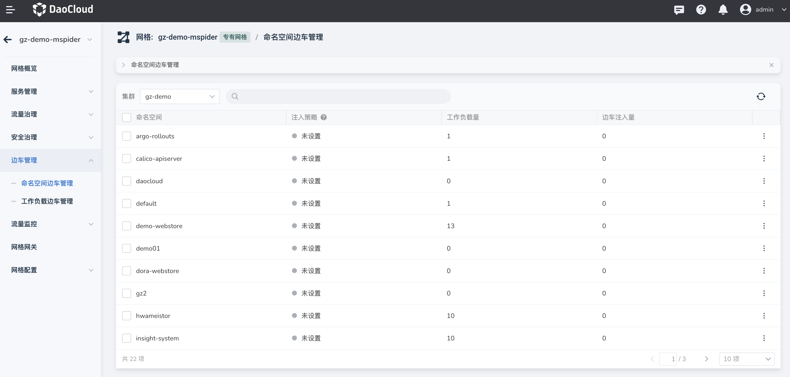
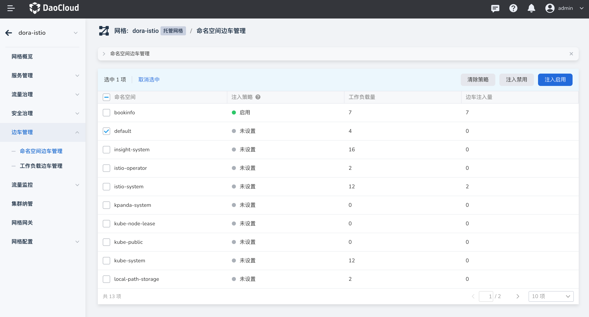
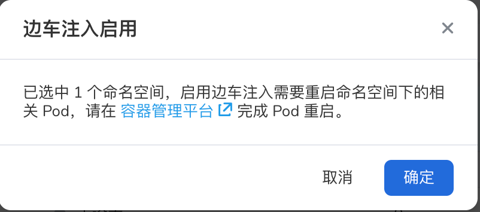
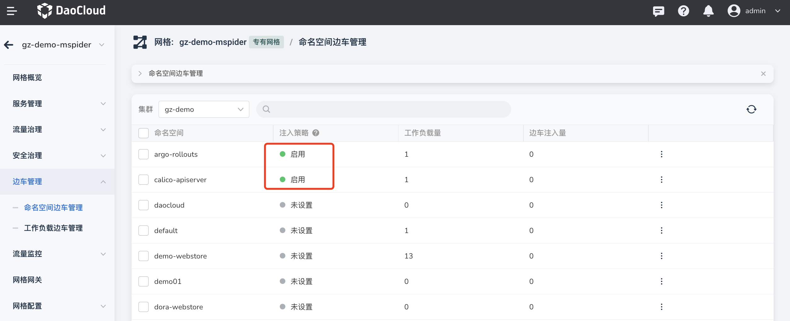
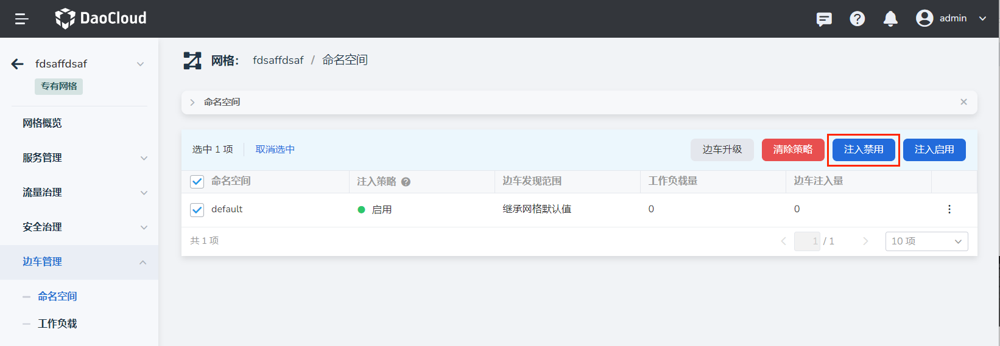
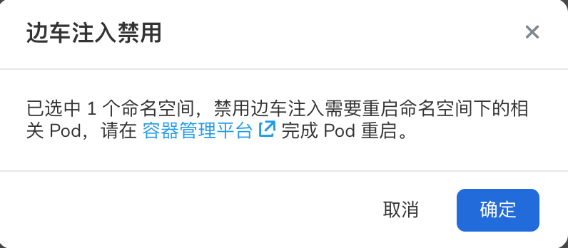
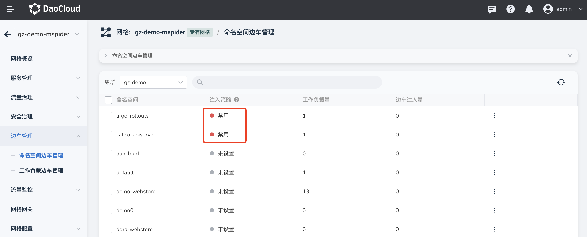
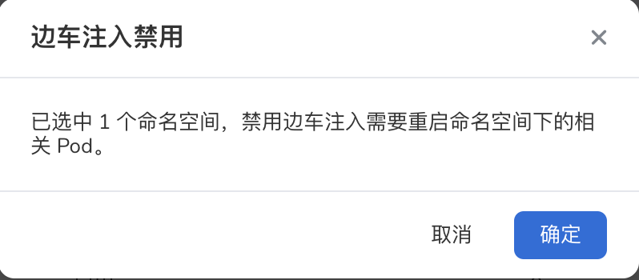
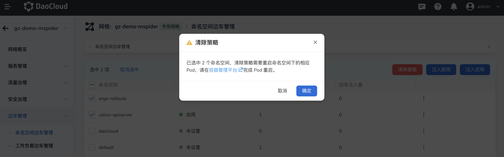
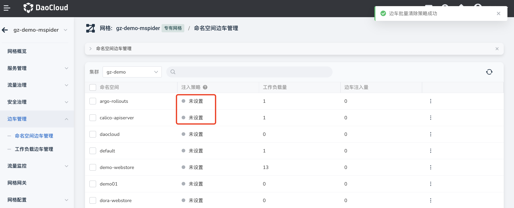

# 命名空间边车管理

您可以勾选任意集群下的多个命名空间，启用、禁用边车注入或清除策略。

注意：如果某工作负载的边车注入设置为禁用，则该工作负载不会随所属命名空间启用注入。

## 查看边车注入信息

在左侧导航栏中，点击 __边车管理__ -> __命名空间__ ，可以查看对应网格下所有命名空间的边车状态。

当命名空间较多时，可以按命名空间的名称进行排序，并通过搜索功能进行查找。
还可以选择是否显示以下系统命名空间：

- default
- insight-system
- istio-operator
- istio-system
- kpanda-system
- kube-node-lease
- kube-public
- kube-system

## 启用边车注入

您可以勾选一个或多个命名空间，启用边车注入，具体步骤如下：

1. 勾选一个或多个未注入边车的命名空间，点击 __注入启用__ ；

    

2. 在弹出的对话框中，确认所选的命名空间，点击 __确定__ 。

    

    请按屏幕提示，重启对应的 Pod。

3. 返回命名空间的边车列表，可以看到刚刚所选命名空间的 __注入策略__ 状态已变更为 __启用__ 。在用户完成工作负载的重启后，将完成边车注入，相关注入进度可查看 __边车注入量__ 一列。

    

## 禁用边车注入

您可以选择一个或多个命名空间，禁用边车注入，具体步骤如下：

1. 勾选一个或多个已启用边车注入的命名空间，点击 __注入禁用__ ；

    

2. 在弹出的对话框中，确认所选的命名空间后，点击 __确定__ 。

    

    请按屏幕提示，重启对应的 Pod。

3. 返回命名空间的边车列表，可以看到刚刚所选命名空间的 __注入策略__ 状态已变更为 __禁用__ 。
   在用户完成工作负载的重启后，将完成边车禁用，相关卸载进度可查看 __边车注入量__ 一列。

    

## 清除策略

您可以选择一个或多个命名空间，清除命名空间层面的边车策略。
清除后，命名空间下的工作负载的边车状态将仅受 __工作负载边车管理__ 控制，具体步骤如下：

1. 勾选一个或多个已启用边车注入的命名空间，点击 __清除策略__ 按钮；

    

2. 在弹出的对话框中，确认所选的命名空间后，点击 __确定__ 。

    

3. 返回命名空间的边车列表，可以看到刚刚所选命名空间的 __注入策略__ 状态已变更为 __未设置__ ，
   此时用户可以在 __工作负载边车管理__ 为特定工作负载设定边车注入策略。

    

下一步：[工作负载边车管理](./workload-sidecar.md)
