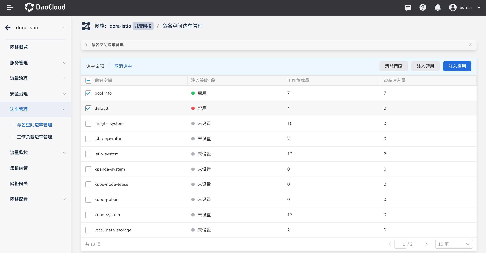

# 命名空间边车管理

用户可以从命名空间的层面启用、禁用边车注入或清除边车注入策略。

!!! note

    在命名空间边车列表中，勾选某个边车后，右上角才会显示`注入禁用`、`注入启用`和`清除策略`的按钮。

## 查看边车注入信息

在左侧导航栏中，点击`边车管理` -> `命名空间边车管理`，点选某个集群（图示为 `dora-cluster01`），可以查看该集群下所有命名空间的边车状态。

当命名空间较多时，可以按命名空间的名称进行排序，并通过搜索功能进行查找。

## 启用边车注入

用户可以选择一个或多个命名空间，启用边车自动注入功能，具体步骤如下：

1. 选择一个未启用边车注入的命名空间，点击`注入启用`按钮；

    

2. 在弹出的对话框中，确认选择的命名空间数量是否正确，确认无误后，点击`确定`。

    

3. 自动返回命名空间的边车列表，可以看到刚刚所选命名空间的`注入策略`状态已变更为`启用`。在用户完成工作负载的重启后，将完成边车注入，相关注入进度可查看`边车注入量`一列。

## 禁用边车注入

用户可以选择一个或多个命名空间，禁用边车自动注入功能，具体步骤如下：

1. 选择一个已启用边车注入的命名空间，点击`注入禁用`按钮；

    

2. 在弹出的对话框中，确认选择的命名空间数量是否正确，确认无误后，点击`确定`。

    

3. 自动返回命名空间的边车列表，可以看到刚刚所选命名空间的`注入策略`状态已变更为`禁用`。在用户完成工作负载的重启后，将完成边车禁用，相关卸载进度可查看`边车注入量`一列。

## 清除策略

用户可以选择一个或多个命名空间，清除命名空间层面的边车策略，清除后，命名空间下的工作负载的边车状态将仅受`工作负载边车管理`控制，具体步骤如下：

1. 选择一个已启用边车注入的命名空间，点击`清除策略`按钮；

    

2. 在弹出的对话框中，确认选择的命名空间数量是否正确，确认无误后，点击`确定`。

    

3. 自动返回命名空间的边车列表，可以看到刚刚所选命名空间的`注入策略`状态已变更为`未设置`，此时用户可以在`工作负载边车管理`为特定工作负载设定边车注入策略。
