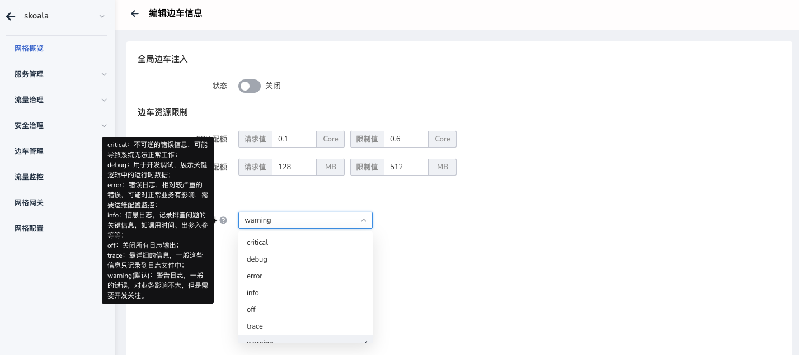
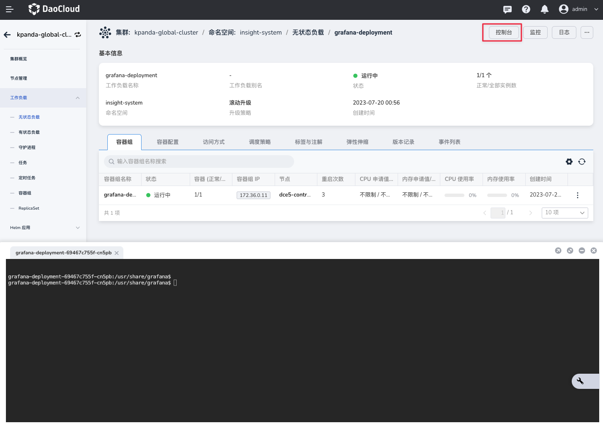
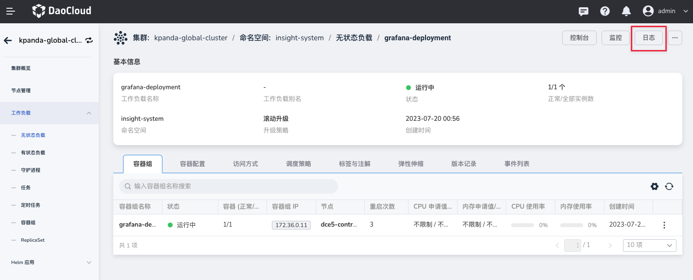

# 更改边车日志级别

边车日志，用于记录工作负载的边车的工作情况，通过控制日志级别，可以控制边车日志的输出，从而减少日志的输出，减少日志的存储和传输。

在部署网格实例时，DaoCloud 支持配置全局默认的边车日志级别，默认情况下所有工作负载的边车都会采用此配置。

## 边车日志级别配置

- 全局默认边车日志级别：默认情况下，全部边车日志的级别，可以在网格实例的边车信息中进行配置
- 临时修改工作负载边车日志级别：适用于单个工作负载的边车日志级别，可通过到工作负载的边车容器内临时修改

### 全局默认边车日志级别

!!! warning

    全局默认边车日志级别，需由网格管理员进行修改。

1. 登录 DaoCloud 控制台，进入网格实例详情页，点击`边车信息`菜单，进入边车信息修改页面

    

2. 在边车信息修改页面，可以修改全局默认边车日志级别，修改完成后，点击`保存`按钮，即可保存修改

    

### 临时修改工作负载边车日志级别

通常情况下我们在临时分析问题时，需要修改某个工作负载的边车日志级别，所以，我们支持通过到工作负载的边车容器内临时修改。



这里需要使用 Kubectl 来进行容器边车的配置更新，您需要访问集群控制台，并打开终端，执行如下命令：

```shell
kubectl -n <namespace> exec -it <pod-name>  -c istio-proxy -- curl -X POST localhost:15000/logging?level=<log level>
```

- `<namespace>`：工作负载所在的命名空间
- `<pod-name>`：工作负载的 Pod 名称
- `<log level>`：边车日志级别，可选值为：`trace`、`debug`、`info`、`warning`、`error`、`critical`、`off` 等
- `istio-proxy`：边车容器名称，不需要修改
- `localhost:15000`：边车容器的监听地址，不需要修改

例如，我们需要将 `default` 命名空间下的 `productpage-v1-5b4f8f9b9f-8q9q2` 工作负载的边车日志级别修改为 `debug`，则执行如下命令：

```shell
kubectl -n default exec -it productpage-v1-5b4f8f9b9f-8q9q2  -c istio-proxy -- curl -X POST localhost:15000/logging?level=debug
```

执行完成后，可以在页面点击查看日志，确认边车日志级别是否已经修改成功。


