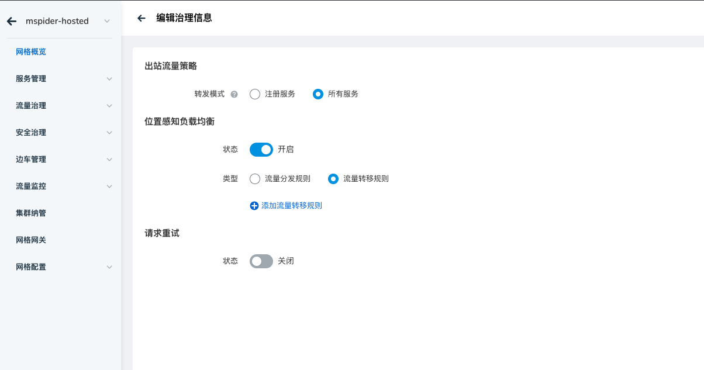
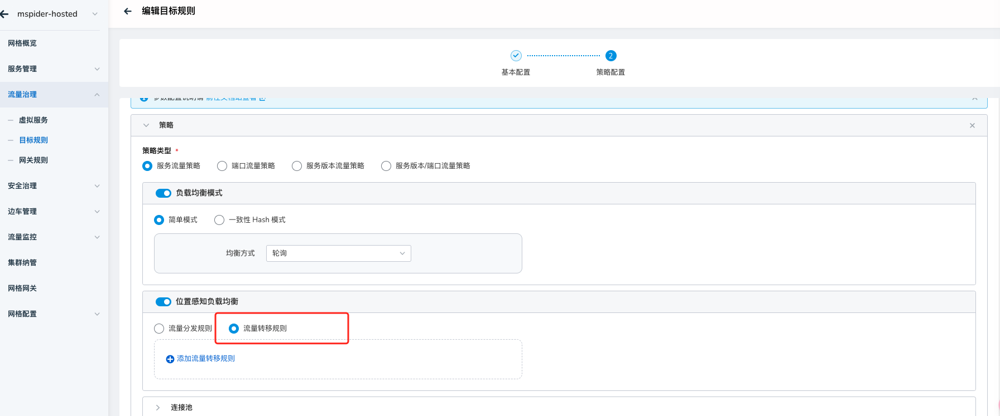
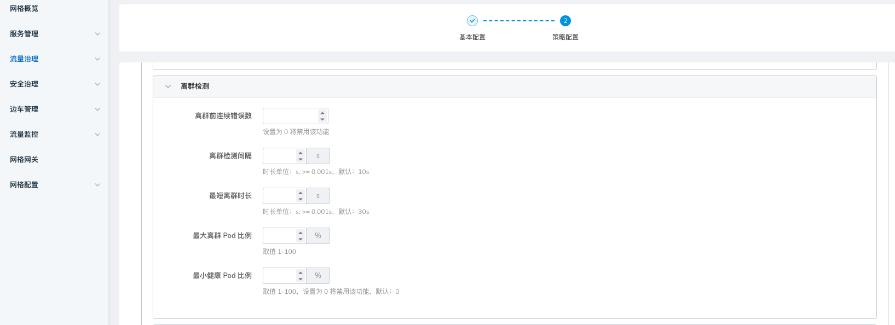

# 流量故障转移

在 Istio 中，localityLbSetting 中的流量故障转移规则（Traffic Failover Rule）允许你配置当某个本地性区域（如区域、可用区）的服务实例不可用时，
将流量故障转移到其他区域或可用区。这种机制可以提高服务的可用性，特别是在跨多个区域或可用区部署的情况下。

## localityLbSetting 的配置结构

流量故障转移规则切换可以在网格级别（网格概览 -> 治理信息）进行配置，也可以在服务级别进行配置。  
localityLbSetting 通常在 DestinationRule 中定义，具体包括三个主要部分：

1. **enabled** : 是否启用区域感知负载均衡。
2. **distribute** : 控制流量如何在不同的区域或可用区之间分布。
3. **failover** : 定义从一个区域或可用区失败后切换到其他区域或可用区的策略。

## 网格级别配置

网格概览 -> 治理信息：

## 服务级别配置

在实例级别、服务级别配置流量故障转移规则后，均需为每个服务单独配置「离群检测」（取决于具体服务触发离群的条件）。

## 使用场景

1. **高可用性** : 当一个区域的服务实例出现故障时，通过自动切换流量到其他区域，确保服务的连续性。
2. **灾难恢复** : 在灾难或重大故障事件发生时，确保系统能够自动将流量重定向到其他可用的区域或数据中心。

## 小结

通过配置 localityLbSetting 中的 failover 规则，可以实现自动的区域切换，当某个区域出现故障时，
流量会被自动切换到其他预先定义的区域。这种配置对于多区域部署的服务非常重要，有助于提升整体服务的可用性和鲁棒性。
