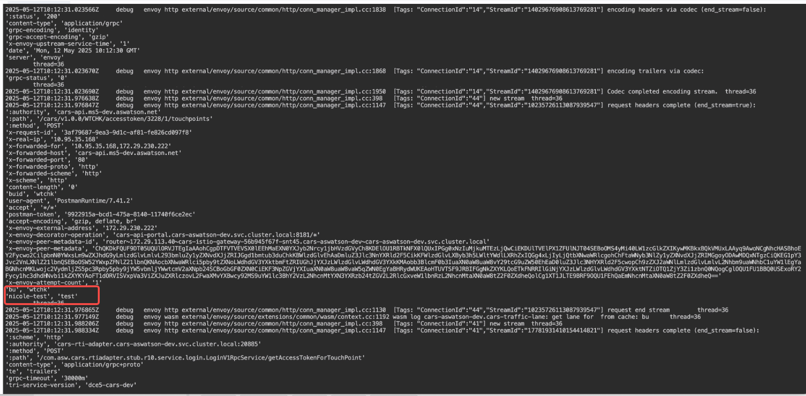
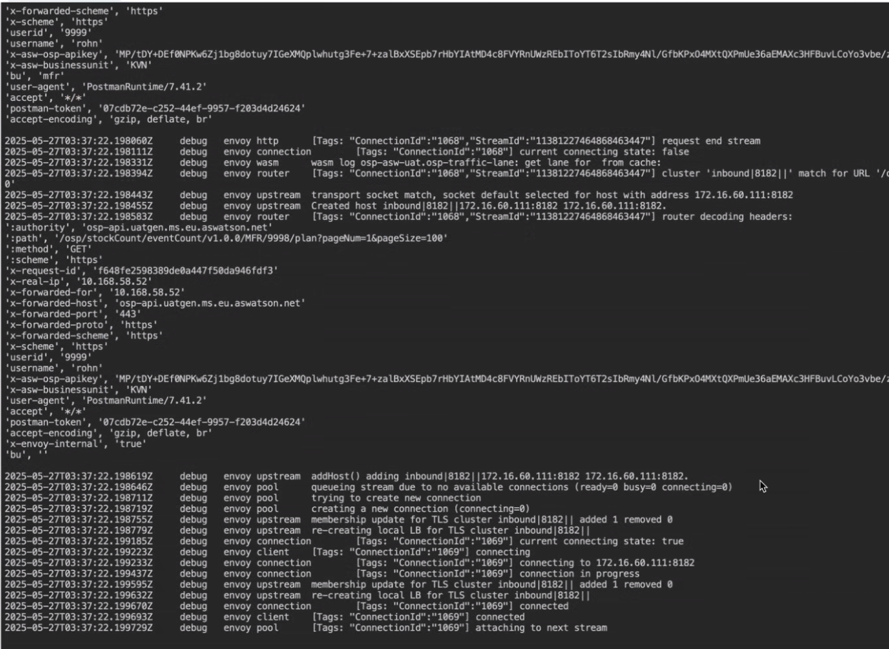

# 流量泳道

流量泳道（Traffic Lane）功能用于实现多版本、灰度发布等场景下的 **精细化流量路由控制** 。
该机制的核心依赖以下三个关键要素：

- **Wasm 扩展模块**：在服务间请求中注入自定义 Header（如 `bu`），用于标识请求所属的泳道。
- **TraceID 链路追踪信息**：辅助识别请求来源，为泳道路由提供上下文支持。
- **Istio 路由配置**：通过 VirtualService（VS）和 DestinationRule（DR）基于 Header 实现泳道级流量分发。

## 场景示例

### 系统请求链路

```yaml
istio-cars-ingress（Istio 网关）
    ↓
portal-api-portal
    ↓
cars-rti-adapter
    ↓
cars-aggregator
```

此链路中的每一跳服务均已接入 Istio Sidecar，并支持基于 Header 的子集路由。

### 泳道规划策略

- 定义两个泳道：`wtchk` 和 `wicph`
- 使用 Header Key：`bu`（泳道标识字段）
- 默认泳道值：`wtchk`

### 路由行为预期

| 请求 Header 示例 | 预期路由目标子集 |
| --------------- | ------------- |
| build: wtchk | wtchk |
| build: wicph | wicph |

- 请求到达时，Istio 会依据 Header 中的泳道标识将流量路由至对应的子集 Pod。
- 若 Header 缺失，系统可配置默认值或返回错误，具体取决于 VS/DR 策略。

### Header 重写说明

由于上游服务可能使用 `buid` 字段，而系统内部标准识别字段为 `bu`，
建议在入口网关（如 `istio-cars-ingress`）的 VirtualService 中添加以下配置：

```yaml
http:
- match:
    ...
  headers:
    request:
      set:
        bu: "{{ request.headers['buid'] }}"
```

!!! note

    如上操作用于将 `buid` 统一映射为标准泳道标识 `bu`，仅当上游请求头不一致时才需配置；若已统一为 `bu`，可跳过这一步。

## 示例操作步骤

### 1. 开启网格链路追踪功能


### 2. wasm plugin 定义流量泳道匹配 header

```yaml
apiVersion: extensions.istio.io/v1alpha1
kind: WasmPlugin
metadata:
  name: cars-traffic-lane
  namespace: cars-aswatson-dev
spec:
  imagePullPolicy: Always
  phase: STATS
  pluginConfig:
    cache_size: 1024
    lane_header: bu # 流量泳道识别的通用 header key
    traffic_lane: wtchk # 泳道默认 header value
    type: W3C
  selector:
    matchLabels:
      app.kubernetes.io/part-of: cars # 泳道作用的工作负载共同 label
  url: oci://10.95.35.134/release.daocloud.io/mspider/mspider-traffic-lane:v0.30.4 # 泳道版本
```

如果是私有环境，记得提前将泳道的 Wasm 推送到镜像仓库。

### 3. 服务检查

- 端口协议配置, **端口协议定义一定要正确**
- 服务与多版本工作负载是否正确绑定
- 注入边车
- 服务是否正常运行（服务列表 UI 界面）


### 4. 定义服务的 dr, 给每个服务都配置 wtchk 和 wicph 两组 subset

要确认是否绑定了目标服务，可以通过服务网格界面辅助判断


### 5. 南北网关定义 vs 路由规则

网关需要重写 header

```yaml
apiVersion: networking.istio.io/v1beta1
kind: VirtualService
metadata:
  name: cars-api-portal
  namespace: cars-aswatson-dev
spec:
  gateways:
    - cars-aswatson-dev/cars # 网关入口服务
  hosts:
    - "*"
  http:
    - headers: # 将请求 header 重置为流量泳道通用 header 规则 <bu：wtchk>
        request:
          set: # 重写
            bu: wtchk
      match: # 访问服务，比如发起 http 的入口请求（postman），需要定义 header <wtchk>
        - headers:
            buid:
              exact: wtchk
      name: hk
      route:
        - destination:
            host: cars-api-portal.cars-aswatson-dev.svc.cluster.local
            port:
              number: 8181
            subset: cars-api-portal-wtchk
    - headers:
        request:
          set:
            bu: wicph
      match:
        - headers:
            buid:
              exact: wicph
      name: ph
      route:
        - destination:
            host: cars-api-portal.cars-aswatson-dev.svc.cluster.local
            port:
              number: 8181
            subset: cars-api-portal-wtcph
```

如果不需要重写 header，示例如下：

```yaml
apiVersion: networking.istio.io/v1beta1
kind: VirtualService
metadata:
  name: cars-api-portal
  namespace: cars-aswatson-dev
spec:
  gateways:
    - cars-aswatson-dev/cars # 网关入口服务
  hosts:
    - "*"
  http:
    - match: # 访问服务，比如发起 http 的入口请求（postman），需要定义 header <wtchk>
        - headers:
            bu:
              exact: wtchk
      name: hk
      route:
        - destination:
            host: cars-api-portal.cars-aswatson-dev.svc.cluster.local
            port:
              number: 8181
            subset: cars-api-portal-wtchk
    - match:
        - headers:
            buid:
              exact: wicph
      name: ph
      route:
        - destination:
            host: cars-api-portal.cars-aswatson-dev.svc.cluster.local
            port:
              number: 8181
            subset: cars-api-portal-wtcph
```

### 6. 后续内部服务定义 VirtualService

```yaml
apiVersion: networking.istio.io/v1beta1
kind: VirtualService
metadata:
  name: cars-rti-adapter
  namespace: cars-aswatson-dev
spec:
  gateways:
    - mesh # 全局服务
  hosts:
    - cars-rti-adapter # 内部服务
  http:
    - match: # 匹配泳道 通用 header 规则
        - headers:
            bu:
              exact: wtchk
      name: cars-adapter
      route:
        - destination:
            host: cars-rti-adapter.cars-aswatson-dev.svc.cluster.local
            port:
              number: 20885
            subset: cars-rti-adapter-wtchk
    - match:
        - headers:
            bu:
              exact: wtcph
      name: cars-adapter-ph
      route:
        - destination:
            host: cars-rti-adapter.cars-aswatson-dev.svc.cluster.local
            port:
              number: 20885
            subset: cars-rti-adapter-wtcph
```

## 常见问题记录

### VS 端口错误导致服务无法访问

**VS 的目标端口选择错误** ，上面服务都是 http + grpc 两个端口，服务内部调用通过 grpc，默认选择了 http 端口，导致请求异常。

### no healthy upsteam - 工作负载匹配问题

错误一：DR 的 subset 中 label 匹配出错，导致无法找到 Pod

错误二： **服务和工作负载没有正确对应** ，导致无法找到对应的 Pod，可以在服务网格 UI 界面服务列表，检查服务与工作负载对应关系

### 没有开启链路追踪，导致服务访问错误

现象是 istio-proxy 有传入 header，但是没有 traceid：



业务日志看到的请求 header bu 正常应该是：



