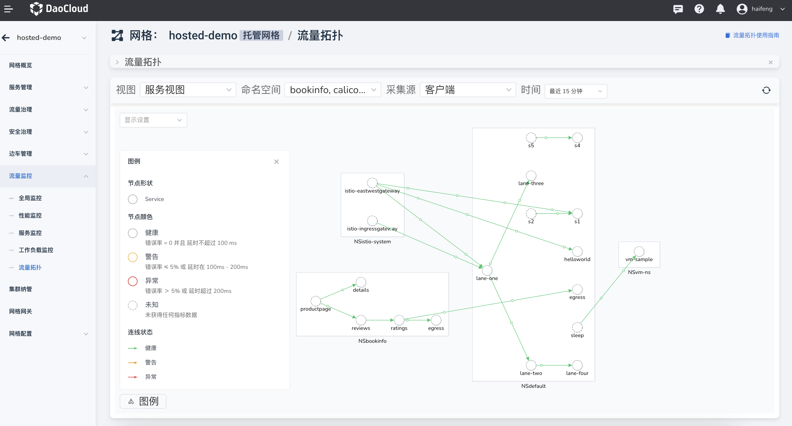

---
hide:
  - toc
---

# 流量监控

流量监控图表采用了 Istio 的原生 Grafana 图表，目前采用了以下 4 个图表板块：

- 全局监控：网格全局的各类资源统计

- 性能监控：网格控制面和数据面组件性能展示，还包含基于组件版本的性能统计信息

- 服务监控：网格内所有注入边车的服务性能统计信息，并提供多种筛选方式，您可以从命名空间、请求来源、服务版本等多个维度筛选显示内容

- 工作负载监控：网格内所有注入边车的工作负载性能统计信息，并提供多种筛选方式，您可以从命名空间、所属服务、请求来源、服务版本等多个纬度筛选显示内容

还提供了流量拓扑，监测不同命名空间、采集源的流量，还增加了流量动画，方便查看动态的流量流转情况。

有关更多信息，请参阅 Istio 的 [Grafana Dashboard 说明](https://istio.io/latest/docs/tasks/observability/metrics/using-istio-dashboard/)。
