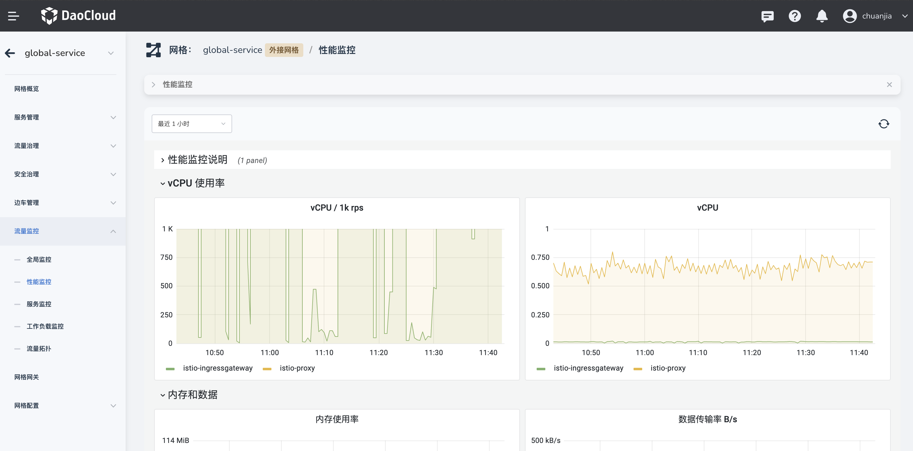
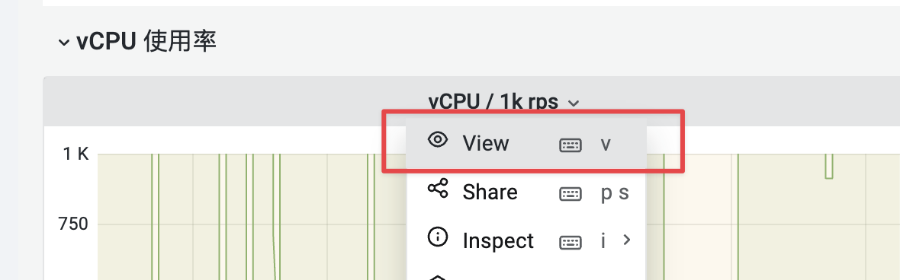
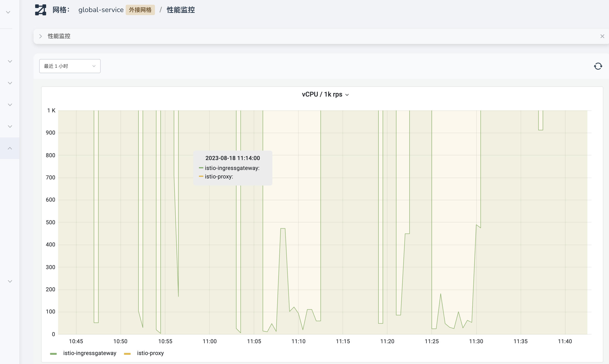
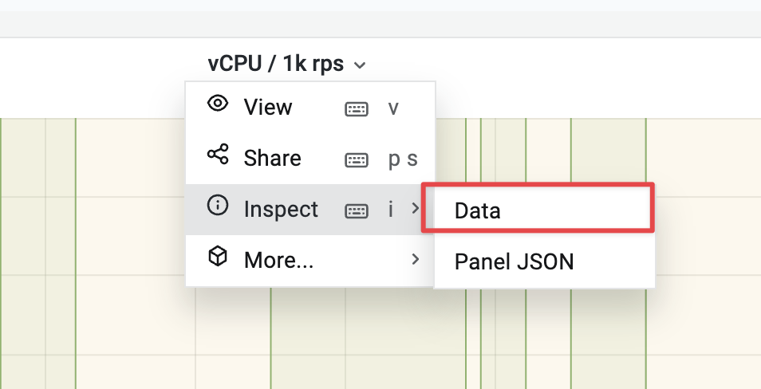
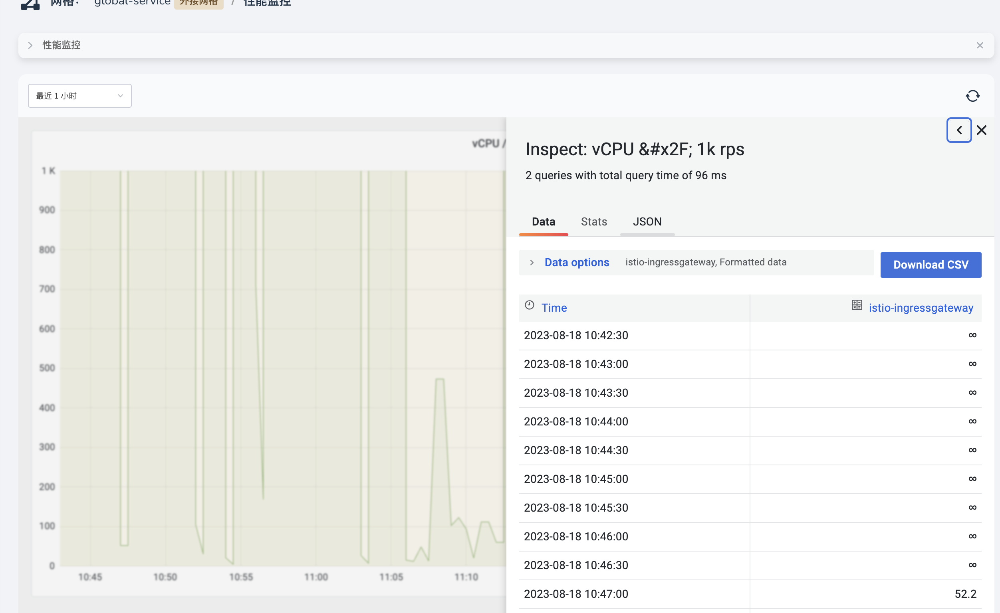
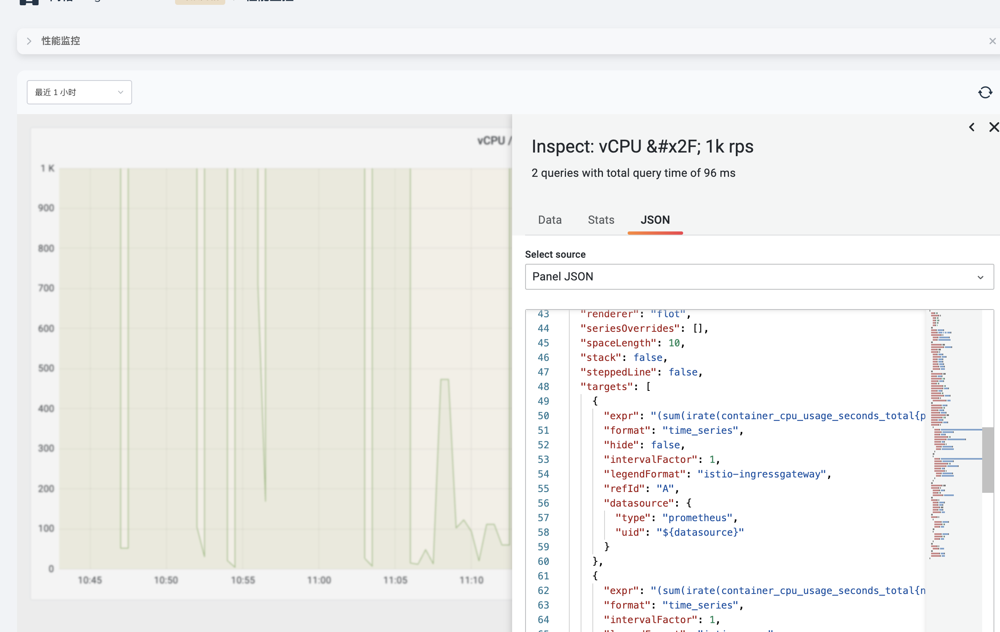

# 监控图表阅读指南

服务网格基于 Istio 开源的 Grafana Dashboard，为了每一个服务网格实例自动生成了流量监控看板。

主要根据以下几个维度进行呈现：

- 全局监控：主要展示网格实例的策略数量、服务与工作负载等全部的资源情况。
- 性能监控：重点展示网格实例的系统资源的性能情况、以及 Sidecar 资源消耗资源等。
- 服务监控：以服务作为主视角，展示服务的流量和工作负载的状态。
- 工作负载监控：以工作负载作为主视角，展示工作负载的资源消耗、业务负载等数据。

## 图表阅读指南

以性能监控为例，图表中提供了各个指标的监控数据，展示形式主要以数值、图表、表单等来呈现。

图表上方的搜索条提供了监控看板的一些辅助检索字段，基于看板的不同，可用的检索字段也略有不同。

- 时间范围（通用）
- 刷新按钮（通用）
- 命名空间
- 服务名称
- 工作负载
- ...

### 全屏查看指标

点击对应指标图表的标题，可以展开更多的指标操作，其中第一个就是方法查看，可通过键盘 **ESC** 返回。

### 导出指标数据

如果希望查看图表对应的原始数据，可以点击指标图表的标题，然后选择 Inspect > Data，就可以用数据表的形式查看对应的数据。

此时，我们可以进行数据的导出，支持 CSV 和 Excel 两种格式

### 查看指标的计算表达式

如果想要详细的了解改指标的计算公式，可以查看指标图表的 Json 结构体，在其中会给出指标的具体计算方式，操作路径如下：

