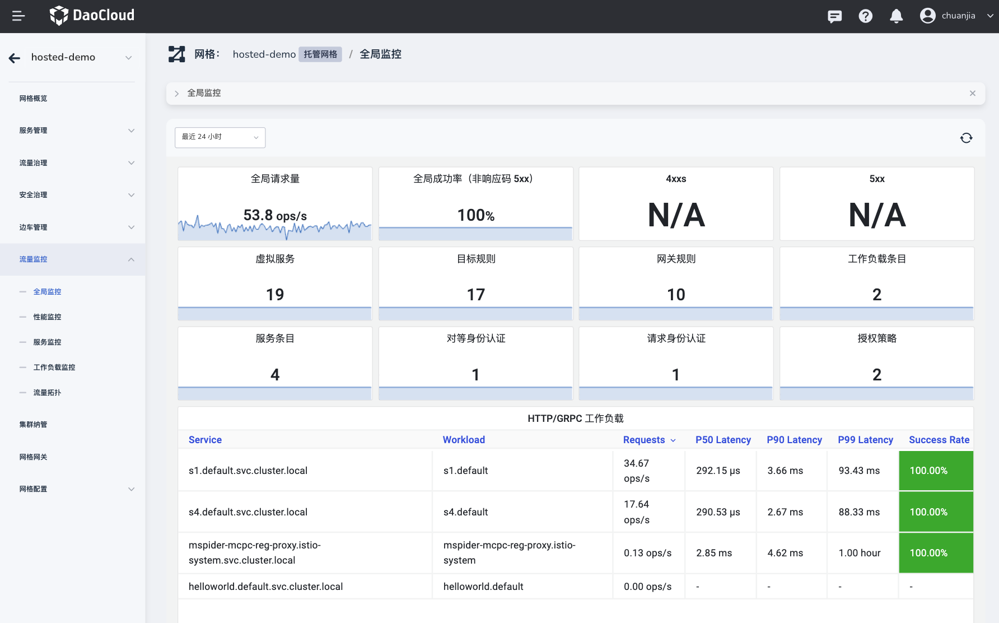
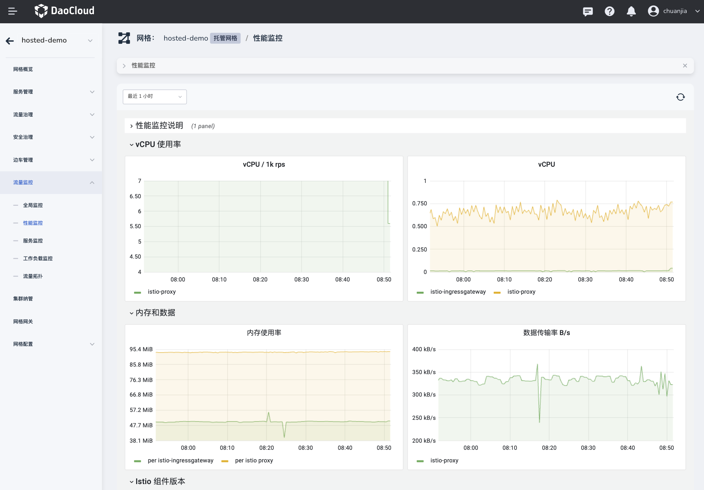
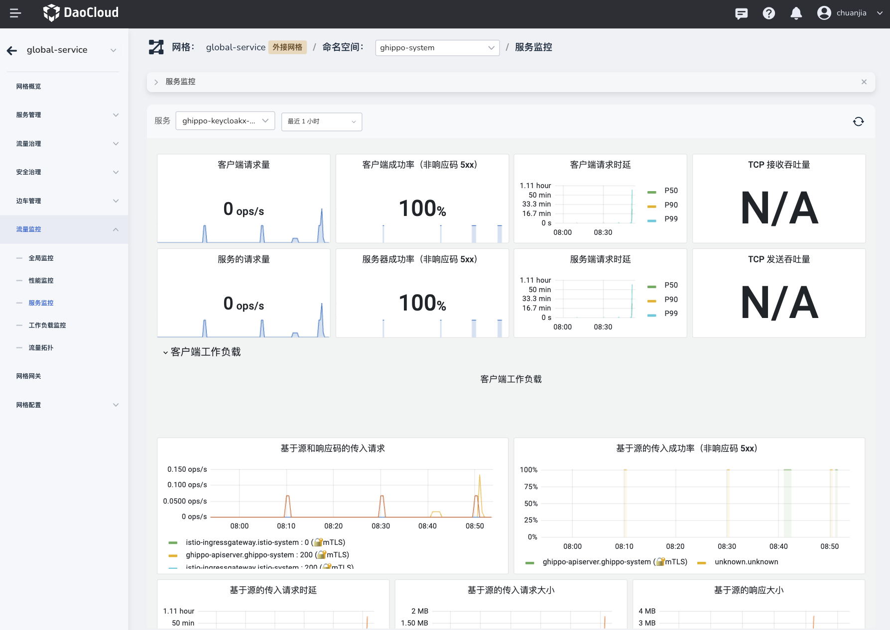
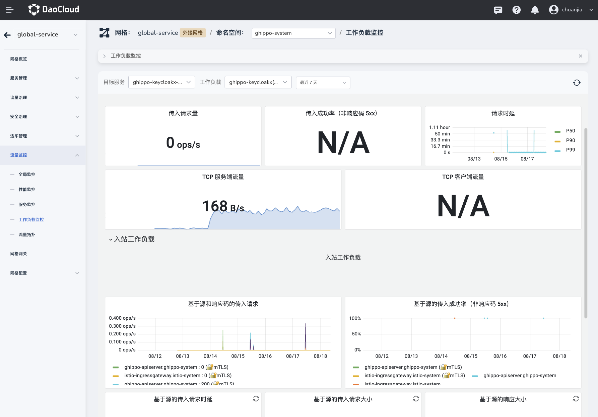

# 监控看板指标说明

本文用于补充介绍，网格实例中流量监控中的各个监控看板的指标的含义，方便用户查询和定义

## 全局监控

| 分类                  | 参数                      | 参数介绍                                                     | 计算方式                                                     |
| --------------------- | ------------------------- | ------------------------------------------------------------ | ------------------------------------------------------------ |
| 常规                  | 全局请求总量              | "Global Request Volume" 代表整个服务网格中的请求流量总量，Ops/s 标识每秒执行的操作或请求的数量。在 Istio中，这个度量通常用来评估整个服务网格的流量 | OPS/s = 总操作数 / 时间段（秒）                              |
|                       | 全局成功率（非 5xx 响应） |                                                              | 全局成功率（非响应率 5xx） = (总请求 - 5xx 响应) / 总请求 * 100 |
|                       | 4xxs                      | 4xxs 是客户端错误，表示请求可能有问题（例如，404 表示未找到） | ops/s = 每秒收到的 4xx 响应的数量                            |
|                       | 5xxs                      | 5xxs 是服务器错误，表示服务器未能正确处理有效请求（例如，500 表示内部服务器错误） | ops/s = 每秒收到的 5xx 响应的数量                            |
|                       | 虚拟服务                  | 统计一段时间范围内服务网格内的虚拟服务的净增长情况，通过比较添加和删除事件的数量，可以了解服务的动态变化，并可能有助于识别潜在的问题。 | max(Virtual Services && and) - max(Virtual Services && delete) |
|                       | 目标规则                  | 统计一段时间范围内服务网格内的目标规则（Destination Rule）的净增长情况，通过比较添加和删除事件的数量，可以了解服务的动态变化，并可能有助于识别潜在的问题。 | max(Destination Rule && and) - max(Destination Rule && delete) |
|                       | 网关规则                  | 统计一段时间范围内服务网格内的网关规则（Gateway）的净增长情况，通过比较添加和删除事件的数量，可以了解服务的动态变化，并可能有助于识别潜在的问题。 | max(Gateway && and) - max(Gateway && delete)                 |
|                       | 工作负载条目              | 统计一段时间内 WorkloadEntry 的增长趋势，通过观察 Workload 的变化，可以快速了解服务的动态变化，并可能有助于识别潜在的问题。 | max(WorkloadEntry && and) - max(WorkloadEntry && delete)     |
|                       | 服务条目                  | 统计一段时间内 Service Entries 的增长趋势，通过观察 Service Entries 的变化，可以快速了解服务的动态变化，并可能有助于识别潜在的问题。 | max(Service Entries && and) - max(Service Entries && delete) |
|                       | 对等认证策略              | 统计一段时间内 PeerAuthentication Policies 的增长趋势，通过观察 PeerAuthentication Policies 的变化，可以快速了解服务的动态变化，并可能有助于识别潜在的问题。 | max(PeerAuthentication Policies && and) - max(PeerAuthentication Policies && delete) |
|                       | 请求认证策略              | 统计一段时间内 RequestAuthentication Policies 的增长趋势，通过观察 RequestAuthentication Policies 的变化，可以快速了解服务的动态变化，并可能有助于识别潜在的问题。 | max(RequestAuthentication Policies && and) - max(RequestAuthentication Policies && delete) |
|                       | 授权策略                  | 统计一段时间内 Authorization Policies 的增长趋势，通过观察 Authorization Policies 的变化，可以快速了解服务的动态变化，并可能有助于识别潜在的问题。 | max(Authorization Policies  && and) - max(Authorization Policies  && delete) |
| HTTP/GRPC 工作负载    | Service                   | 服务名称，名称组合服务所在的命名空间和 Kubernetes 的 Service 访问信息 |                                                              |
|                       | 工作负载                  | 工作负载名称，名称组合工作负载所在的命名空间                 |                                                              |
|                       | 请求量                    | 请求的数量，表示特定时间段内的请求总数                       | sum(rate(istio_requests_total{...}[1m]))                     |
|                       | P50 延迟                  | 中位数延迟，50%的请求在的请求延迟在这个时间以下完成          | histogram_quantile(0.50, sum(rate(...))                      |
|                       | P90 延迟                  | 90%的请求在的请求延迟在这个时间以下完成                      | histogram_quantile(0.90, sum(rate(...))                      |
|                       | P99 延迟                  | 99%的请求在的请求延迟在这个时间以下完成                      | histogram_quantile(0.99, sum(rate(...))                      |
|                       | 成功率                    | 成功率，在查询时间段内成功响应（响应状态码不等于 5xx）的请求所占的百分比， | sum(rate(... response_code!~"5.*")) / sum(rate(...))         |
| TCP 工作负载          | Service                   | 工作负载名称，从 Istio 提供的指标中获取destination_service 标签，这个标签包含了服务的名称。 | destination_workload                                         |
|                       | 工作负载                  | 工作负载名称，从 Istio 提供的指标中获取destination_workload 标签，这个标签包含了工作负载的名称。 | destination_service                                          |
|                       | 发送字节数                | 每秒发送的字节量                                             | 通过 istio_tcp_sent_bytes_total 计算累计的 TCP 字节，使用 rate 计算对应的发送速率 |
|                       | 接收字节数                | 每秒接收的字节量                                             | 通过 istio_tcp_received_bytes_total 计算累计的 TCP 字节，使用 rate 计算对应的发送速率 |
| 基于版本的 Istio 组件 |                           | Istio 组件构建版本的可视化展示，展示各个组件的版本分布，以及它们在不同集群中的部署情况。这对于了解 Istio 部署的健康状况和一致性非常有用。 | sum(istio_build{mesh_id="$mesh"}) by (component, tag, mesh_cluster) |

## 性能监控

| 分类           | 参数               | 参数介绍                                                  | 计算方式                                                  |
| --------------------- | ------------------------- | ------------------------------------------------------------ | ------------------------------------------------------------ |
| VCPU 使用量       | vCPU / 1k rps  | 展示 Istio 每千次请求 (1k rps) 所消耗的虚拟 CPU (vCPU) 资源，主要查询了 istio-ingressgateway 和 istio-proxy。为了保障查询效率，Istio 限制仅当 istio-ingressgateway 请求大于 10 时才进行 istio-proxy 统计。 | (sum(irate(container_cpu_usage_seconds_total{namespace!="istio-system",container="istio-proxy"}[1m]))/ (round(sum(irate(istio_requests_total[1m])), 0.001)/1000))/ (sum(irate(istio_requests_total{source_workload="istio-ingressgateway"}[1m])) >bool 10) |
|                   | vCPU           | 展示 Istio 中虚拟 CPU (vCPU) 的整体使用情况                  |                                                              |
| 内存和数据        | 内存用量       | 展示 Istio 系统组件中的内存使用情况，统计单位为 bytes        | sum(container_memory_working_set_bytes{pod=~"istio-ingressgateway-.*"}) / count(container_memory_working_set_bytes{pod=~"istio-ingressgateway-.*",container!="POD"}) |
|                   | 数据传输量 B/s | 展示 Istio 系统组件的的每秒传输的字节数，统计单位为 Bps      | sum(irate(istio_response_bytes_sum{source_workload="istio-ingressgateway", reporter=~"$reporter",destination_mesh_id="$mesh"}[1m])) |
| Istio 组件版本    | Istio 组件版本 | 展示Istio组件的版本统计信息，图例格式将包括组件名称、标签和网格集群。 | sum(istio_build{mesh_id="$mesh"}) by (component, tag, mesh_cluster) |
| 边车资源使用率    | 内存           | 展示边车容器“istio-proxy”的每分钟工作集字节的总和的变化，用于监视Istio代理容器的内存使用情况 | sum(container_memory_working_set_bytes{container="istio-proxy"}) |
|                   | vCPU           | 展示边车代理（Proxy）资源使用的虚拟CPU（vCPU）统计信息，展示容器“istio-proxy”的CPU使用秒数的速率总和 | sum(rate(container_cpu_usage_seconds_total{container="istio-proxy"}[1m])) |
|                   | 磁盘           | 展示边车代理（Proxy）资源使用的磁盘统计信息，展示容器“istio-proxy”的文件系统使用字节的总和 | sum(container_fs_usage_bytes{container="istio-proxy"})       |
| Istiod 资源使用率 | 内存           | 展示 Istiod 服务的内存使用情况，提供了一个全面的视图： - 总计：Istiod服务在Kubernetes中的总内存使用量 - 容器内存：Istiod服务在Kubernetes中每个容器的内存使用量 包括虚拟内存、常驻内存、堆内存和栈内存等不同类型的内存使用情况。 | 总计（Total (k8s)）："sum(container_memory_working_set_bytes{container=~\"discovery\|istio-proxy\", pod=~\"istiod-.*\"})" 容器内存（{{ container }} (k8s)）："container_memory_working_set_bytes{container=~\"discovery\|istio-proxy\", pod=~\"istiod-.*\"}" |
|                   | vCPU           | 展示Istiod服务的虚拟CPU（vCPU）使用情况，提供了一个全面的视图： - 总计： 显示Istiod服务在Kubernetes中的总CPU使用率 - 容器 CPU 使用率：显示Istiod服务在Kubernetes中每个容器的CPU使用率 - Pilot：显示Istiod的pilot组件的CPU使用情况 | 总计（Total (k8s)）: "sum(rate(container_cpu_usage_seconds_total{container=~\"discovery\|istio-proxy\", pod=~\"istiod-.*\"}[1m]))"  容器CPU使用率（{{ container }} (k8s)）:  "sum(rate(container_cpu_usage_seconds_total{container=~\"discovery\|istio-proxy\", pod=~\"istiod-.*\"}[1m])) by (container)"  pilot: "irate(process_cpu_seconds_total{app=\"istiod\"}[1m])" |
|                   | 磁盘           | 展示每个集群中 Istio组件的磁盘使用情况，特别是与discovery和istio-proxy容器相关的文件系统使用情况。 | sum(process_open_fds{mesh_id="$mesh",app="istiod"}) by (mesh_cluster) container_fs_usage_bytes{ container=~"discovery\|istio-proxy", pod=~"istiod-.*"} |
|                   | Goroutines     | 展示每个集群中 Istio组件的Go协程数量的趋势                   | sum(go_goroutines{mesh_id="$mesh", app="istiod"}) by (mesh_cluster) |

## 服务监控

| 分类           | 参数               | 参数介绍                                                  | 计算方式                                                  |
| --------------------- | ------------------------- | ------------------------------------------------------------ | ------------------------------------------------------------ |
| 常规           | 客户端请求量                            | 展示当前服务的客户端的每 5 分钟的请求操作量，如果结果为空值是会展示为 N/A；阈值数值超过 80%时会展示为红色 | round(sum(irate(istio_requests_total{reporter=~"$reporter",destination_mesh_id="$mesh",destination_service=~"$service"}[5m])), 0.001) |
|                | 客户端成功率（非 5xx 响应）             | 展示当前服务的客户端的每 5 分钟的成功请求率，并且提供了一种可视化方式来快速识别潜在的问题或趋势。 | sum(irate(istio_requests_total{reporter=~"$reporter",destination_mesh_id="$mesh",destination_service=~"$service",response_code!~"5.*"}[5m])) / sum(irate(istio_requests_total{reporter=~"$reporter",destination_mesh_id="$mesh",destination_service=~"$service"}[5m])) |
|                | 客户端请求时延                          | 展示当前服务的客户端的请求用时情况，定义了三个目标，用于计算 P50、P90 和 P99 的持续时间。表达式分别计算了 50%、90% 和 99% 的持续时间百分位数。 | 示例：(histogram_quantile(0.50, sum(irate(istio_request_duration_milliseconds_bucket{reporter=~\"$reporter\",destination_mesh_id=\"$mesh\",destination_service=~\"$service\"}[1m])) by (le)) / 1000) or histogram_quantile(0.50, sum(irate(istio_request_duration_seconds_bucket{reporter=~\"$reporter\",destination_mesh_id=\"$mesh\",destination_service=~\"$service\"}[1m])) by (le)) |
|                | TCP 接收字节数                          | 展示当前服务在1 分钟内 TCP 接收字节的即时速率之和，如果匹配到 "null"，结果文本为 "N/A"，单位 Bps | "sum(irate(istio_tcp_received_bytes_total{reporter=~\"$reporter\",destination_mesh_id=\"$mesh\", destination_service=~\"$service\"}[1m]))" |
|                | 服务的请求量                            | 展示当前服务的请求量，按照时间展示趋势图，如果匹配到 "null"，结果文本为 "N/A"，单位 Ops | round(sum(irate(istio_requests_total{reporter="destination", destination_mesh_id="$mesh",destination_service=~"$service"}[5m])), 0.001) |
|                | 服务器成功率（非 5xx 响应）             | 展示当前服务的非 5xx 响应的成功率，阈值设置表明，95%以下的成功率标记为红色，99%以下的成功率标记为橙色， 100%为绿色（百分比取值 2位） | sum(irate(istio_requests_total{reporter="destination", destination_mesh_id="$mesh",destination_service=~"$service",response_code!~"5.*"}[5m])) / sum(irate(istio_requests_total{reporter="destination", destination_mesh_id="$mesh", destination_mesh_id="$mesh",destination_service=~"$service"}[5m])) |
|                | 服务端请求时延                          | 展示当前服务的服务器请求的延时，通过计算不同分位数的持续时间来提供对服务性能的深入了解。三个目标表达式分别计算了中位数、90%、和99%的请求的延时，以提供从中位数到高端的性能概览 | - histogram_quantile - istio_request_duration_milliseconds_bucket - istio_request_duration_seconds_bucket |
|                | TCP 发送字节数                          | 展示当前服务在1 分钟内 TCP 发送字节的即时速率之和，如果匹配到 "null"，结果文本为 "N/A"，单位 Bps |                                                              |
| 客户端工作负载 | 基于源和响应码的传入请求                | 展示按源工作负载和响应代码分类的传入请求，能够可视化地展示各种工作负载之间的交互情况，分别对具有和不具有互相认证TLS的连接进行计算，以提供对连接安全性的洞察。可以清晰地了解请求如何在不同的源和目的地之间分布。 |                                                              |
|                | 基于源的传入成功率（非 5xx 响应）       | 展示按源工作负载和命名空间分类的传入成功率，其中成功率是非5xx响应的百分比，分别对具有和不具有互相认证TLS的连接进行计算，以提供对连接成功率的视图。 | sum(irate(istio_requests_total{reporter=~"$reporter",destination_mesh_id="$mesh", connection_security_policy="mutual_tls", destination_service=~"$service",response_code!~"5.*", source_workload=~"$srcwl", source_workload_namespace=~"$srcns"}[5m])) by (source_workload, source_workload_namespace) / sum(irate(istio_requests_total{reporter=~"$reporter",destination_mesh_id="$mesh", connection_security_policy="mutual_tls", destination_service=~"$service", source_workload=~"$srcwl", source_workload_namespace=~"$srcns"}[5m])) by (source_workload, source_workload_namespace) |
|                | 基于源的传入请求时延                    | 展示按源工作负载和命名空间的请求耗时，分别计算了P50、P90、P95 和 P99等分位数不同的请求持续时间。注意，将分位值除以 1000 转为为秒作为单位。 | 示例： (histogram_quantile(0.50, sum(irate(istio_request_duration_milliseconds_bucket{reporter=~"$reporter",destination_mesh_id="$mesh", connection_security_policy="mutual_tls", destination_service=~"$service", source_workload=~"$srcwl", source_workload_namespace=~"$srcns"}[1m])) by (source_workload, source_workload_namespace, le)) / 1000) or histogram_quantile(0.50, sum(irate(istio_request_duration_seconds_bucket{reporter=~"$reporter",destination_mesh_id="$mesh", connection_security_policy="mutual_tls", destination_service=~"$service", source_workload=~"$srcwl", source_workload_namespace=~"$srcns"}[1m])) by (source_workload, source_workload_namespace, le)) |
|                | 基于源的传入请求大小                    | 展示按源工作负载传入的请求大小，分别计算了P50、P90、P95 和 P99等分位数不同的请求大小。 |                                                              |
|                | 基于源的响应大小                        | 展示按源工作负载（source workload）展示了在 P50、P90、P95、P99 (🔐mTLS): 表示在启用了相互TLS（mTLS）的情况下的响应大小的百分位数 |                                                              |
|                | 接收来自传入 TCP 连接的字节数           | 展示当前服务通过 TCP 连接收到的字节数，并且展示在 mutual TLS 连接（标记为 🔐mTLS）和非 mutual TLS 连接下从 TCP 连接收到的字节数的情况 |                                                              |
|                | 发送到传入 TCP 连接的字节数             | 展示当前服务通过 TCP 连接发送的字节数，并且展示在 mutual TLS 连接（标记为 🔐mTLS）和非 mutual TLS 连接下从 TCP 连接收到的字节数的情况 |                                                              |
| 服务工作负载   | 基于目标负载和响应码的传入请求          | 展示按目的工作负载和响应代码分类的传入请求，能够可视化地展示各种工作负载之间的交互情况，分别对具有和不具有互相认证TLS的连接进行计算，以提供对连接安全性的洞察。可以清晰地了解请求如何在不同的源和目的地之间分布。 |                                                              |
|                | 基于目标负载的传入成功率（非 5xx 响应） | 展示按目的工作负载和命名空间分类的传入成功率，其中成功率是非5xx响应的百分比，分别对具有和不具有互相认证TLS的连接进行计算，以提供对连接成功率的视图。 |                                                              |
|                | 基于服务负载的传入请求时延              | 展示按目的工作负载和命名空间的请求耗时，分别计算了P50、P90、P95 和 P99等分位数不同的请求持续时间。注意，将分位值除以 1000 转为为秒作为单位。 |                                                              |
|                | 基于服务负载的传入请求大小              | 展示按目的工作负载传入的请求大小，分别计算了P50、P90、P95 和 P99等分位数不同的请求大小。 |                                                              |
|                | 基于服务负载的响应大小                  | 展示按目的工作负载（source workload）展示了在 P50、P90、P95、P99 (🔐mTLS): 表示在启用了相互TLS（mTLS）的情况下的响应大小的百分位数 |                                                              |
|                | 接收来自传入 TCP 连接的字节数           | 展示当前服务通过 TCP 连接收到的字节数，并且展示在 mutual TLS 连接（标记为 🔐mTLS）和非 mutual TLS 连接下从 TCP 连接收到的字节数的情况 |                                                              |
|                | 发送到传入 TCP 连接的字节数             | 展示当前服务通过 TCP 连接发送的字节数，并且展示在 mutual TLS 连接（标记为 🔐mTLS）和非 mutual TLS 连接下从 TCP 连接收到的字节数的情况 |                                                              |

## 工作负载监控

| 分类           | 参数               | 参数介绍                                                  | 计算方式                                                  |
| --------------------- | ------------------------- | ------------------------------------------------------------ | ------------------------------------------------------------ |
| 常规         | 传入请求量                          | 展示当前工作负载的传入请求量，单位为 Ops，如果接收到的数据为空（null），则会显示 "N/A" | 计算过去 5 分钟内的传入请求总数，其中包括特定的目的地工作负载、命名空间和集群。 |
|              | 传入成功率（非 5xx 响应）           | 展示当前工作负载的每 5 分钟的成功请求率（不含 5xx 的请求），并且提供了一种可视化方式来快速识别潜在的问题或趋势。如果成功率低于 95%，将显示为红色，如果低于 99%，则显示为橙色 | 使用了两个分母和分子的查询来计算非 5xx 响应的百分比。分子计算与特定服务相关的非 5xx 响应，分母计算与该服务相关的所有请求 |
|              | 请求时延                            | 展示当前工作负载的请求的时延，分别显示 P50、P90 和 P99 的请求持续时间，可以用于观察系统的性能，并快速识别潜在的瓶颈或延迟问题。 | (histogram_quantile(0.50, sum(irate(istio_request_duration_milliseconds_bucket{reporter=~"$reporter",destination_mesh_id="$mesh",destination_workload=~"$workload", destination_cluster=~"$dstcluster", destination_workload_namespace=~"$namespace"}[1m])) by (le)) / 1000) or histogram_quantile(0.50, sum(irate(istio_request_duration_seconds_bucket{reporter=~"$reporter",destination_mesh_id="$mesh",destination_workload=~"$workload", destination_cluster=~"$dstcluster", destination_workload_namespace=~"$namespace"}[1m])) by (le)) |
|              | TCP 服务端流量                      | 展示当前工作负载的TCP 服务器流量，注重统计作为目标工作负载、命名空间和集群，即作为 TCP 服务器，有助于了解网络负载和可能的瓶颈；并以每秒字节（Bps）为单位显示 TCP 发送和接收的字节总数。 | destination_workload_namespace=~"$namespace", destination_workload=~"$workload", destination_cluster=~"$dstcluster" |
|              | TCP 客户端流量                      | 展示当前工作负载的 TCP 客户端的流量，注重统计作为源工作负载、命名空间和集群，即作为 TCP服务器，有助于了解网络负载和可能的瓶颈；并以每秒字节（Bps）为单位显示 TCP 发送和接收的字节总数。 | source_workload_namespace=~"$namespace", source_workload=~"$workload" |
| 入站工作负载 | 基于源和响应码的传入请求            | 展示当前工作负载中，根据源工作负载和响应代码分类的传入请求，计算使用和不使用双向 TLS 连接的传入请求速率，并按源工作负载、源命名空间和响应代码分类 | 示例： round(sum(irate(istio_requests_total{connection_security_policy!="mutual_tls", destination_workload_namespace=~"$namespace", destination_workload=~"$workload", destination_cluster=~"$dstcluster", reporter=~"$reporter",destination_mesh_id="$mesh", source_workload=~"$srcwl", source_workload_namespace=~"$srcns"}[5m])) by (source_workload, source_workload_namespace, response_code), 0.001) |
|              | 基于源的传入成功率（非 5xx 响应）   | 展示传入成功请求的比率（非 5xx 响应），分别按使用和不使用双向 TLS 的连接进行分类，并进一步按源工作负载和源命名空间分组。 | sum(irate(istio_requests_total{reporter=~"$reporter",destination_mesh_id="$mesh", connection_security_policy="mutual_tls", destination_workload_namespace=~"$namespace", destination_workload=~"$workload", destination_cluster=~"$dstcluster",response_code!~"5.*", source_workload=~"$srcwl", source_workload_namespace=~"$srcns"}[5m])) by (source_workload, source_workload_namespace) / sum(irate(istio_requests_total{reporter=~"$reporter",destination_mesh_id="$mesh", connection_security_policy="mutual_tls", destination_workload_namespace=~"$namespace", destination_workload=~"$workload", destination_cluster=~"$dstcluster", source_workload=~"$srcwl", source_workload_namespace=~"$srcns"}[5m])) by (source_workload, source_workload_namespace) |
|              | 基于源的传入请求时延                | 展示使用双向TLS（标志为🔐mTLS）和未使用双向TLS的源工作负载的请求持续时间。通过各种百分位数 P50、P90和 P99，可以更好地理解不同工作负载下的性能表现 |                                                              |
|              | 基于源的传入请求大小                | 展示来自不同来源的请求大小的图表，增加了用于计算不同分位数P50、P90、P95和P99的请求大小。 |                                                              |
|              | 基于源的响应大小                    | 展示响应大小的线型图表，可用于监控来自不同来源的响应大小，使用了histogram_quantile函数计算不同分位数的响应字节大小（例如P50、P90、P95和P99）。 |                                                              |
|              | 接收来自传入 TCP 连接的字节数       | 展示与传入TCP连接相关的字节接收情况，分别表示与mTLS和非mTLS的连接有关的数据。 |                                                              |
|              | 发送到传入 TCP 连接的字节数         | 展示对发送到传入TCP连接的字节的可视化表示。通过与之前的图表结合，可以提供完整的对TCP连接的监控视图，同时比较启用和未启用mTLS的连接 |                                                              |
| 出站工作负载 | 基于目标和响应码的传出请求          | 展示按目的地和响应代码的传出请求，基于 istio_requests_total 指标，，分别表示与mTLS和非mTLS的请求量数据。 | round(sum(irate(istio_requests_total{destination_principal=~"spiffe.*", source_workload_namespace=~"$namespace", source_workload=~"$workload", reporter="source", destination_mesh_id="$mesh", destination_service=~"$dstsvc"}[5m])) by (destination_service, response_code), 0.001) |
|              | 基于目标的传出成功率（非 5xx 响应） | 展示传出成功请求的比率（非 5xx 响应），分别按使用和不使用双向 TLS 的连接进行分类，并进一步按源工作负载和源命名空间分组。 |                                                              |
|              | 基于目标的传出请求时延              | 展示对应请求目标传出的请求时长的百分位，支持50、P90、P95和P99。同时支持mTLS和非mTLS的的安全策略，单位：秒/毫秒。 |                                                              |
|              | 基于目标的传出请求大小              | 展示在使用mTLS和不使用时传出的请求大小，支持支持50、P90、P95和P99。表达式中使用了与 Istio、工作负载、命名空间和目标服务相关的标签进行过滤。 |                                                              |
|              | 基于目标的响应大小                  | 展示传出不同目的地的响应大小，分别计算了 P50、P90、P95 和 P99 的值，有的与 mutual_tls 的连接安全策略相关联。 |                                                              |
|              | 传出 TCP 连接发送的字节数           | 展示通过TCP连接发出的字节。通过对比mTLS（双向TLS）和非mTLS连接，深入了解不同安全策略下的字节发送情况。 |                                                              |
|              | 接收来自传出 TCP 连接的字节数       | 展示通过目的服务发出的外部TCP连接接收的字节量， 分别统计通过 mutual TLS 和不通过 mutual TLS 进行保护的连接的字节总量 | 示例： round(sum(irate(istio_tcp_sent_bytes_total{reporter="source", destination_mesh_id="$mesh", connection_security_policy!="mutual_tls", source_workload_namespace=~"$namespace", source_workload=~"$workload", destination_service=~"$dstsvc"}[1m])) by (destination_service), 0.001) |