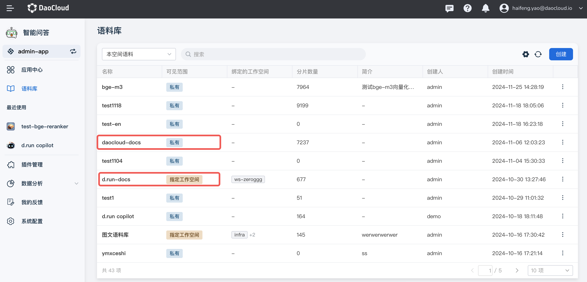
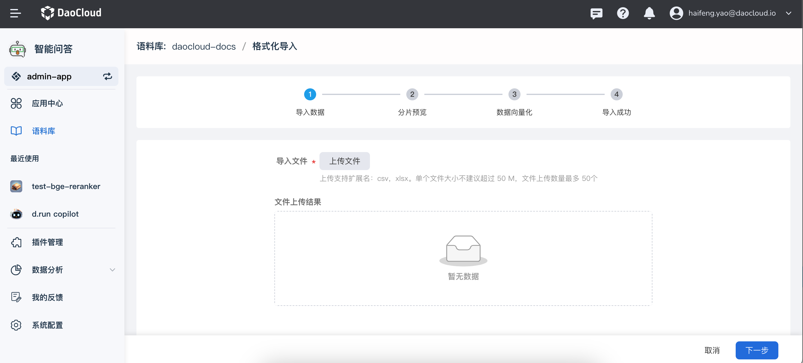
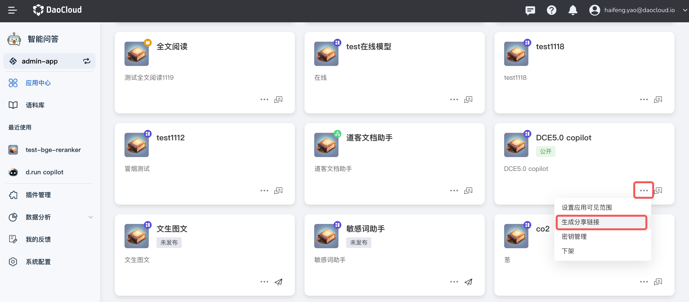

# 维护 ChatBot 聊天机器人

!!! note

    本文仅适合有权限的管理员阅读，方便维护 docs.d.run 和 docs.daocloud.io 等网站的聊天机器人。

## 环境

目前所用的维护环境为：
https://console.d.run/dak

需要有 DAK 的管理员权限。

## 维护语料库

1. 克隆 [docs-processor](https://gitlab.daocloud.cn/ats/drun-appstore/docs-processor)
仓库
1. 使用其中的 main.py 脚本，将文档站的 markdown 数据处理成 d.run 可以识别的 CSV 语料库。
   目前有 2 个语料库：

    - daocloud-docs 对应 docs.daocloud.io
    - d.run-docs 对应 docs.d.run

    

1. 比如点击 daocloud-docs，在右上角点击 **...** -> 格式化导入

    

1. 导入准备好的 CSV 文件，依次完成向导的步骤。

    

## 更新 ChatBot URL

!!! note

    一般不需要修改这个 URL。

如果 ChatBot 的 URL 发生变化，可以参考
[PR #5969](https://github.com/DaoCloud/DaoCloud-docs/pull/5969)，
在中英文目录的 main.html 中，增加以下 script 代码段：

```html
<script src="https://console.d.run/drun-copilot/chatbot-sdk.umd.js?ws=302&token=ZjgxNzgwNTktMmZjNS00NTZhLWI0YTItNzYyMzQ4MDE1MzFh"></script>
```

有关这个 URL，参阅下图：



## ChatBot 的前端 SDK

如果发现 ChatBot 有一些前端 Bug，可以查验和修改
[chatbot-sdk](https://gitlab.daocloud.cn/ats/drun-appstore/chatbot-sdk)
中的代码。
