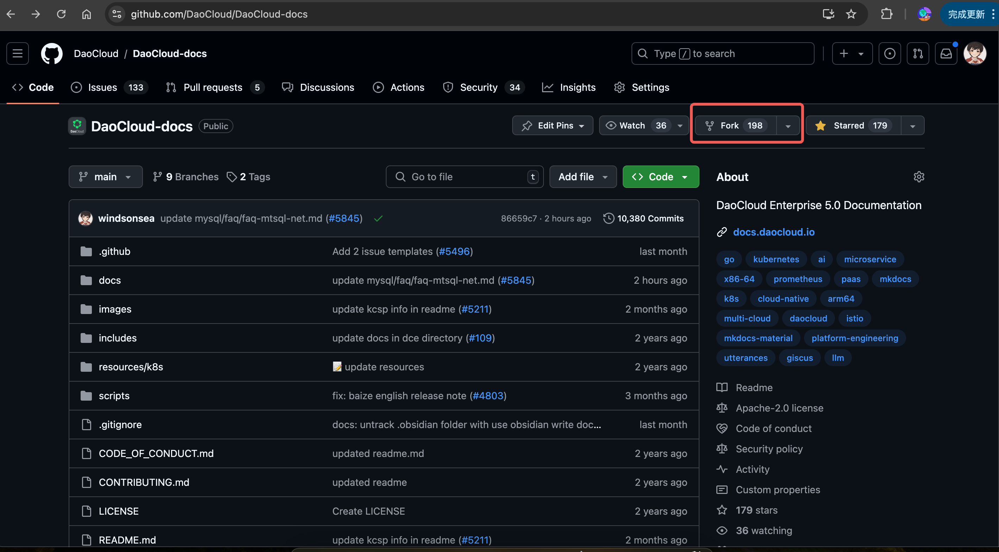
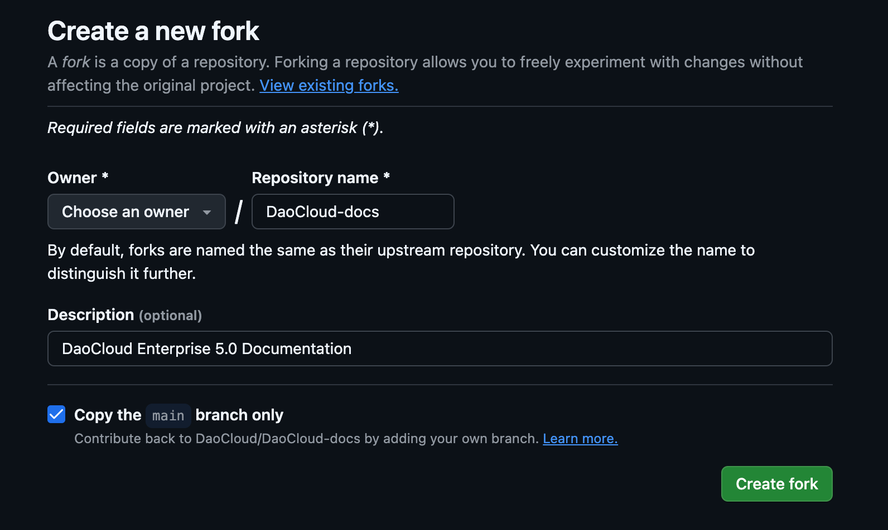
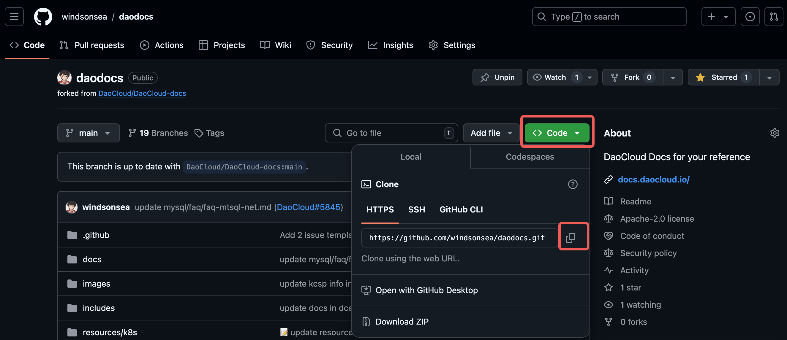

---
hide:
  - navigation
---

# 构建离线文档站

DCE 5.0 文档完全开源，所有原始 Markdown 文件都托管在 [GitHub](https://github.com/DaoCloud/DaoCloud-docs) 上，
采用 [Material for MkDocs](https://squidfunk.github.io/mkdocs-material/) 静态编译器编译，
遵循 GitHub 标准化 CI 流程，以 [Netlify](https://www.netlify.com/) 构建后将编译生成的 HTML
文件包存放在 UCloud 上，供海内外客户使用。

有些企业需要搭建离线的文档站，或者需要构建个性化的导航目录，可以参考本页说明下载/修改文档数据，在本地构建和运行文档站镜像。

## Fork 和 Clone

1. 打开文档仓库 [https://github.com/DaoCloud/DaoCloud-docs](https://github.com/DaoCloud/DaoCloud-docs)，点击 **Fork** 按钮

    

1. 简单配置后点击 **Create fork**

    

1. 点击右侧的 **Code** 选择一种方式，比如复制 HTTPS 地址

    

1. 在本地新建一个文件夹，进入命令行模式，运行以下命令克隆数据：

    ```git
    git clone https://github.com/windsonsea/daodocs.git
    ```

下载好全部数据后，你就可以复制到内部离线环境中修改任意 Markdown 文件。
推荐使用 Git 来做文档版本管理。另外，你也可以使用
[GitHub Codespace](https://docs.github.com/zh/codespaces/overview) 等云端环境进行在线调试。

## 本地修改文档

文档目录结构说明：

```shell 
├── .github # GitHub CI 流程配置
├── docs
│   ├── en
│   └── zh
│       ├── amamba     # 应用工作台
│       ├── baize      # AI Lab
│       ├── blogs      # 博客
│       ├── community  # 开源生态项目
│       ├── dce        # DCE 介绍
│       ├── download   # 下载中心
│       ├── ghippo     # 全局管理
│       ├── insight    # 可观测性
│       ├── install    # 安装
│       ├── kairship   # 多云编排
│       ├── kangaroo   # 镜像仓库
│       ├── kant       # 云边协同
│       ├── kpanda     # 容器管理
│       ├── middleware # 中间件
│       ├── mspider    # 服务网格
│       ├── native     # 云原生研究院
│       ├── network    # 网络
│       ├── security   # 安全
│       ├── skoala     # 微服务
│       ├── storage    # 存储
│       ├── videos     # 视频教程
│       ├── virtnest   # 虚拟机
└── scripts # 常用脚本
```

文档站插件和导航配置：

- mkdocs.yml

    这是 MkDocs 构建时会读取的插件配置文档，你可以配置 plugins 和 extensions。
    比如你可以在 plugins 部分添加：

    ```yaml
    plugins:
      - offline
    ```

    让构建出的离线包支持 [MkDocs 离线插件](https://squidfunk.github.io/mkdocs-material/plugins/offline/)。

- navigation.yml

    中英目录都有这样一个 YAML 文件，控制文档站左侧的导航。
    你可以根据自己采购的模块，定制专属的 Nav 导航目录。
    **这一部分可能就是你主要的工作量和日常修改任务。**

整个文档站的原始数据采用 Markdown 格式，你可以用 [VSCode](https://code.visualstudio.com/) 等编辑器进行编辑。

## 本地 mkdocs build

比如你在本地修改某个中文页面后，你可以进入 zh 目录，执行 build 操作：

```shell
cd docs/zh
mkdocs build
```

Build 成功后，会出现一个 site 目录，其中包含了 MkDocs 编译生成的所有 HTML 文件：

```console
├── site
│   ├── amamba
│   ├── baize
│   ├── blogs
│   ├── community
│   ├── dce
│   ├── download
...
```

点击 **site/index.html** 就可以离线查看文档页面。

!!! tip

    如果 `mkdocs build` 出现插件类的报错：

    ```log
    ERROR   -  Config value 'plugins': The "swagger-ui-tag" plugin is not installed
    ```

    可以在 mkdocs.yml 中临时注释掉提示有问题的插件后重试：

    ```yaml
    ...
    #  - swagger-ui-tag
    #  - redirects:
    ...
    ```

## 构建和运行镜像

完成本地修改和 `mkdocs build` 后，你可以参考以下步骤构建和运行镜像。

1. 创建 Dockerfile

    在 site 目录下创建一个名为 `Dockerfile` 的文件：

    ```dockerfile title="Dockerfile"
    # 使用一个基础镜像，例如 nginx
    FROM nginx:alpine

    # 将 site 目录复制到 nginx 的默认目录
    COPY site /usr/share/nginx/site/

    # 公开端口
    EXPOSE 80
    ```

1. 构建 Docker 镜像

    在终端中，确保你在 `site` 目录下，运行以下命令构建 Docker 镜像：

    ```shell
    docker build -t site .
    ```

    其中 `-t site` 是给镜像起的名字，`.` 表示 Dockerfile 在当前目录。

1. 运行 Docker 镜像并启动一个容器：

    ```bash
    docker run -d -p 8080:80 site
    ```

    其中，`-d` 表示在后台运行容器，`-p 8080:80` 将主机的 8080 端口映射到容器的 80 端口。

1. 打开浏览器，访问 `http://localhost:8080`，你应该能看到离线文档站页面。

## 其他用法

另外你可以将 [mkdocs build](#mkdocs-build) 和[构建镜像](#_3)合并为一个流程，比如编写这样一个脚本：

```bash title="build_and_run.sh"
#!/bin/bash

# 设置工作目录
WORK_DIR="docs/zh"
SITE_DIR="$WORK_DIR/site"

# 进入工作目录
cd "$WORK_DIR" || { echo "目录 $WORK_DIR 不存在"; exit 1; }

# 执行 mkdocs build
mkdocs build

# 检查 mkdocs build 是否成功
if [ $? -ne 0 ]; then
    echo "mkdocs build 失败"
    exit 1
fi

# 创建 Dockerfile
cat << EOF > "$SITE_DIR/Dockerfile"
# 使用一个基础镜像，例如 nginx
FROM nginx:alpine

# 将 site 目录复制到 nginx 的默认目录
COPY site /usr/share/nginx/site/

# 公开端口
EXPOSE 80
EOF

# 构建 Docker 镜像
docker build -t site "$SITE_DIR"

# 检查 Docker build 是否成功
if [ $? -ne 0 ]; then
    echo "Docker 镜像构建失败"
    exit 1
fi

# 运行 Docker 镜像并启动一个容器
docker run -d -p 8080:80 site

# 检查 Docker run 是否成功
if [ $? -ne 0 ]; then
    echo "Docker 容器启动失败"
    exit 1
fi

echo "容器已成功启动，您可以访问 http://localhost:8080"
```

然后在终端运行：

```shell
chmod +x build_and_run.sh
./build_and_run.sh
```

!!! note

    - 确保已安装了 MkDocs 和 Docker，使其命令可以在终端中运行。
    - 上述脚本会根据你的工作目录和 `site` 目录路径进行操作，确保路径正确。
    - 如果需要在 Dockerfile 中做其他自定义配置，可以在脚本中相应修改 `Dockerfile` 的内容。

当然，你可以在修改 Markdown 文件后，批量执行更多自动化的操作，例如设计更加优秀的 Dockerfile。

## 参考链接

- [DCE 5.0 文档站仓库](https://github.com/DaoCloud/DaoCloud-docs)
- [Material for MkDocs 官网](https://squidfunk.github.io/mkdocs-material/)
- [Git 文档流程](https://docs.daocloud.io/native/git/)
