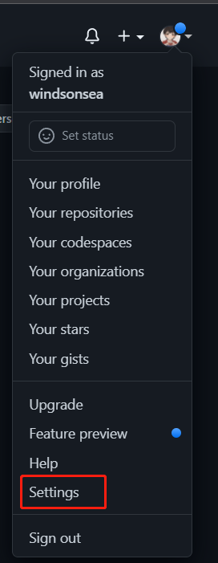
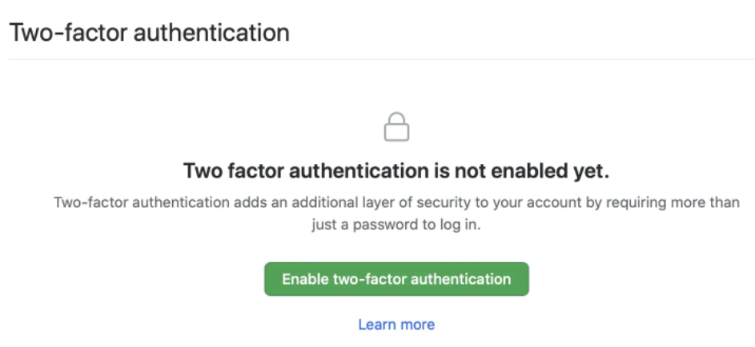
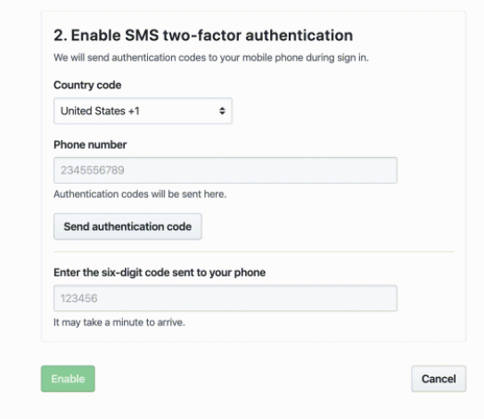
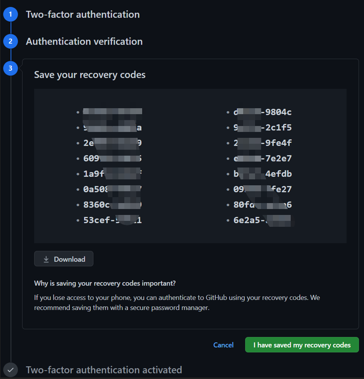
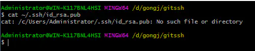
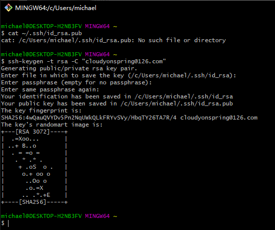
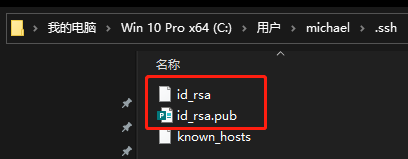
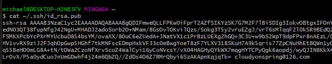
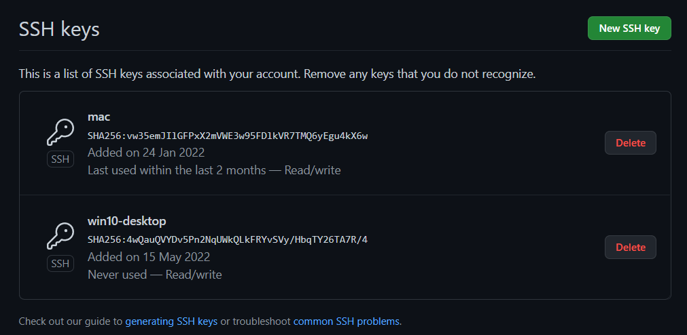

# GitHub 开启两步安全验证

想要成为 GitHub member、reviewer、approver 或某些项目的 owner，你除了需要签署 CLA 之外，
账号还需经过 two-factor authentication，也就是两步安全验证。

## 开启两步验证

1. 登录 GitHub，在右上角的头像旁，点击下拉箭头，选择 `Settings`。

    

2. 选择 `Password and authentication` -> `Enable two-factor authentication`。

    

3. 选择 sms 短信认证方式。

    

4. 找了半天发现没有 China -_! 还好办法总比问题多。例如在 Chrome 中，右键点击当前页面，选择 `检查`-> `Console`，在光标处运行以下命令：

    ```bash
    var option = new Option("China +86","+86");
    option.selected = true;
    document.getElementById('countrycode').options.add(option, 0);
    ```

5. 现在出现 +86 了，输入你的手机号，点击 `Send authentication code`，输入手机短信的六位码进行验证，屏幕将显示 16 个 recovery code。

    

    > 这个 recovery code 最好打印下来，电子版也要 download 存放好。 

6. 点击 `I have saved my recovery codes`。恭喜你，屏幕出现了天女散花，两步验证设置成功了。

## 设置 ssh-keygen 或 access token

开启了二次验证后，命令行 clone/pull/push 会一直提示输入用户名和密码。有两个解决方法：

### 方法 1：设置 ssh-keygen

1. 在 git bash 中运行以下命令，检查本机是否存在 ssh key。
   
    ```bash
    cat ~/.ssh/id_rsa.pub
    ```
    
    

2. 如果没有，则运行以下命令创建一个 ssh key。

    ```bash
    ssh-keygen -t rsa -C "你的邮箱地址"
    ```
   
    

3. 一直敲回车，全部使用默认值即可。完成后就会在用户目录生成两个文件：
   
    - 私钥 id_rsa
    - 公钥 id_rsa.pub

    

4. 执行以下命令获取公钥:

    ```bash
    cat ~/.ssh/id_rsa.pub
    ```
    
    

5. 登录 GitHub，依次点击 `Settings` -> `SSH and GPG keys` -> `New SSH key`，随意给个 Title，在 Key 文本框中输入上一步获取的公钥后保存。

    

### 方法 2：申请 Access Token

1. 登录 GitHub，从右上角进入 Settings 页面，依次点击 Developer settings -> Personal access tokens，创建一个 Token。
  
    > 保存好这个 Token，最好保存到本机，因为离开页面就找不到这个 token 了。

2. 在命令行执行以下命令保存认证信息。
   
    ```bash
    git config --global credential.helper store
    ```

3. 运行 git clone xxx 命令，提示输入 UserName 和 Token。这样就会在用户根目录生成一个名为 `.git-credentials` 的文件，里面保存了你的 UserName 和 Token。
