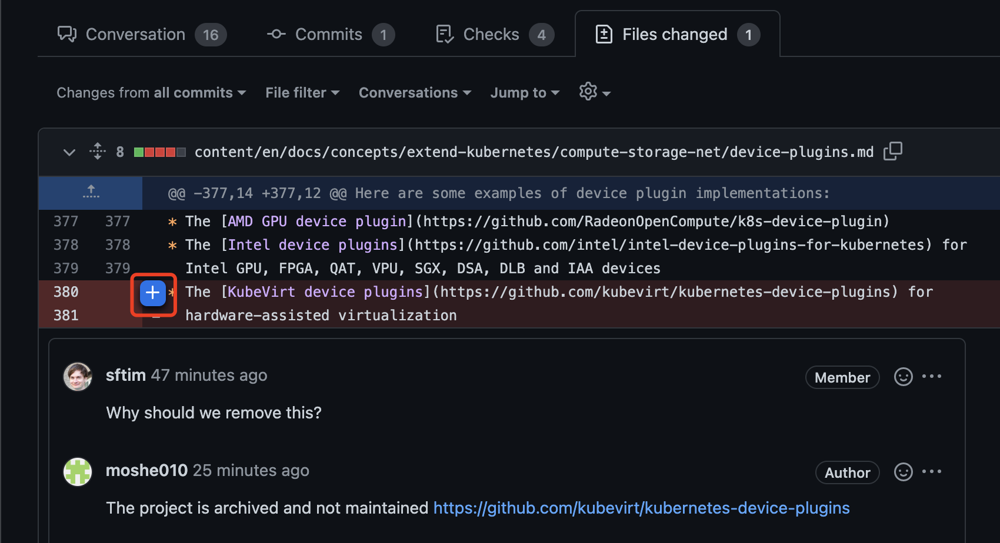
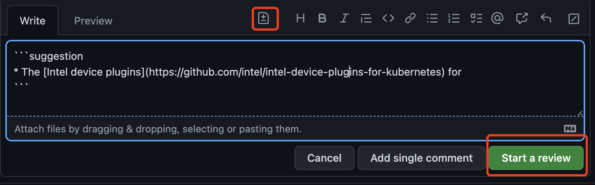
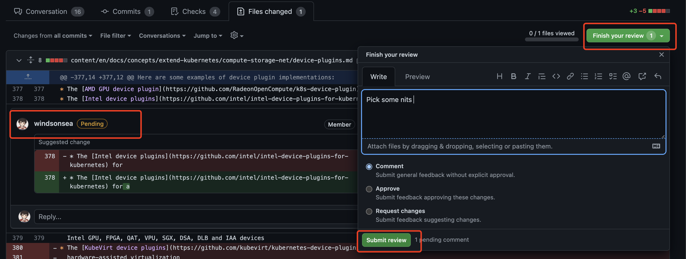
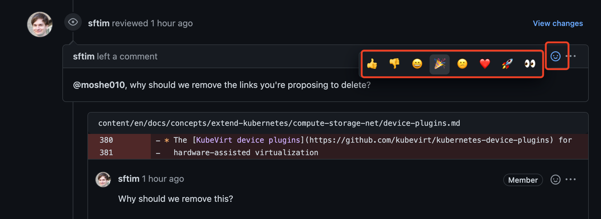

# 混迹 GitHub 社区的技巧

GitHub 号称有 8000 万名开发者活跃，如何能在目标社区展露头角？

一方面需要你自己的专业水平过硬，另一方面需要了解一些社区礼仪和基本技巧。

## 在社区留痕的形式

- PR 和 Issue

    提了一个 PR 或 Issue 后，如果有人留下 comments，一定要及时回复和处理！

    因为社区的 8000 万人，90% 的时间都在用 comments 交流。
    想象一下，如果你在企业微信给同事留了一条言，而对方 10 天半个月才答复，你是什么感受？？？

- Comment 评论

    看到一个 PR 或 Issue 时，如果心中有所疑问，或看出了什么问题，要积极留下 comments。

    1. 点击每一行左侧的 `+` 号

        
    
    2. 点击 `Add a suggestion` 图标，修改代码后，点击 `Start a review`

        

        !!! warning

            尽量不要点击 `Add single comment`，除非你真的只有一条 comment。
            这是因为你每一条 comment，都会给这个 PR 的作者、Reviwer、关注者群发一封邮件！
            如果你连续点击 `Add single comment`，将对这些人的邮箱形成轰炸效果，Spam!!!

    3. 看完全文，做了所有 comment 之后，点击右上角 `Finish your review`，勾选 `Comment` 后点击 `Submit review`。

        

- 表示关注

    如果你对某个 PR 感兴趣，但暂时没有合适的 comment，可以用表情符号来留下痕迹。

    

!!! tip

    走过路过，千万不要沉默！！！让大家知道你来过！！！
