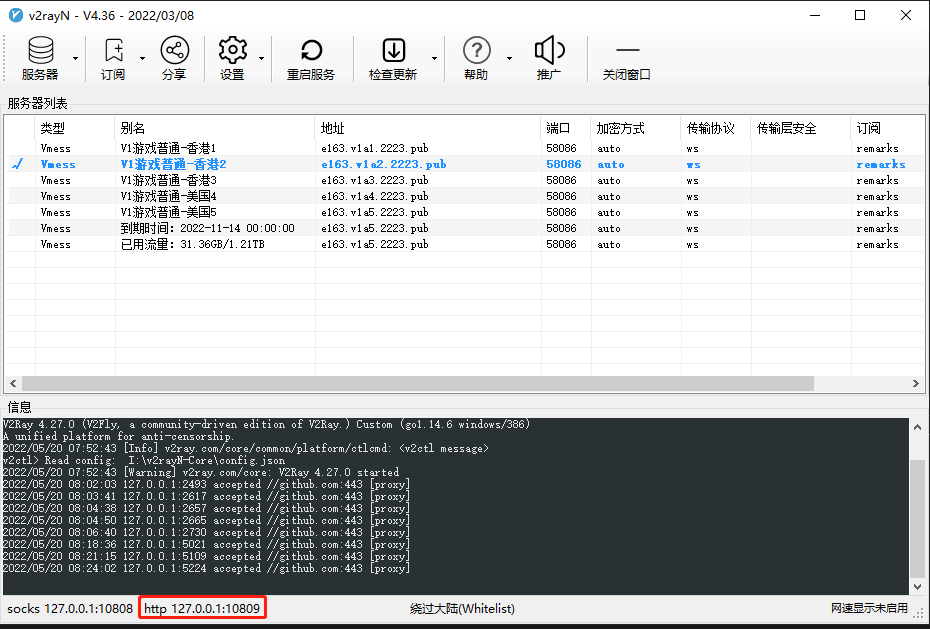
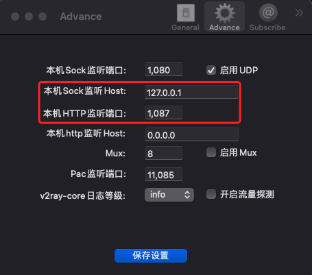

# Git 代理设置问题

代理俗称梯子、科学上网、翻墙等等，这是使用 GitHub 的第一步。

对于 GitHub，有时候虽然开启了代理，但 `git clone` 的速度还是超级慢，每秒只有几 K 几十 K，还经常 push timeout，这不能忍！

## Win10

显示隐藏文件，修改系统盘的用户根目录的 `.gitconfig` 文件。

1. 查找你的 http 代理地址和端口号。

    

2. 在系统盘的用户根目录找到 `.gitconfig` 文件，比如我的电脑是：

    ```path
    C:\Users\michael\.gitconfig
    ```

3. 编辑 `.gitconfig` 文件，在底部增加这两行：

    ```bash
    [http]
        proxy = http://127.0.0.1:10809
    [https]
        proxy = https://127.0.0.1:10809
    ```

4. 保存退出，去重新运行 `git clone` 命令，速度提高了 100 倍，哈哈。我的 .gitconfig 示例配置如下：

    ```git
    [user]
        email = example@gmail.com
        name = Michael
    [http]
        sslVerify = false
        proxy = http://127.0.0.1:10809
    [https]
        sslVerify = false
        proxy = https://127.0.0.1:10809
    [filter "lfs"]
        clean = git-lfs clean -- %f
        smudge = git-lfs smudge -- %f
        process = git-lfs filter-process
        required = true
    ```

## Mac

显示隐藏文件，修改当前用户根目录下的 `.gitconfig` 文件。

1. 在终端中运行以下命令，显示隐藏文件：

    ```bash
    defaults write com.apple.finder AppleShowAllFiles -boolean true; killall Finder
    ```

2. 打开梯子，查找 http 代理地址和端口号。

    

3. 在用户根目录，找到 `.gitconfig` 文件，用 VScode 等编辑器进行修改。

    ```git
    [user]
        email = example@gmail.com
        name = Michael
    [http]
        sslVerify = false
        proxy = http://127.0.0.1:1087
    [https]
        sslVerify = false
        proxy = https://127.0.0.1:1087
    [filter "lfs"]
        clean = git-lfs clean -- %f
        smudge = git-lfs smudge -- %f
        process = git-lfs filter-process
        required = true
    ```

## 手动设置

另外一种方法是运行以下命令，单独为 github 设代理地址和端口：

```git
git config --global http.https://github.com.proxy https://127.0.0.1:10809
git config --global https.https://github.com.proxy https://127.0.0.1:10809
```

如果你想设全局代理，则运行以下命令：

```git
git config --global http.proxy http://127.0.0.1:10809
git config --global https.proxy https://127.0.0.1:10809
```
