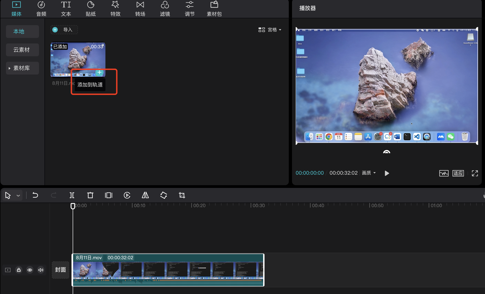

# 视频录制和剪辑教程

本文以 MacOS 上的 QuickTime 和剪映为例，简要说明视频录制和剪辑的大致步骤。

## 准备工具

录屏软件只要能够：

1. 导出视频无水印
2. 支持录入麦克风声音，即可用来录制产品操作视频。

因此，你可以使用自己常用的录屏软件，也可以使用下面推荐的软件：

- MacOS: QuickTime Player
  
    这是系统自带的录屏软件，无需下载。
    优点是不限制录屏时长，视频背景无水印，可以录入麦克风声音，且简单易用。
    缺点是功能略显单薄，但对于录制产品操作视频而言足够了。

    !!! tip

        QuickTime Player 默认不支持录入系统声音。
        如需录制系统声音，需要安装插件 [Soundflower](https://soundflower.en.softonic.com/mac)。

- Windows: [Bandicam](https://www.bandicam.cn/)
  
    适用于 Windows 系统的录屏软件，功能强大。
    免费版最长可录制 10 分钟且导出视频会有水印，使用[其他版本](https://pan.baidu.com/s/1454QrpmxV2tyd4lM2sR_dQ)可以避免这个问题。

- MacOS/Windows：[OBS Studio](https://obsproject.com/)

    这是一款开源的录屏软件，功能强大，可以跨平台使用。

- 剪辑软件：[剪映](https://www.capcut.cn/)或其海外版 [CapCut](https://www.capcut.com/zh-tw/)。
  进阶之后，可以试试 [After Effects](https://www.adobe.com/products/aftereffects.html) 和
  [Adobe Premiere Pro](https://www.adobe.com/products/premiere.html)

- 当然一名专业的视频剪辑师，只有上述几个软件是不够的，海量自由的素材库、关键帧等高级运用技巧、美感和节奏的把控、定向垂直领域投放才是说话的底气。

言归正传，本文只介绍简单的操作视频制作步骤，供大家参考和统一风格。

## 开场白与结束语

使用统一的开场白：“本次视频录制的主题是如何 xxx”。例如：“本视频介绍的主题是如何接入集群。”

使用统一的结束语：“以上就是本次视频的全部内容，感谢您的观看“

录制期间需要自己解说操作，作为旁白。普通话不标准没关系，后期会使用软件替换。录制期间自己解说主要为了便于软件识别与转换，
无需手动添加字幕、无需大量调节音频，可以省去不少时间。咬字清楚、节奏恰当可以提高软件识别/转换的准确度，减少后期的手动调整量。

## 录制视频

鉴于公司内部大多数同事使用的都是 MacBook，下面就以 Mac 自带的 QuickTime Player 为例来说明如何录制产品操作视频。

1. 新建屏幕录制
   
    右键点击 QuickTime Player 图标，选择 **新建屏幕录制**

    

2. 调整录屏设置

    - 选择 **录制所选部分** ，下图中的红框 1，不要录入与视频无关的标题栏、底部导航栏等内容，
    - 自定义录屏文件的存储位置，下图中的红框 2
    - 选择麦克风，外接设备或系统麦克风均可，下图中的红框 3
    - 选择 **显示鼠标点按** ，下图中的红框 4

    

3. 开始/结束录制

    - 调整好录屏设置后，点击 **录制** 开始录屏。
  
        > **重要：录屏开始时记得说开场白、期间需要自己解说操作，以及结束时别忘了说结束语。**

        
     
        查看屏幕右上方的状态栏是否出现如下标志，如果出现则说明系统正在录屏。
     
        

    - 想要结束录制时，点击上图中的圆圈即可退出录屏。

## 添加和修改字幕

录屏好视频之后，需要为视频添加字幕。

剪映是一款跨平台的音视频剪辑软件，支持智能识别音屏并自动添加字幕。
使用剪映的智能识别音屏和自动添加字幕功能后，我们只需要对自动生成的字幕稍作调整即可，可以节省不少时间。

1. 导入视频文件

    在图示界面上点击 **导入** ，选择刚才录制好的文件进行导入：
    
    

2. 将视频添加到轨道
    
    点击 **+** 将视频添加到轨道。
    
    

3. 智能识别音频与字幕
   
    在底部的操作区中，右键点击视频，选择 **识别字幕/歌词** ：

    

4. 调整字幕片段

    音频识别完成后，系统会自动根据识别结果添加字幕。在右上角的操作区，点击播放按钮（下图中的红框 1），查看整体效果。如有字幕需要调整，可参考如下操作：
    
    - 选择需要调整的字幕，下图中的红框 2
    - 如需调整字幕出现的时间点，直接在下方的操作区前后拖动所选中的字幕片段即可，下图中的红框 2
    - 如有文字识别错误，可在文本框进行调整，下图中的红框 3
    - 字幕样式：颜色统一使用黑色，其他使用默认设置
    - 字幕在页面中的位置：统一放在页面底部中间位置

    

## 添加和修改音频

1. 关闭原声
   
    添加音频之前，为避免干扰，需要关闭视频中的原声。**关闭原声之后，最终的视频中就听不到自己旁白的声音了** 。

    

2. 添加配音
   
    调整完字幕之后，选中所有字幕片段，在右上角的操作区选择 **朗读** --> **知性女声** --> **开始朗读** 。

    

3. 调节音频
   
    朗读结束后，系统会自动生成一个音频轨道，根据需要对音频片段进行调整即可。

    音频的音量使用默认值即可，无需修改。

4. 添加背景轻音乐
   
    在左上角的工作区，选择 **音频** --> **轻快** --> **Light Ukulele** ，点击 **+** 号将该背景音添加到轨道，在右侧将背景音的音量调节为 **-24.0 db** 。

    

5. 调整背景音使其符合视频时长

    如果背景音太短，可以选中第一段背景音通过**复制粘贴**延长背景音。如果最后一段背景音超出了视频长度，将标志线拉到视频结尾，选中最后一段背景音，选择 **分割** ，然后将多余的背景音删除即可。

    

## 封面和封底

字幕、音频、背景音都调整好之后，在视频前选择 **封面** --> **本地** ，添加本地封面，并进行适当的编辑之后，点击 **完成设置** 即可。

所有 DCE 5.0 的操作视频都使用统一的封面模板，只需更改主题文字即可。


- [下载封面 PPT](./images/video-cover-template.pptx)：在 PPT 中修改标题，然后导出为图片
- [下载中文封底 16:9](images/end-cover16-9.png)
- [下载中文封底 16:10](images/end-cover16-10.png)
- [下载中英双语封底视频](./images/back-cover.mp4)

## 导出视频

调整完所有字幕后，在右上角点击 **导出** ，勾选 **封面添加至视频片头** ，填写文件名、存储位置，选择导出格式为 **mp4** ，其余选项使用默认值即可，最后点击 **导出** 即可。


至此，录制视频和添加字幕就完成了，可以自己再完整地观看一遍。

## 上传和发布

视频确认没问题之后就可以上传到 UCloud 对象存储，你会拿到一个 `https://` 开头的链接。

然后在 Markdown 中使用以下语法，发布到[视频中心](../../../videos/index.md)。

```html
<div class="responsive-video-container">
<video controls src="https://harbor-test2.cn-sh2.ufileos.com/docs/videos/create-pipeline.mp4" preload="metadata" poster="images/amamba-pipeline.png"></video>
</div>
```
