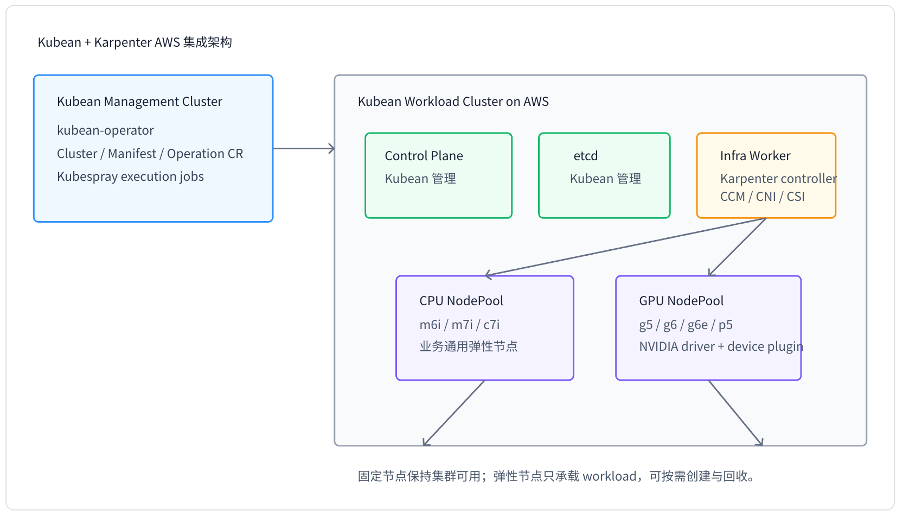
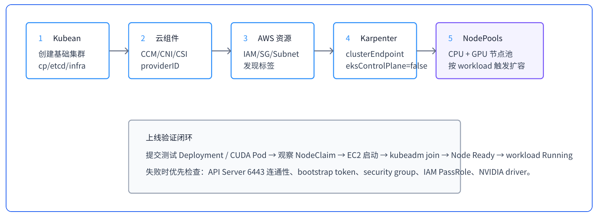

# Kubean 集群集成 Karpenter AWS 弹性节点 Preview 方案（含 GPU）

## 1. 方案定位

这套方案的边界非常清晰：Kubean 管“集群生命周期”，Karpenter 管“云上弹性 worker 容量”。Karpenter 不负责 control-plane、etcd，也不替代 Kubean 的升级、扩容和运维流程。

**Kubean 负责**

- 创建 control-plane、etcd、infra worker
- 维护 Kubernetes 版本、Kubespray 配置与基础组件
- 提供稳定承载 Karpenter controller 的基础节点

**Karpenter 负责**

- 根据 pending pods 创建 AWS EC2 worker
- 通过 EC2NodeClass 和 NodePool 管理 CPU/GPU 弹性节点池
- 节点空闲、漂移或低利用率时自动回收

| 组件 | 职责 |
| --- | ---- |
| **Kubean** | - 创建 control-plane、etcd、infra worker<br>- 维护 Kubernetes 版本、Kubespray 配置与基础组件<br>- 提供稳定承载 Karpenter controller 的基础节点 |
| **Karpenter** | - 根据 pending pods 创建 AWS EC2 worker<br>- 通过 `EC2NodeClass` 和 `NodePool` 管理 CPU/GPU 弹性节点池<br>- 节点空闲、漂移或低利用率时自动回收 |



## 2. 可行性与关键约束

| 维度 | 可行性判断 | 落地要求 |
| :-- | :------- | :------ |
| 控制平面 | Karpenter 支持自定义 Kubernetes API Server endpoint。 | 配置 `clusterEndpoint`、`clusterCABundle`、`eksControlPlane=false`。 |
| 节点加入 | 可行，但不是 EKS 自动 bootstrap。 | 使用 `amiFamily: Custom`，在 userData 中执行 kubeadm join 或等价 bootstrap。 |
| AWS 云集成 | 可行。 | 安装 AWS Cloud Controller Manager，节点 kubelet 使用 `cloud-provider=external`。 |
| GPU | 可行。 | GPU AMI 预装 NVIDIA driver/container runtime，集群安装 NVIDIA device plugin。 |
| 生产边界 | 推荐职责隔离。 | Kubean 只管固定节点；Karpenter 只管弹性 worker。 |

**风险提示：**
不要让 Karpenter 管理 control-plane、etcd 或承载 Karpenter controller 的 infra worker。否则弹性回收、漂移或配置错误可能影响集群自愈能力。

## 3. 凭证与占位符清单

| 类别 | 占位符 | 说明 |
| :--- | :--- | :--- |
| Kubean SSH | `<KUBEAN_NODE_SSH_USER>`, `<KUBEAN_NODE_SSH_PRIVATE_KEY>`, `<KUBEAN_NODE_SSH_PORT>` | Kubean/Kubespray 访问基础节点。 |
| Kubernetes Bootstrap | `<KUBE_APISERVER_DNS_NAME>`, `<BASE64_CLUSTER_CA_BUNDLE>`, `<KUBEADM_BOOTSTRAP_TOKEN>`, `<KUBEADM_CA_CERT_HASH>` | 新 EC2 节点加入自建集群。 |
| AWS 控制器 | `<AWS_REGION>`, `<AWS_ACCESS_KEY_ID_FOR_KARPENTER_CONTROLLER>`, `<AWS_SECRET_ACCESS_KEY_FOR_KARPENTER_CONTROLLER>` | 仅在不能使用 Instance Profile 时使用静态凭证。 |
| AWS 节点身份 | `<KARPENTER_NODE_IAM_ROLE_NAME>`, `<KARPENTER_NODE_INSTANCE_PROFILE_NAME>` | Karpenter 创建出来的 worker 节点身份。 |
| AWS 网络 | `<AWS_VPC_ID>`, `<AWS_PRIVATE_SUBNET_ID_A>`, `<KARPENTER_NODE_SECURITY_GROUP_ID>`, `<CONTROL_PLANE_SECURITY_GROUP_ID>` | EC2 放置位置和 API Server 连通性。 |
| AMI | `<KARPENTER_CPU_WORKER_AMI_ID>`, `<KARPENTER_GPU_WORKER_AMI_ID>` | CPU/GPU 节点建议使用不同 AMI。 |
| GPU | `<NVIDIA_DRIVER_VERSION>`, `<CUDA_VERSION>`, `<NVIDIA_DEVICE_PLUGIN_VERSION>` | GPU 节点镜像和插件版本。 |

!!! note

    生产环境优先使用 EC2 Instance Profile、SSM Parameter Store 或 Secrets Manager，避免把长期 AWS AK/SK 或长期 kubeadm token 写入 manifest。

## 4. 部署流程



1. 用 Kubean 创建 control-plane、etcd、infra worker。
2. 安装并验证 CNI、AWS Cloud Controller Manager、EBS CSI Driver。
3. 准备 AWS IAM role、instance profile、subnet/security group 发现标签。
4. 创建 kubeadm bootstrap token，或把 bootstrap 配置放入 SSM/Secrets Manager。
5. 安装 Karpenter，配置自定义控制平面的 endpoint 和 CA。
6. 创建 CPU EC2NodeClass/NodePool。
7. 创建 GPU EC2NodeClass/NodePool，并安装 NVIDIA device plugin。
8. 用普通 workload 和 CUDA sample 分别验证 CPU/GPU 弹性扩容。

## 5. Karpenter 安装配置

```yaml
settings:
  clusterName: &lt;CLUSTER_NAME&gt;
  clusterEndpoint: https://&lt;KUBE_APISERVER_DNS_NAME&gt;:6443
  clusterCABundle: &lt;BASE64_CLUSTER_CA_BUNDLE&gt;
  eksControlPlane: false
  isolatedVPC: false
  interruptionQueue: &lt;KARPENTER_INTERRUPTION_QUEUE_NAME_OR_EMPTY&gt;

controller:
  env:
    - name: AWS_REGION
      value: <AWS_REGION>
    - name: AWS_ACCESS_KEY_ID
      valueFrom:
        secretKeyRef:
          name: karpenter-aws-credentials
          key: AWS_ACCESS_KEY_ID
    - name: AWS_SECRET_ACCESS_KEY
      valueFrom:
        secretKeyRef:
          name: karpenter-aws-credentials
          key: AWS_SECRET_ACCESS_KEY

nodeSelector:
  node-role.kubernetes.io/infra: ""

tolerations:
  - key: CriticalAddonsOnly
    operator: Exists
```

**推荐：**
如果 infra worker 运行在 AWS EC2 上，优先通过 infra worker 的 Instance Profile 给 Karpenter controller 授权，而不是注入静态 AWS AK/SK。

## 6. CPU 弹性节点池

```yaml
apiVersion: karpenter.k8s.aws/v1
kind: EC2NodeClass
metadata:
  name: kubean-aws-cpu
spec:
  amiFamily: Custom
  amiSelectorTerms:
    - id: &lt;KARPENTER_CPU_WORKER_AMI_ID&gt;
  subnetSelectorTerms:
    - tags:
        karpenter.sh/discovery: &lt;CLUSTER_NAME&gt;
  securityGroupSelectorTerms:
    - tags:
        karpenter.sh/discovery: &lt;CLUSTER_NAME&gt;
  role: &lt;KARPENTER_NODE_IAM_ROLE_NAME&gt;
  userData: |
    #!/bin/bash
    set -euxo pipefail
    INSTANCE_ID="$(curl -s http://169.254.169.254/latest/meta-data/instance-id)"
    AWS_AZ="$(curl -s http://169.254.169.254/latest/meta-data/placement/availability-zone)"
    PROVIDER_ID="aws:///${AWS_AZ}/${INSTANCE_ID}"
    mkdir -p /etc/systemd/system/kubelet.service.d
    cat &gt;/etc/systemd/system/kubelet.service.d/20-karpenter.conf &lt;&lt;EOF
    [Service]
    Environment="KUBELET_EXTRA_ARGS=--cloud-provider=external --provider-id=${PROVIDER_ID} --register-with-taints=karpenter.sh/unregistered:NoExecute --node-labels=node.lifecycle=karpenter"
    EOF
    systemctl daemon-reload
    systemctl enable containerd
    systemctl start containerd
    kubeadm join https://&lt;KUBE_APISERVER_DNS_NAME&gt;:6443 \
      --token &lt;KUBEADM_BOOTSTRAP_TOKEN&gt; \
      --discovery-token-ca-cert-hash sha256:&lt;KUBEADM_CA_CERT_HASH&gt; \
      --node-name "${INSTANCE_ID}"
    systemctl restart kubelet

---
apiVersion: karpenter.sh/v1
kind: NodePool
metadata:
  name: workload-general
spec:
  template:
    metadata:
      labels:
        node.lifecycle: karpenter
        workload-tier: general
    spec:
      nodeClassRef:
        group: karpenter.k8s.aws
        kind: EC2NodeClass
        name: kubean-aws-cpu
      requirements:
        - key: kubernetes.io/arch
          operator: In
          values: ["amd64"]
        - key: karpenter.sh/capacity-type
          operator: In
          values: ["spot", "on-demand"]
        - key: node.kubernetes.io/instance-type
          operator: In
          values: ["m6i.large", "m6i.xlarge", "m7i.large", "m7i.xlarge"]
  limits:
    cpu: "500"
    memory: 1000Gi
  disruption:
    consolidationPolicy: WhenEmptyOrUnderutilized
    consolidateAfter: 5m
```

## 7. GPU 弹性节点池

GPU 节点建议与 CPU 节点完全拆开：单独 AMI、单独 EC2NodeClass、单独 NodePool、单独 taint。这样可以避免普通 Pod 占用昂贵 GPU 节点的 CPU 和内存。

| 场景 | 推荐实例 | 调度策略 |
| :-- | :------ | :------ |
| 推理 / 视频处理 | g6.xlarge、g6.2xlarge、g6.4xlarge、g6.8xlarge | 可考虑 spot + on-demand 混合。 |
| 中小训练 / A10G 生态 | g5.xlarge、g5.12xlarge、g5.24xlarge、g5.48xlarge | 建议先 on-demand，成熟后再放开 spot。 |
| 大模型训练 | p4d、p5、p5e 等 | 单独 NodePool，结合队列、checkpoint 和容量预留。 |

```yaml
apiVersion: karpenter.k8s.aws/v1
kind: EC2NodeClass
metadata:
  name: kubean-aws-gpu
spec:
  amiFamily: Custom
  amiSelectorTerms:
    - id: &lt;KARPENTER_GPU_WORKER_AMI_ID&gt;
  subnetSelectorTerms:
    - tags:
        karpenter.sh/discovery: &lt;CLUSTER_NAME&gt;
  securityGroupSelectorTerms:
    - tags:
        karpenter.sh/discovery: &lt;CLUSTER_NAME&gt;
  role: &lt;KARPENTER_NODE_IAM_ROLE_NAME&gt;
  blockDeviceMappings:
    - deviceName: /dev/xvda
      ebs:
        volumeSize: 200Gi
        volumeType: gp3
        encrypted: true
        deleteOnTermination: true
  userData: |
    #!/bin/bash
    set -euxo pipefail
    INSTANCE_ID="$(curl -s http://169.254.169.254/latest/meta-data/instance-id)"
    AWS_AZ="$(curl -s http://169.254.169.254/latest/meta-data/placement/availability-zone)"
    PROVIDER_ID="aws:///${AWS_AZ}/${INSTANCE_ID}"
    mkdir -p /etc/systemd/system/kubelet.service.d
    cat &gt;/etc/systemd/system/kubelet.service.d/20-karpenter.conf &lt;&lt;EOF
    [Service]
    Environment="KUBELET_EXTRA_ARGS=--cloud-provider=external --provider-id=${PROVIDER_ID} --register-with-taints=karpenter.sh/unregistered:NoExecute,gpu=true:NoSchedule --node-labels=node.lifecycle=karpenter,node.accelerator=nvidia-gpu"
    EOF
    systemctl daemon-reload
    systemctl enable containerd
    systemctl start containerd
    nvidia-smi || true
    kubeadm join https://&lt;KUBE_APISERVER_DNS_NAME&gt;:6443 \
      --token &lt;KUBEADM_BOOTSTRAP_TOKEN&gt; \
      --discovery-token-ca-cert-hash sha256:&lt;KUBEADM_CA_CERT_HASH&gt; \
      --node-name "${INSTANCE_ID}"
    systemctl restart kubelet

---
apiVersion: karpenter.sh/v1
kind: NodePool
metadata:
  name: workload-gpu-l4
spec:
  template:
    metadata:
      labels:
        node.lifecycle: karpenter
        node.accelerator: nvidia-gpu
        gpu.workload: inference
    spec:
      nodeClassRef:
        group: karpenter.k8s.aws
        kind: EC2NodeClass
        name: kubean-aws-gpu
      taints:
        - key: gpu
          value: "true"
          effect: NoSchedule
      requirements:
        - key: kubernetes.io/arch
          operator: In
          values: ["amd64"]
        - key: karpenter.sh/capacity-type
          operator: In
          values: ["spot", "on-demand"]
        - key: karpenter.k8s.aws/instance-family
          operator: In
          values: ["g6"]
        - key: karpenter.k8s.aws/instance-gpu-manufacturer
          operator: In
          values: ["nvidia"]
        - key: karpenter.k8s.aws/instance-gpu-name
          operator: In
          values: ["l4"]
        - key: karpenter.k8s.aws/instance-gpu-count
          operator: In
          values: ["1"]
  limits:
    nvidia.com/gpu: "20"
  disruption:
    consolidationPolicy: WhenEmpty
    consolidateAfter: 10m
apiVersion: apps/v1
kind: DaemonSet
metadata:
  name: nvidia-device-plugin
  namespace: kube-system
spec:
  selector:
    matchLabels:
      name: nvidia-device-plugin
  template:
    metadata:
      labels:
        name: nvidia-device-plugin
    spec:
      tolerations:
        - key: gpu
          operator: Equal
          value: "true"
          effect: NoSchedule
        - operator: Exists
          effect: NoExecute
      nodeSelector:
        node.accelerator: nvidia-gpu
      containers:
        - image: nvcr.io/nvidia/k8s-device-plugin:&lt;NVIDIA_DEVICE_PLUGIN_VERSION&gt;
          name: nvidia-device-plugin
          args:
            - --fail-on-init-error=false
          securityContext:
            privileged: true
          volumeMounts:
            - name: device-plugin
              mountPath: /var/lib/kubelet/device-plugins
      volumes:
        - name: device-plugin
          hostPath:
            path: /var/lib/kubelet/device-plugins

---
apiVersion: v1
kind: Pod
metadata:
  name: cuda-vectoradd-test
spec:
  restartPolicy: Never
  tolerations:
    - key: gpu
      operator: Equal
      value: "true"
      effect: NoSchedule
  nodeSelector:
    node.accelerator: nvidia-gpu
  containers:
    - name: cuda
      image: nvcr.io/nvidia/k8s/cuda-sample:vectoradd-cuda12.5.0
      resources:
        limits:
          nvidia.com/gpu: 1
```

## 8. 验证与排障清单

- [ ] Kubean 基础集群节点全部 Ready。
- [ ] infra worker 已打标签并承载 Karpenter controller。
- [ ] Karpenter controller 能访问 AWS API。
- [ ] EC2 节点安全组能访问 API Server 6443。
- [ ] 新节点 kubelet providerID 正确。
- [ ] CPU workload 能触发 NodeClaim。
- [ ] GPU workload 能触发 GPU NodeClaim。
- [ ] GPU 节点上 `nvidia-smi` 正常。
- [ ] Node allocatable 中出现 `nvidia.com/gpu`。
- [ ] 空闲节点能按 disruption 策略回收。

```bash
kubectl get pods -A
kubectl get nodes -o wide
kubectl get nodeclaims
kubectl get nodes -l node.lifecycle=karpenter
kubectl get nodes -l node.accelerator=nvidia-gpu
kubectl describe node &lt;GPU_NODE_NAME&gt; | grep -A5 "nvidia.com/gpu"
kubectl logs -n karpenter deploy/karpenter
kubectl logs cuda-vectoradd-test
```

**常见失败点：**
API Server 安全组未开放、bootstrap token 过期、CA hash 错误、Karpenter controller 缺少 `iam:PassRole`、GPU AMI 未正确配置 NVIDIA container runtime、device plugin 没有容忍 GPU taint。
