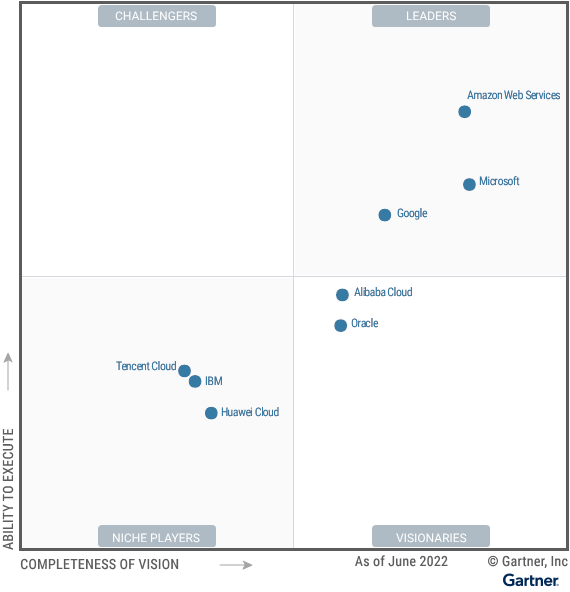

# 社区要闻

- [**2022-12-21 全球分布式云大会·深圳站议题征集中**](https://mp.weixin.qq.com/s/d5j4WawE_fzHuh4ZyRsixg)
  
    由全球分布式云联盟、众视 Tech 主办的的 2022 全球分布式云大会·深圳站将于 12 月 21 日召开。大会以“云筑数字新基 远见数智未来”为主题，将设立分布式主题报告会以及分布式算力、分布式数据库、云原生开源实践三大主题分论坛。

- [**2022-12-16 Linux 基金会亚太团队正式启动 OSPO Summit 2022，共话本地和全球的开源发展**](https://mp.weixin.qq.com/s/W9kb4YeuqC77pfpBAdFUOQ)
  
    峰会定于 12 月 16 日在北京举行，将重点讨论 Upstream First 的成功实践和开源办公室（OSPO）的工作实践。此外，还将就降本增效、DevSecOps、开源文化、企业单位与开源共同体、许可、供应链、SBOM、项目共同体构建、成为开源世界的领导者等话题展开讨论。

- [**2022-12-14 第二届「云原生十大技术创新/先锋实践」评选正式启动**](https://mp.weixin.qq.com/s/UZ_05I06VCJYN5MKLwO7IA)
  
    评选由创原会发起，CNCF、中国信通院、华为云参与评选，旨在评选取得显著效果、具有一定复制性和参考性的云原生技术应用实践以及实现创新突破的云原生开源项目、创新产品、科学论文等。获评项目将受邀参加云原生年度技术创新峰会，并获得媒体宣传机会等。

- [**2022-12-07 KubeDay Japan 会议议程发布**](https://events.linuxfoundation.org/kubeday-japan/program/schedule/)
  
    KubeDay 是 CNCF 主办的地区性云原生系列活动，首场将于下月初在日本举行。目前，会议的议程已经发布。所有的主题演讲和会议的录制视频将于 12 月中旬在 CNCF 的 YouTube 频道上发布。

- [**2022-12-05 ICT 中国·云原生发展论坛将在北京拉开帷幕**](https://mp.weixin.qq.com/s/vMRtNDE0dMgV0I0T2Wf92w)
  
    论坛由工业和信息化部主办，聚焦主题“软件架构的变革、新生产力的飞跃”。届时将发布和应用现代化、金融行业湖仓、Serverless 相关的报告，以及公布云原生存储、大数据、混部、安全、弹性算力、中间件领域的评估结果。

- [**2022-12-03 云原生社区举行 Meetup 长沙站**](https://mp.weixin.qq.com/s/vSp6j_Mu5g4uF0mp4t1PeA)
  
    此次云原生 Meetup 长沙站由云原生社区主办，演讲者来自极狐 GitLab、中国移动、中国电信等公司，演讲内容涵盖 DevSecOps、ClusterAPI、云桌面等技术和话题。

- [**2022-12-03 微服务 x 容器开源开发者 Meetup 在上海举行**](https://mp.weixin.qq.com/s/OlGXER4RgfyCwKT0at_6ug)
  
    微服务x容器开源开发者 Meetup 由阿里云飞天 club 与云原生应用平台共同打造。本次 Meetup 邀请到 Spring Cloud Alibaba、Dubbo、OpenYurt、KubeVela、OpenSergo 等项目的核心维护者，演讲内容围绕 11 个云原生开源项目的技术分享和企业实践展开。

- [**2022-11-30 全球分布式云大会年终盛典开启奖项申报**](https://mp.weixin.qq.com/s/wtUyNpv9Q6gbtI1L3Odfng)
  
    全球分布式云大会年终盛典由全球分布式云联盟和众视 Tech 主办，旨在表彰在全球范围内分布式云领域的佼佼者，具体奖项设置包括：分布式云原生企业 TOP3、中国算力先锋企业 TOP3、分布式操作系统 TOP3、边缘云建设贡献奖、分布式数据库奖等。

- [**2022-11-18 Kubernetes Community Days 成都站重启**](https://mp.weixin.qq.com/s/DTDfFezLlyOtmVz3gV6bKw)
  
    Kubernetes Community Days 成都站由 CNCF 和 DaoCloud 道客、华为云等联合发起的，聚焦 Istio、KubeEdge、中间件、分布式应用运行时、存储、多云管理等云原生开源项目与技术实践的主题分享。

- [**2022-11-15 研究咨询机构爱分析发布《2022 信创厂商全景报告》，DaoCloud 入选厂商全景图信创云板块**](https://mp.weixin.qq.com/s/GCeOGq4DcO-20CtFATDPcA)
  
    报告选取数据库、操作系统、中间件、信创云、云桌面等 9 个特定市场的需求定义和代表厂商能力进行重点分析，为企业厂商选型提供参考。其中，云平台的全面国产化，逐渐成为企业构建全栈自主可控 IT 架构的关键一环。

- [**2022-10-31 KubeEdge 云原生边缘计算免费公开课发布**](https://mp.weixin.qq.com/s/s4iuQMDhxjVTnhwVF7_ZJQ)
  
    KubeEdge 云原生边缘计算公开课联合 CNCF 基金会、KubeEdge 社区、高校、企业等产学研多方力量，提供云原生边缘计算领域的行业发展概览、特性应用实操、典型案例剖析和源码解读等课程。

- [**2022-10-19 Gartner 发布《2022 云基础设施和平台服务（CIPS）魔力象限》**](https://www.gartner.com/doc/reprints?id=1-29B7RDWN&ct=220304&st=sb)
  
    Gartner CIPS 魔力象限关注基础设施即服务（IaaS）和集成平台即服务（PaaS）两类产品。今年的报告显示，AWS、Azure 和 Google Cloud 继续保持领先地位，入选领导者象限。而国内方面，阿里云、华为云和腾讯云入选，其中，华为云是首次入选。

    