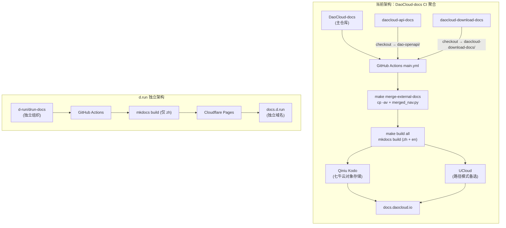
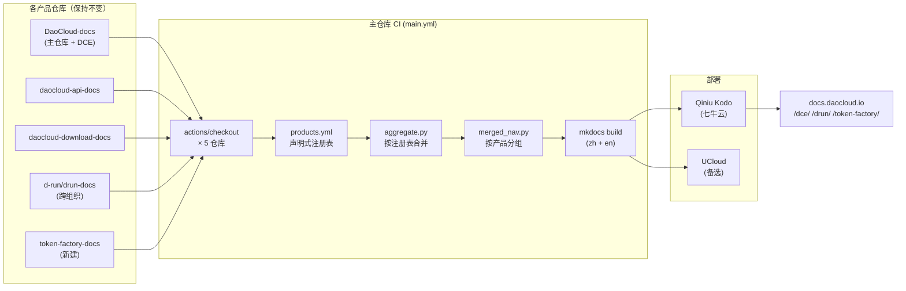
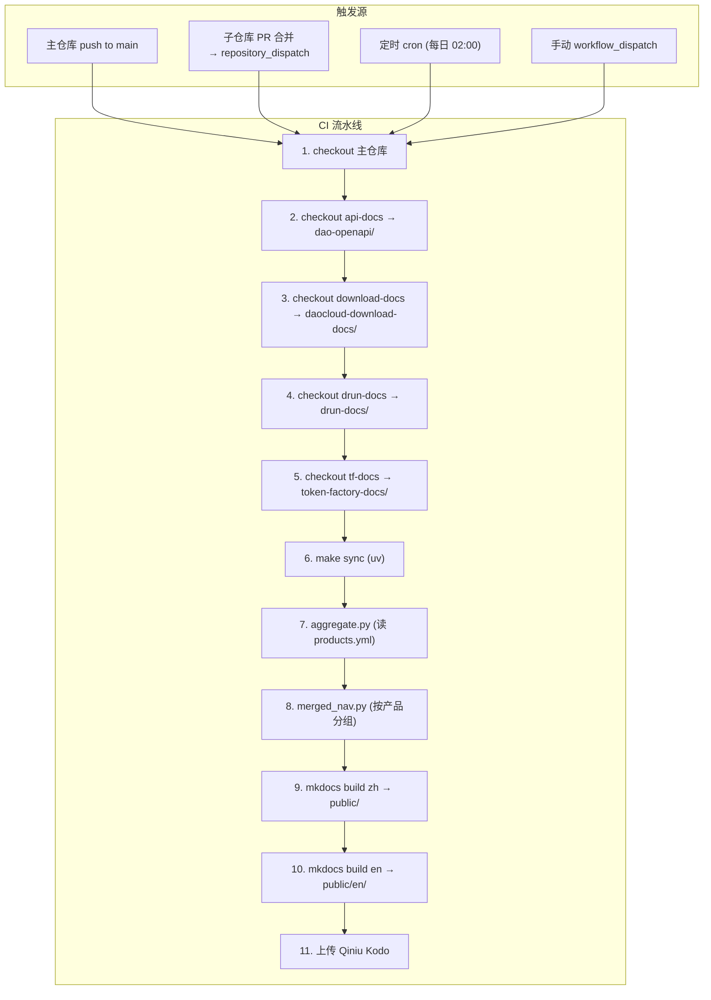
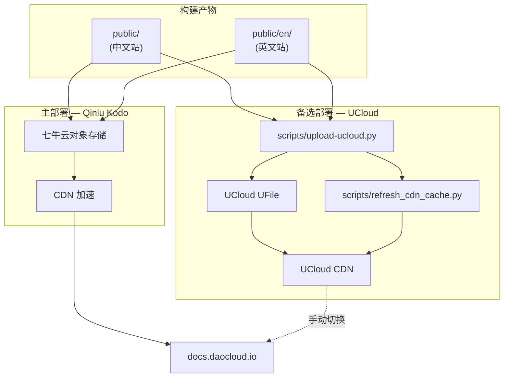
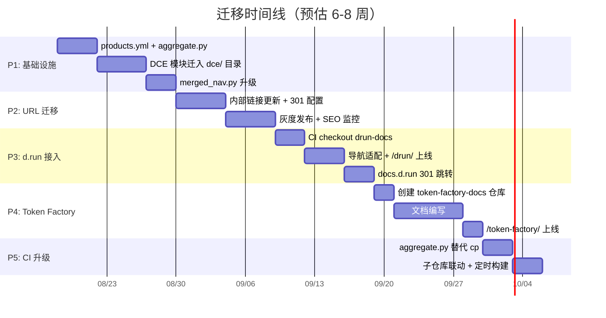

---
hide:
  - navigation
---

# docs.daocloud.io 多产品统一文档站目录架构设计

> **版本**: v2 · **日期**: 2026-08 · **状态**: 设计评审中

将当前仅承载 DCE 内容的文档站，演进为一站式兼容 DCE、d.run、Token Factory 等多产品线的统一文档门户。源文件分布在多个仓库，构建时聚合为单站点，部署到 Qiniu Kodo / UCloud。

## 现状分析：四仓库多源构建机制

### 现有仓库全景

docs.daocloud.io 的源文件已分布在 **4 个独立仓库**中，分属两个 GitHub 组织：

| 仓库 | 组织 | 内容 | 对应 URL | 部署目标 |
|------|------|------|---------|---------|
| `DaoCloud/DaoCloud-docs` | DaoCloud | DCE 全部文档 + 博客/视频/社区/开源生态 | `/` (根级，无产品前缀) | Qiniu Kodo |
| `DaoCloud/daocloud-api-docs` | DaoCloud | OpenAPI 文档 | `/openapi/` | Qiniu Kodo / UCloud |
| `DaoCloud/daocloud-download-docs` | DaoCloud | 下载中心文档 | `/download/` | Qiniu Kodo |
| `d-run/drun-docs` | **d-run** (独立组织) | d.run 智算平台文档 | `docs.d.run` (独立域名) | Cloudflare Pages |

### 当前构建流水线

主仓库 `DaoCloud-docs` 的 CI（`.github/workflows/main.yml`）已经实现了 **多仓库 checkout + 文件拷贝合并** 的聚合机制：

```yaml
# .github/workflows/main.yml — 当前流水线
steps:
  # Step 1-3: 在同一 job 中 checkout 三个仓库到不同子目录
  - uses: actions/checkout@v4                    # → 主仓库 DaoCloud-docs
  - name: Checkout OpenAPI docs
    uses: actions/checkout@v4
    with:
      repository: daocloud/daocloud-api-docs
      path: dao-openapi                            # → dao-openapi/
  - name: Checkout download docs
    uses: actions/checkout@v4
    with:
      repository: daocloud/daocloud-download-docs
      path: daocloud-download-docs                 # → daocloud-download-docs/

  # Step 4: 合并外部文档（cp + 脚本）
  - run: make merge-external-docs
      # merge-openapi:  cp -av dao-openapi/docs/openapi → docs/zh/docs/
      #                 python scripts/merged_nav.py (nav 数组拼接)
      # merge-download: cp -av daocloud-download-docs/docs/zh/docs/download → docs/zh/docs/
      #                 cp -av daocloud-download-docs/docs/en/docs/download → docs/en/docs/

  # Step 5: 构建双语站点
  - run: make build all
      # mkdocs build -f docs/zh/mkdocs.yml -d ../../public/    (中文)
      # mkdocs build -f docs/en/mkdocs.yml -d ../../public/en/  (英文)

  # Step 6: 上传到七牛云
  - uses: samzong/action-qiniu-upload-nodejs@v0.0.8
    with: { source_dir: public, dest_dir: / }
```

### 当前目录结构

主仓库采用 `docs/zh/` + `docs/en/` 双语分离结构，各自拥有独立的 `mkdocs.yml` 与 `navigation.yml`：

```
DaoCloud-docs/
├── docs/
│   ├── zh/                             # 中文站
│   │   ├── docs/                       # ← Markdown 内容
│   │   │   ├── dce/                    # DCE 产品介绍
│   │   │   ├── kpanda/                 # 容器管理（根级路径）
│   │   │   ├── amamba/                 # 应用工作台
│   │   │   ├── kairship/               # 多云编排
│   │   │   ├── ...                     # 16+ 模块
│   │   │   ├── openapi/               # ← CI 从 dao-openapi/ 拷入
│   │   │   └── download/              # ← CI 从 daocloud-download-docs/ 拷入
│   │   ├── mkdocs.yml                  # 中文 MkDocs 配置
│   │   └── navigation.yml              # 中文导航（CI 合并后覆写）
│   ├── en/                             # 英文站（结构镜像中文）
│   │   ├── docs/
│   │   │   └── download/              # ← CI 从 download-docs 拷入英文版
│   │   ├── mkdocs.yml
│   │   └── navigation.yml
│   └── theme/                          # 主题覆盖
├── scripts/
│   ├── merged_nav.py                   # 导航合并脚本
│   ├── upload-ucloud.py               # UCloud 上传脚本
│   └── refresh_cdn_cache.py           # UCloud CDN 刷新脚本
├── Makefile
├── pyproject.toml                     # uv 管理依赖
└── .github/workflows/
    ├── main.yml                        # 主部署 → Qiniu Kodo
    └── main.path.yml                   # 路径模式部署 → UCloud
```

### d.run 文档现状

d.run 文档仓库 `d-run/drun-docs` 是 **完全独立** 的文档站，与 DaoCloud-docs 聚合流程无任何关联：

| 维度 | DaoCloud-docs | d-run/drun-docs |
|------|--------------|-----------------|
| GitHub 组织 | DaoCloud | **d-run**（独立组织） |
| 域名 | docs.daocloud.io | **docs.d.run** |
| 包管理 | uv（现代） | pip + requirements.txt |
| MkDocs 主题 | 官方 PyPI mkdocs-material | 自定义 fork（DaoCloud/mkdocs-material） |
| 语言 | zh + en | 仅 zh |
| 部署 | Qiniu Kodo（主）/ UCloud（备） | Cloudflare Pages |
| 外部仓库合并 | 有（api-docs, download-docs） | 无 |



*图 1：当前四仓库构建与部署架构全景*

## 问题诊断与演进目标

### 当前架构的瓶颈

| 问题 | 说明 |
|------|------|
| **合并方式脆弱** | `cp -av` 文件拷贝是硬编码的——每新增一个子仓库就需在 Makefile 中添加一行 `cp` 命令。`merged_nav.py` 仅做 nav 数组拼接，无产品层级分组。 |
| **无产品命名空间** | DCE 16+ 模块直接占据根级 URL（`/kpanda/`、`/amamba/`），接入 d.run 或 Token Factory 时路径冲突风险高。 |
| **d.run 完全割裂** | d.run 在独立组织、独立域名、独立部署链路。用户需跳转不同域名，无法实现"一站式"体验。 |
| **CI 硬编码仓库列表** | 当前 workflow 中 `actions/checkout` 的 repository/path 是硬编码的，新增产品需手动修改 YAML。 |

### 演进目标

核心目标：**复用已有聚合机制 + 引入产品命名空间 + 统一域名**。不推翻现有架构，而是在已有的 CI 多仓库 checkout + 文件合并机制上做增量演进：

- **保持各仓库自治**——DCE、API、Download、d.run 仓库不变，各自独立维护
- **引入产品命名空间**——DCE 模块收入 `/dce/`，d.run 收入 `/drun/`，Token Factory 收入 `/token-factory/`
- **声明式仓库注册**——用一个 `products.yml` 替代 CI 中硬编码的 checkout 步骤
- **统一域名**——d.run 文档从 docs.d.run 迁入 docs.daocloud.io/drun/（旧域名 301）
- **导航按产品分组**——合并后的导航以产品为一级分组，而非扁平列表

## URL 路由架构设计

### 目标 URL 结构

采用 **产品 → 模块 → 页面** 三层路由。DCE 模块加 `/dce/` 前缀，d.run 和 Token Factory 各获独立顶级路径：

```
docs.daocloud.io/
│
├── /                               # 门户首页（产品导航卡片）
│
├── /dce/                            # ── DCE（源: DaoCloud-docs 仓库） ──
│   ├── /dce/intro/                  # 产品介绍
│   ├── /dce/kpanda/                 # 容器管理
│   ├── /dce/amamba/                 # 应用工作台
│   ├── /dce/kairship/               # 多云编排
│   ├── /dce/kangaroo/               # 镜像仓库
│   ├── /dce/network/  /storage/  /virtnest/  /insight/
│   ├── /dce/skoala/  /mspider/  /middleware/  /baize/
│   ├── /dce/hydra/  /clawos/  /kant/  /ghippo/
│   ├── /dce/install/  /dce/bphome/  /dce/faq/  /dce/license/
│   └── /dce/roadmap/               # 产品路线图
│
├── /drun/                           # ── d.run 智算平台（源: d-run/drun-docs 仓库） ──
│   ├── /drun/intro/                 # 平台介绍
│   ├── /drun/getting-started/       # 快速开始
│   ├── /drun/compute/               # 算力市场与调度
│   ├── /drun/baize/                 # 算法开发（训推一体）
│   ├── /drun/inference/             # 推理服务
│   ├── /drun/model-gallery/         # 模型仓库
│   ├── /drun/operations/            # 运营管理（计费/运营）
│   └── /drun/faq/                   # 常见问题
│
├── /token-factory/                  # ── Token Factory（源: 新建仓库） ──
│   ├── /token-factory/intro/       # 什么是 Token Factory
│   ├── /token-factory/architecture/ # 系统架构
│   ├── /token-factory/deployment/   # 部署指南
│   ├── /token-factory/optimization/ # 推理性能优化
│   └── /token-factory/benchmarking/ # 性能基准测试
│
├── /openapi/                        # OpenAPI（源: daocloud-api-docs）— 保持不变
├── /download/                       # 下载中心（源: daocloud-download-docs）— 保持不变
├── /videos/  /blogs/  /community/  /native/   # DCE 仓库内的共享内容
├── /trial/                          # 免费体验
│
└── /en/                             # 英文版本（镜像上述全部路径）
    ├── /en/dce/...
    ├── /en/drun/...
    └── /en/token-factory/...
```

### URL 变更与重定向

DCE 模块从根级迁入 `/dce/` 前缀，需配置全量 301 重定向。其他路径（openapi/download/videos 等）保持不变：

| 原 URL | 新 URL | 动作 | 影响范围 |
|--------|--------|------|---------|
| `/kpanda/...` | `/dce/kpanda/...` | 301 | DCE 全部 16+ 模块 |
| `/dce/` | `/dce/intro/` | 301 | DCE 首页 |
| `/install/...` | `/dce/install/...` | 301 | 安装文档 |
| `/openapi/...` | `/openapi/...` | 不变 | — |
| `/download/...` | `/download/...` | 不变 | — |
| `/videos/  /blogs/` | 同左 | 不变 | — |
| `docs.d.run/*` | `docs.daocloud.io/drun/*` | 301 (跨域) | d.run 全站 |

## 仓库组织与目录约定

### 仓库角色定义

不新建聚合仓库，而是 **将主仓库 DaoCloud-docs 升级为聚合+门户仓库**，其他仓库保持不变：

| 仓库 | 角色 | 变更 | 对应 URL |
|------|------|------|---------|
| `DaoCloud/DaoCloud-docs` | **聚合仓库 + DCE 文档 + 共享内容** | DCE 模块迁入 `docs/zh/docs/dce/`；新增 `products.yml` + 聚合脚本 | `/dce/` + 共享区 |
| `DaoCloud/daocloud-api-docs` | OpenAPI 子项目 | 不变，继续被 CI checkout | `/openapi/` |
| `DaoCloud/daocloud-download-docs` | 下载中心子项目 | 不变，继续被 CI checkout | `/download/` |
| `d-run/drun-docs` | d.run 文档 | CI 新增 checkout 步骤；URL 前缀改为 `/drun/` | `/drun/` |
| `DaoCloud/token-factory-docs` | Token Factory 文档 | **新建仓库** | `/token-factory/` |

### 声明式产品注册表

在主仓库根目录新增 `products.yml`，替代 CI workflow 中硬编码的 checkout 步骤。新增产品只需在此添加一条记录：

```yaml
# DaoCloud-docs/products.yml — 产品注册表
products:
  dce:
    repo: "DaoCloud/DaoCloud-docs"           # 主仓库自身，无需 checkout
    source_dir: "docs/zh/docs/dce"
    url_prefix: "/dce"
    nav_file: "docs/zh/navigation-dce.yml"
    display_name: "DCE"
    icon: "📦"

  openapi:
    repo: "DaoCloud/daocloud-api-docs"
    checkout_path: "dao-openapi"              # 与现有 CI 一致
    source_dir: "dao-openapi/docs/openapi"
    dest_dir: "docs/zh/docs/openapi"          # cp 目标（与现有 merge 一致）
    url_prefix: "/openapi"
    nav_file: "dao-openapi/openapi-nav.yml"
    display_name: "OpenAPI"
    icon: "🔌"

  download:
    repo: "DaoCloud/daocloud-download-docs"
    checkout_path: "daocloud-download-docs"
    source_dir: "daocloud-download-docs/docs/zh/docs/download"
    dest_dir: "docs/zh/docs/download"
    url_prefix: "/download"
    nav_file: "daocloud-download-docs/docs/zh/nav-download.yml"
    display_name: "下载中心"
    icon: "⬇️"

  drun:
    repo: "d-run/drun-docs"                   # 跨组织仓库
    checkout_path: "drun-docs"
    source_dir: "drun-docs/docs/zh/docs"
    dest_dir: "docs/zh/docs/drun"             # 新增合并目标
    url_prefix: "/drun"
    nav_file: "drun-docs/docs/zh/nav-drun.yml"
    display_name: "d.run 智算平台"
    icon: "⚡"

  token-factory:
    repo: "DaoCloud/token-factory-docs"       # 新建
    checkout_path: "token-factory-docs"
    source_dir: "token-factory-docs/docs/zh/docs"
    dest_dir: "docs/zh/docs/token-factory"
    url_prefix: "/token-factory"
    nav_file: "token-factory-docs/docs/zh/nav-tf.yml"
    display_name: "Token Factory"
    icon: "🏭"

  # 未来新增产品只需在此追加...
```

### 主仓库升级后的目录结构

主仓库 `DaoCloud-docs` 的 `docs/zh/docs/` 目录变化——DCE 模块收入 `dce/` 子目录：

```
# DaoCloud-docs/  升级后结构（变更部分标注 ← NEW / ← MOVE）

DaoCloud-docs/
├── docs/
│   ├── zh/
│   │   ├── docs/
│   │   │   ├── dce/                    # ← MOVE: DCE 模块从根级移入此目录
│   │   │   │   ├── intro/
│   │   │   │   ├── kpanda/             # 原 docs/zh/docs/kpanda/
│   │   │   │   ├── amamba/
│   │   │   │   ├── kairship/
│   │   │   │   ├── ... (全部 16+ 模块)
│   │   │   │   └── install/
│   │   │   │
│   │   │   ├── drun/                   # ← NEW: CI 从 drun-docs 拷入
│   │   │   │   ├── intro/
│   │   │   │   ├── compute/
│   │   │   │   └── ...
│   │   │   │
│   │   │   ├── token-factory/          # ← NEW: CI 从 token-factory-docs 拷入
│   │   │   │
│   │   │   ├── openapi/                # 保持: CI 从 dao-openapi 拷入（无变化）
│   │   │   ├── download/               # 保持: CI 从 daocloud-download-docs 拷入
│   │   │   │
│   │   │   ├── videos/                 # 保持: DCE 仓库内的共享内容
│   │   │   ├── blogs/
│   │   │   ├── community/
│   │   │   ├── native/
│   │   │   └── trial/
│   │   │
│   │   ├── mkdocs.yml
│   │   ├── navigation.yml             # CI 合并后生成（包含全部产品导航）
│   │   └── navigation-dce.yml          # ← NEW: DCE 专属导航片段
│   │
│   └── en/  # 镜像中文结构
│
├── products.yml                        # ← NEW: 声明式产品注册表
├── scripts/
│   ├── merged_nav.py                   # 升级: 按产品分组合并，而非简单拼接
│   ├── aggregate.py                    # ← NEW: 读取 products.yml 驱动合并
│   ├── upload-ucloud.py               # 保持
│   └── refresh_cdn_cache.py           # 保持
├── Makefile                            # 升级: make merge → 调用 aggregate.py
├── pyproject.toml
└── .github/workflows/
    ├── main.yml                        # 升级: checkout drun-docs + token-factory-docs
    └── main.path.yml
```

### 各产品仓库的目录约定

子仓库（drun-docs、token-factory-docs 等）遵循统一约定，聚合脚本据此自动发现：

```
# drun-docs/  (子产品仓库标准约定)

drun-docs/
├── docs/
│   ├── zh/                            # 中文 Markdown
│   │   └── docs/
│   │       ├── intro/
│   │       ├── compute/
│   │       └── ...
│   └── en/                            # 英文（可选）
│
├── docs/zh/nav-drun.yml               # 本产品导航片段（约定文件名）
├── docs/zh/mkdocs-partial.yml         # 本产品专有 mkdocs 配置（可选）
├── resources/                          # 图片/附件
└── README.md
```



*图 2：升级后的多仓库聚合架构*

## 聚合构建流水线设计

### 升级后的 CI Workflow

在现有 `main.yml` 基础上增量修改——新增 drun-docs 和 token-factory-docs 的 checkout，并用 `aggregate.py` 替代硬编码的 `cp` 命令：

```yaml
# .github/workflows/main.yml — 升级后
name: deploy-for-main
on:
  push:
    branches: [main]
    paths: [docs/**]
  workflow_dispatch: {}

jobs:
  build-deploy:
    runs-on: ubuntu-latest
    steps:
      # 1. checkout 主仓库
      - uses: actions/checkout@v4
        with: { fetch-depth: 0 }

      # 2. checkout OpenAPI 文档（已有）
      - uses: actions/checkout@v4
        with: { repository: "daocloud/daocloud-api-docs", path: "dao-openapi" }

      # 3. checkout 下载文档（已有）
      - uses: actions/checkout@v4
        with: { repository: "daocloud/daocloud-download-docs", path: "daocloud-download-docs" }

      # 4. ← NEW: checkout d.run 文档（跨组织）
      - uses: actions/checkout@v4
        with: { repository: "d-run/drun-docs", path: "drun-docs" }

      # 5. ← NEW: checkout Token Factory 文档
      - uses: actions/checkout@v4
        with: { repository: "daocloud/token-factory-docs", path: "token-factory-docs" }

      # 6. 安装依赖
      - run: make sync

      # 7. ← UPGRADED: 声明式聚合（替代硬编码 cp）
      - run: make aggregate-all
          # python scripts/aggregate.py --lang zh --config products.yml
          # python scripts/aggregate.py --lang en --config products.yml
          # → 拷贝各产品文件到 docs/zh/docs/{product}/
          # → 合并各产品 nav 到 navigation.yml

      # 8. 构建双语站点（已有）
      - run: make build all

      # 9. 上传到七牛云（已有）
      - uses: samzong/action-qiniu-upload-nodejs@v0.0.8
        with: { source_dir: public, dest_dir: / }
```

### aggregate.py 聚合脚本逻辑

替代现有 Makefile 中的 `cp -av` 硬编码命令，从 `products.yml` 读取配置自动执行：

```python
# scripts/aggregate.py — 核心逻辑（约 80 行）

def main(lang, config_path):
    products = load_yaml(config_path)     # 读取 products.yml
    merged_nav = []

    for key, product in products.items():
        if product.get('repo') == "DaoCloud/DaoCloud-docs":
            # 主仓库自身内容已在正确位置，无需拷贝
            pass
        else:
            # 从 checkout 目录拷贝到目标目录
            src = f"{product['checkout_path']}/docs/{lang}/docs"
            dst = f"docs/{lang}/docs/{key}"
            copy_tree(src, dst)

        # 加载并追加产品导航片段
        nav_file = product['nav_file'].replace('{lang}', lang)
        nav_fragment = load_yaml(nav_file)
        merged_nav.append({
            'section': product['display_name'],
            'icon': product['icon'],
            'items': nav_fragment['nav']
        })

    # 写入合并后的 navigation.yml
    write_navigation(f"docs/{lang}/navigation.yml", merged_nav)
```

### 触发机制

| 触发方式 | 说明 |
|---------|------|
| **推送触发**（已有） | 主仓库 `main` 分支 `docs/**` 路径变更时触发 |
| **子仓库联动**（新增） | 子仓库 PR 合并后，通过 `repository_dispatch` 事件触发主仓库构建，实现准实时同步 |
| **定时全量**（新增） | 每日凌晨 2 点定时构建，拉取所有子仓库最新代码。作为兜底机制，确保内容最长延迟 24 小时 |
| **手动触发** | 紧急发布或调试时，在 GitHub Actions 界面手动触发 `workflow_dispatch` |



*图 3：升级后 CI 流水线完整流程*

## 导航合并机制

### 当前 vs 升级后对比

**当前：简单数组拼接**

```python
# merged_nav.py 当前逻辑
merged_nav = master_nav + openapi_nav
# 直接拼接，无分组
```

OpenAPI 导航追加到末尾，无产品层级分隔。

**升级后：按产品分组**

```python
# merged_nav.py 升级后
nav = [
  {section: "DCE", items: dce_nav},
  {section: "d.run",   items: drun_nav},
  {section: "TF",      items: tf_nav},
  {section: "共享",     items: shared_nav},
]
```

导航以产品为一级分组，结构清晰。

### 合并后的导航结构

各产品仓库提供自己的导航片段，聚合脚本按 `products.yml` 顺序合并为全局导航：

```yaml
# 合并后生成的 docs/zh/navigation.yml

nav:
  # ── 产品文档 ──
  - 首页: index.md

  - 📦 DCE:                    # ← from DaoCloud-docs (主仓库自身)
      - 产品介绍: dce/intro/index.md
      - 容器管理:
          - 概述: dce/kpanda/intro.md
          - 管理集群: dce/kpanda/cluster.md
      - 应用工作台:
          - 概述: dce/amamba/intro.md
      - AI Lab:
          - 概述: dce/baize/intro.md

  - ⚡ d.run 智算平台:              # ← from drun-docs
      - 平台介绍: drun/intro/index.md
      - 算力市场:
          - 概述: drun/compute/intro.md
      - 推理服务:
          - 概述: drun/inference/intro.md

  - 🏭 Token Factory:               # ← from token-factory-docs
      - 什么是 Token Factory: token-factory/intro.md
      - 系统架构: token-factory/architecture.md

  # ── 共享内容 ──
  - 🔌 OpenAPI: openapi/index.md      # ← from dao-openapi
  - ⬇️ 下载中心: download/index.md    # ← from daocloud-download-docs
  - 视频教程: videos/index.md
  - 博客: blogs/index.md
  - 开源社区: community/index.md
```

### 顶部导航栏设计

```
┌──────────────────────────────────────────────────────────────────────┐
│  DaoCloud  │  产品 ▾  │  OpenAPI  │  下载  │  视频  │  博客  │  EN ▾  │
└──────────────────────────────────────────────────────────────────────┘
                  │
                  ▼
         ┌──────────────────────────────┐
         │  📦 DCE            → /dce/     │
         │  ⚡ d.run 智算平台      → /drun/    │
         │  🏭 Token Factory      → /tf/      │
         └──────────────────────────────┘
```

## 部署架构

### 当前部署渠道

| 渠道 | Workflow | 触发 | 用途 |
|------|---------|------|------|
| **Qiniu Kodo** | `main.yml` | push to main | **主生产部署**（当前线上） |
| **UCloud** | `main.path.yml` | 手动触发 | 路径模式构建备选 |
| **Cloudflare Pages** | d-run 仓库 CI | push to main | d.run 独立部署（将迁移） |
| Docker 镜像 | `docker-build.yml` | tag push | ghcr.io 容器化构建 |

### 目标部署架构

统一到 **Qiniu Kodo（主）+ UCloud（备）** 双渠道，d.run 从 Cloudflare Pages 迁入主站部署链路：



*图 4：目标部署架构（七牛主 + UCloud 备）*

### d.run 迁移策略

d.run 文档当前通过 Cloudflare Pages 部署到 `docs.d.run`。迁移到 `docs.daocloud.io/drun/` 后：

- **构建**：d.run 文档由主仓库 CI 统一构建，不再独立部署
- **域名**：`docs.d.run/*` 配置 301 重定向到 `docs.daocloud.io/drun/*`
- **主题**：d.run 当前使用自定义 fork 的 mkdocs-material，需统一为官方版本或合并自定义改动
- **过渡期**：保持 docs.d.run 可访问（只读），同时 docs.daocloud.io/drun/ 上线，观察 1-2 周后切换 301

## 迁移路径与实施计划

### 五阶段迁移

| 阶段 | 内容 | 风险 | 验证标准 |
|------|------|------|---------|
| **P1 基础设施** | 在主仓库新增 `products.yml`、`aggregate.py`；升级 `merged_nav.py` 支持产品分组；DCE 模块从 `docs/zh/docs/` 移入 `docs/zh/docs/dce/` | 中 — DCE 路径变更 | 本地构建通过；导航正确分组 |
| **P2 URL 迁移** | DCE 模块路径加 `/dce/` 前缀；配置全量 301 重定向；更新内部交叉引用链接 | 中 — 影响 SEO | 旧 URL 301 到新地址；Google Search Console 无 404 |
| **P3 接入 d.run** | CI 新增 drun-docs checkout；`products.yml` 注册 d.run；`/drun/` 上线；docs.d.run 配置 301 | 低 — 新增路径 | `docs.daocloud.io/drun/` 可访问 |
| **P4 Token Factory** | 创建 `token-factory-docs` 仓库；CI 新增 checkout；`/token-factory/` 上线 | 低 — 全新内容 | `docs.daocloud.io/token-factory/` 可访问 |
| **P5 CI 升级** | `main.yml` 用 `aggregate.py` 替代 `cp`；子仓库 `repository_dispatch` 联动；定时构建兜底 | 低 — 内部优化 | CI 全自动聚合；无手动步骤 |

### 迁移时间线



*图 5：五阶段迁移时间线*

### 风险与缓解

!!! warning "风险一：SEO 权重流失"

    DCE 模块 URL 从根级变为 `/dce/` 前缀。**缓解**：全量 301 + 提交 sitemap 到 Google Search Console。预计 2-4 周恢复。

!!! warning "风险二：内部交叉链接断裂"

    DCE 16+ 模块间存在大量交叉引用（如 kpanda 引用 network）。**缓解**：现有 `corrupted-hyperlink.yml` CI 检查已就位，迁移后全量跑一遍链接检查。

!!! warning "风险三：d.run 主题差异"

    d.run 使用自定义 fork 的 mkdocs-material，与主站官方版本可能有渲染差异。**缓解**：迁移前对比主题差异，将 d.run 自定义改动合并到主站主题覆盖中。

!!! warning "风险四：构建时间增长"

    从 3 仓库 checkout 增至 5 仓库，双语构建时间可能从 5 分钟增长到 10-15 分钟。**缓解**：中英文构建并行（GitHub Actions matrix）；缓存 uv 依赖。

## 总结

本方案的核心是 **在现有四仓库多源构建机制上做增量演进**，而非推翻重建：

- **复用已有 CI 机制**——当前 `actions/checkout` 多仓库拉取 + `cp -av` 合并 + `merged_nav.py` 导航拼接的流程已跑通，只需扩展为声明式驱动
- **引入产品命名空间**——DCE 模块收入 `/dce/`，d.run 迁入 `/drun/`，Token Factory 落地 `/token-factory/`，共享内容保持不变
- **声明式注册**——一个 `products.yml` 驱动 CI checkout、文件合并、导航分组全流程，新增产品只需加一条记录
- **统一域名**——d.run 从独立域名 docs.d.run 迁入 docs.daocloud.io/drun/，实现一站式体验
- **部署不变**——继续使用 Qiniu Kodo（主）+ UCloud（备）双渠道，无需迁移基础设施

关键优势：**新增产品的边际成本趋近于零**——创建仓库、注册 `products.yml`、提供导航片段，三步即可自动接入文档站。
