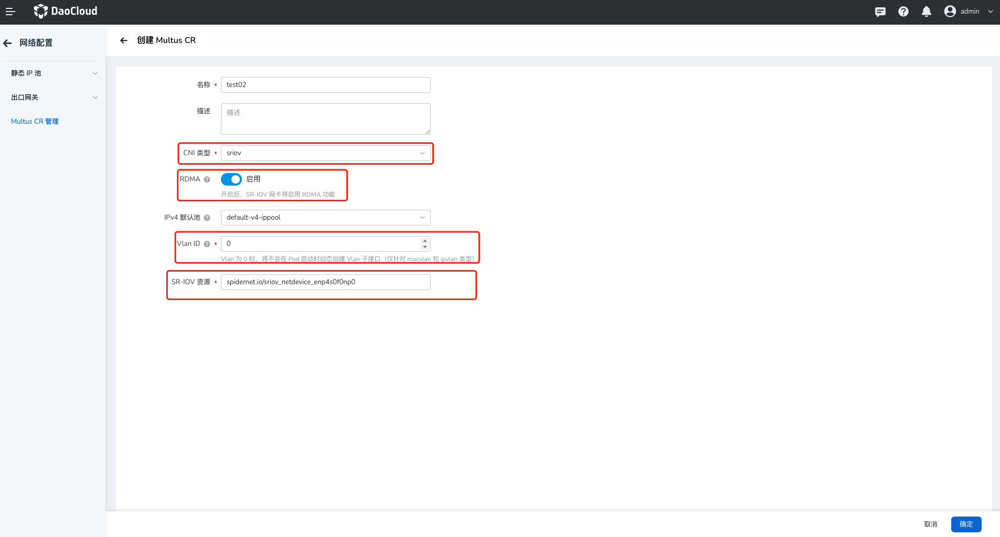

# 创建 Multus CR

 Multus CR 管理，是 Spiderpool 对 Multus CNI 中配置实例的二次封装。旨在为容器提供更灵活的网络连接和配置选项，以满足不同的网络需求，为用户提供更简单和经济高效的使用体验。本页介绍在创建工作负载使用多网卡配置之前，如何创建 Multus CR。

## 前提条件

- [SpiderPool 已成功部署](https://docs.daocloud.io/network/modules/spiderpool/install.html)，新版本的 SpiderPool 已包含 Multus-underlay 的全部功能。

## Vlan 配置说明

1. 如果 Underlay 网络不涉及到 VLAN 网络，不需要配置 `VLAN ID` (默认为 0 即可)。
2. 网络管理员已经创建好 **VLAN 子接口** 或 **Bond 网卡**，不需要填写 `VLAN ID` (默认为 0 即可)，`网卡接口`(Master) 直接填入对应**子接口**或 **Bond 网卡**名称。
3. 如果需要自动创建 **VLAN 子接口** ，那么需要配置 `VLAN ID`，并且 `网卡接口`(Master)  为对应的**父接口**。Spiderpool 将在创建 Pod 时动态的在主机创建一张名为 `master`，`vlanID` 的**子接口**，该接口承接 Pod 的 VLAN 网络。
4. 如果需要自动创建 **Bond 网卡**，那么 `VLAN ID` 配置为 `0`，并且配置 2 张 `网卡接口`(Master)  为组件 `Bond` 的 `Slave` 网卡 ，Spiderpool 将在创建 Pod 时动态的在主机创建一张名为 `name`的 **Bond 网卡**，该 **Bond 网卡** 承接 Pod 的 Underlay 网络。
5. 如果同时需要以 **Bond 网卡**创建的 **VLAN 子接口** 承接 Pod 的网络， 需要配置 `VLAN ID`。Spiderpool 将在创建 Pod 时动态的在主机创建一张名为 `bondName`，`vlanID` 的 **Vlan 子接口**，该 **子接口** 承接 Pod 的 VLAN 网络。
6. 所有通过 Spiderpool 创建的接口，都不会配置 IP，并且这些接口会被移除。当**节点重启**，Pod 重启又会自动添加回来。如果需要这些接口不会随着节点重启丢失或需要配置 IP，可以考虑使用 `nmcli` 工具添加。 
7. 如需创建新的**Multus CR 实例**，可参考此文档。

## 界面操作

1. 登录 DCE UI 后，在左侧导航栏点击 `容器管理` —> `集群列表`，找到对应集群。然后在左侧导航栏点击`容器网络` —> `网络配置`。

    

2. 进入`网络配置` —> `Multus CR 管理`，点击创建 `Multus CR`。

    
  
    !!! note

        注意：创建 Multus CR 时，CNI 类型只能为 `macvlan`、`ipvlan`、`sriov`、`自定义`四种类型四选一，可分成三种场景，参考以下三种参数方式进行配置。

### 创建 macvlan 或 ipvlan 类型的 Multus CR

输入如下参数：

- `名称`：Multus CNI 配置的实例名称，即 Multus CR 名称。
- `描述`：实例的描述信息。
- `CNI 类型`：CNI 的类型，目前界面可选择 `macvlan`，`ipvlan`。
- `IPv4 默认池`：CNI 配置文件 IPv4 默认池。
- `IPv6 默认池`：CNI 配置文件 IPv6 默认池。
- `Vlan ID`：当 CNI 类型为 `macvlan`，`ipvlan`，`sriov` 时被允许配置， "0" 和 ""的效果一样。
- `网卡配置`：网卡配置中包含接口配置信息，当网卡接口数量为一个时，则默认网卡配置中只有一个网卡接口。当添加接口数量大于等于两个时，可以做 Bond 相关配置。
- `网卡接口`：只用于 CNI 类型 为 `macvlan`，`ipvlan` ，至少有一个元素。如果有两个及其以上的元素, bond 必须不能为空。
- `Bond 信息`：名称不能为空，模式必须在范围 [0,6] 内, 分别对应七种模式：
    - balance-rr
    - active-backup
    - balance-xor
    - broadcast
    - 802.3ad
    - balance-tlb
    - balance-alb

参数是可选的, 输入格式为 `k1=v1;k2=v2;k3=v3`，用 `;` 隔开。

### 创建 sriov 类型的 Multus CR

输入如下参数：

- `名称`、`描述`、`CNI 类型`、`IPv4 默认池`、`IPv6 默认池`、`Vlan ID` 配置同场景一。
- `SR-IOV 资源`：只用于`sriov`类型, 填写资源名称，不能为空。

### 创建自定义类型的 Multus CR

输入如下参数：

- `JSON`：自定义类型时，需判断输入一个合法格式的 Json 文件。

创建完成后[工作负载](../modules/spiderpool/usage.md)即可使用 Multus CR 管理。
