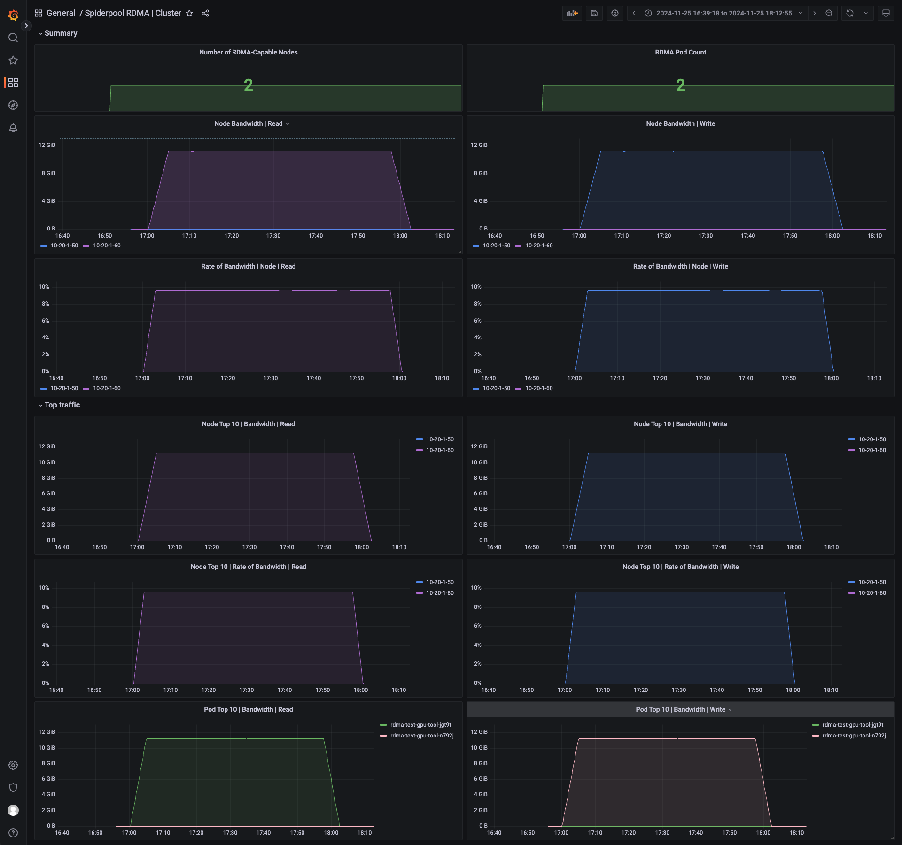
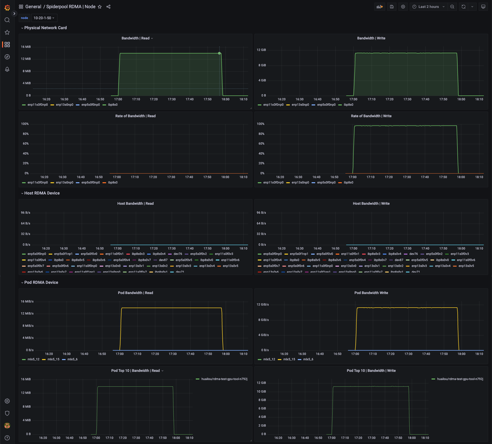
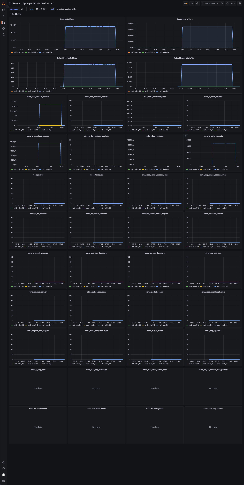

# RDMA 指标

RDMA 是一种高效的网络通信技术，允许一台计算机直接访问另一台计算机的内存，无需操作系统介入，
从而减少延迟，提高数据传输速度和效率。RDMA 支持高速数据传输，减少 CPU 负载，非常适用于需要高速网络通信的场景。

在 Kubernetes 集群中，Spiderpool CNI 支持 RoCE 和 IB 2 种 RDMA 场景，Pod
可以通过共享和独占的方式使用 RDMA 网卡，用户可以根据需求选择合适的方式来使用 RDMA 网卡。

Spiderpool 同时提供了 RDMA exporter 功能和 grafana 监控面板，通过实时监控 Pod/Node RDMA
网络的性能，包括吞吐量、延迟、丢包率等，可以时发现问题并采取措施解决，提高网络的可靠性和性能。

## RDMA 指标的常见场景

1. 性能监控:

    - 吞吐量: 测量通过网络传输的数据量。
    - 乱序: 监控网络中的乱序统计。
    - 丢包率: 监控传输过程中丢失的数据包数量。

2. 错误检测:

    - 传输错误: 检测数据传输中的错误。
    - 连接失败: 监控失败的连接尝试和断开连接。

3. 网络健康状况:

    - 拥塞: 检测网络拥塞和瓶颈。

## 如何开启

```shell
helm upgrade --install spiderpool spiderpool/spiderpool --reuse-values --wait --namespace spiderpool --create-namespace \
  --set sriov.install=true \
  --set spiderpoolAgent.prometheus.enabled=true \
  --set spiderpoolAgent.prometheus.enabledRdmaMetric=true \
  --set grafanaDashboard.install=true \
  --set spiderpoolAgent.prometheus.serviceMonitor.install=true
```

| 参数 | 说明 |
|------|------|
| `--reuse-values` | 重用现有的配置 |
| `--wait` | 等待所有 Pod 运行 |
| `--namespace` | 指定 Helm 安装的命名空间 |
| `--set sriov.install=true` | 开启 SR-IOV，更多可参考《创建集群 - 基于 SR-IOV 技术给容器提供 RDMA 通信能力》 |
| `--set spiderpoolAgent.prometheus.enabled=true` | 启用 Prometheus 监控 |
| `--set spiderpoolAgent.prometheus.enabledRdmaMetric=true` | 启用 RDMA 指标 exporter |
| `--set grafanaDashboard.install=true` | 启用 GrafanaDashboard 看板（需集群已安装 grafana-operator；若未使用 operator，请手动导入 charts/spiderpool/files 中的看板） |

## 指标参考

访问 [Metrics 参考](https://spidernet-io.github.io/spiderpool/v1.0/reference/metrics/)查看指标的详细信息。

## Grafana 监控面板

以下四个监控面板中，RDMA Pod 监控面板仅展示来自 RDMA 隔离子系统中 SR-IOV Pod 的监控数据。而对于采用共享方式的 macvlan Pod，其 RDMA 网卡数据未纳入该面板。

Grafana RDMA Cluster 监控面板，可以查看当前集群每个节点的 RDMA 监控。



Grafana RDMA Node 监控面板，可以查看每个物理网卡的 RDMA 监控，以及该物理网卡的带宽利用率。同时提供了该节点宿主机的 vf 网卡统计，以及该节点 Pod 使用 RDMA 网卡的监控。



Grafana RDMA Pod 监控面板，可以查看 Pod 里面每张网卡的 RDMA 监控，同时提供了网卡错误统计信息，根据这些信息的统计可以排查问题。



Grafana RDMA Workload 监控面板。在进行 AI 推理和训练时，往往使用 Job、Deployment、KServer 等顶层资源下发 CR 启动一组 Pod 进行训练，可以查看每个顶层资源的 RDMA 监控。


## 指标说明

| 名称 | 说明 | 来源 |
|-----|-----|------|
| rx_write_requests | 接收到的 WRITE 请求数量 | rdma cli |
| rx_read_requests | 接收到的 READ 请求数量 | rdma cli |
| rx_atomic_requests | 接收到的原子操作请求数量 | rdma cli |
| rx_dct_connect | 接收到的 DCT 连接请求数量 | rdma cli |
| out_of_buffer | 缓冲区不足导致的错误次数 | rdma cli |
| out_of_sequence | 接收乱序报文的次数 | rdma cli |
| duplicate_request | 接收到重复请求的次数 | rdma cli |
| rnr_nak_retry_err | 接收到的 RNR NAK 包超过 QP 重试上限的次数 | rdma cli |
| packet_seq_err | 数据包序列错误次数 | rdma cli |
| implied_nak_seq_err | 隐式 NAK 序列错误次数 | rdma cli |
| local_ack_timeout_err | 发送端 QP ACK 定时器超时次数（针对 RC、XRC、DCT QP） | rdma cli |
| resp_local_length_error | 响应端检测到本地长度错误的次数 | rdma cli |
| resp_cqe_error | 响应端 CQE 错误次数 | rdma cli |
| req_cqe_error | 请求端检测到 CQE 错误完成的次数 | rdma cli |
| req_remote_invalid_request | 请求端检测到远端非法请求错误的次数 | rdma cli |
| req_remote_access_errors | 请求端远端访问错误次数 | rdma cli |
| resp_remote_access_errors | 响应端远端访问错误次数 | rdma cli |
| resp_cqe_flush_error | 响应端 CQE flush 错误次数 | rdma cli |
| req_cqe_flush_error | 请求端 CQE flush 错误次数 | rdma cli |
| roce_adp_retrans | RoCE 自适应重传次数 | rdma cli |
| roce_adp_retrans_to | RoCE 自适应重传超时次数 | rdma cli |
| roce_slow_restart | RoCE 慢启动触发次数 | rdma cli |
| roce_slow_restart_cnps | RoCE 慢启动模式发送 CNP 包次数 | rdma cli |
| roce_slow_restart_trans | RoCE 切换到慢启动状态的次数 | rdma cli |
| rp_cnp_ignored | Reaction Point HCA 接收但忽略的 CNP 包数量 | rdma cli |
| rp_cnp_handled | Reaction Point HCA 处理用于调节速率的 CNP 包数量 | rdma cli |
| np_ecn_marked_roce_packets | Notification Point 接收的带 ECN 标记的 RoCEv2 拥塞包数量 | rdma cli |
| np_cnp_sent | Notification Point 因检测到拥塞而发送的 CNP 包数量 | rdma cli |
| rx_icrc_encapsulated | 接收到 ICRC 校验错误的 RoCE 包数量 | rdma cli |
| vport_speed_mbps | 虚拟端口速率（Mbps） | ethtool cli |
| rx_discards | 设备丢弃的接收包数量 | ethtool cli |
| tx_discards | 设备丢弃的发送包数量 | ethtool cli |
| rx_pause | 设备丢弃的接收 pause 包数量 | ethtool cli |
| tx_pause | 设备丢弃的发送 pause 包数量 | ethtool cli |
