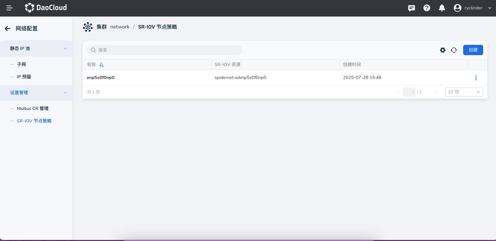
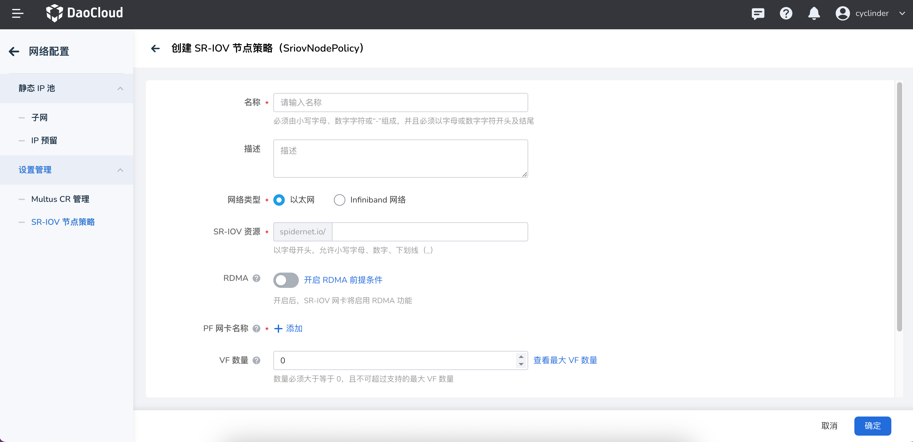

# 创建 SR-IOV 节点策略

SR-IOV 节点策略（SriovNetworkNodePolicy）是 SR-IOV 网络配置的核心组件，用于定义如何在特定节点上配置和使用 SR-IOV VF 设备。通过创建 SR-IOV 节点策略，您可以指定哪些网络接口卡（NIC）应该启用 SR-IOV 功能，以及如何配置虚拟功能（VF）。本页介绍如何创建和配置 SR-IOV 节点策略。

## 前提条件

- [SpiderPool 已成功部署](../modules/spiderpool/install.md)，并且启用安装 sriov。
- 集群节点支持 SR-IOV 硬件功能
- 具有集群管理员权限

## 界面操作

1. 登录 DCE UI 后，在左侧导航栏点击 __容器管理__ —> __集群列表__，找到对应集群。然后在左侧导航栏点击 __容器网络__ —> __网络配置__。

    

2. 进入 __网络配置__ —> __SR-IOV 节点策略管理__ ，点击创建 __SR-IOV 节点策略__ 。

    

    !!! note

        创建 SR-IOV 节点策略时，需要确保目标节点具备 SR-IOV 硬件支持，并且相关的物理网卡处于可用状态。

### 基本配置参数

请输入如下基本参数：



| 参数 | 说明 | 是否必填 |
| ---- | ---- | ---- |
| **名称** | SR-IOV 节点策略的名称，用于标识该策略实例 | 是 |
| **描述** | 策略的描述信息，便于管理和识别 | 否 |
| **网络类型** | 指定此策略的应用的网络类型。目前界面可选择 `以太网` 和 `InfiniBand网络` | 是 |
| **SR-IOV 资源** | 指定此策略的 SR-IOV 资源名称， 用于创建 Multus CR 时引用 | 是 |
| **RDMA** | 是否启用 RDMA 功能, 开启后 Spiderpool 将 SRIOV 网卡的 RDMA 功能赋予工作负载，必须要求网卡具备 RDMA 能力 | 否 |
| **PF 网卡名称** | 指定此策略应用的 PF 网卡名称 | 是 |
| **VF 数量** | 每个物理功能（PF）创建的虚拟功能（VF）数量 | 是 |
| **节点选择器** | 通过 LabelSelector 指定此策略应用于哪些节点 | 是 |

## 最佳实践

### 1. 节点选择器配置

- 使用具体的节点标签来精确控制策略应用范围
- 避免在不支持 SR-IOV 的节点上应用策略
- 考虑使用节点亲和性来优化资源分配

### 2. VF 数量规划

- 根据实际需求合理设置 VF 数量，避免资源浪费
- 考虑物理网卡的硬件限制
- 为系统保留足够的资源

## 故障排查

### 常见问题

1. **策略未生效**
   - 检查节点选择器是否正确匹配目标节点
   - 验证网卡选择器配置是否准确
   - 确认物理网卡支持 SR-IOV 功能

2. **VF 创建失败**
   - 检查 VF 数量是否超过硬件限制
   - 验证网卡驱动是否支持 SR-IOV
   - 确认系统内核版本兼容性

3. **资源不可用**
   - 检查 SR-IOV Network Device Plugin 是否正常运行
   - 验证资源名称配置是否正确
   - 确认节点资源状态

### 查看策略状态

使用以下命令查看 SR-IOV 节点策略状态：

```bash
# 查看所有 SR-IOV 节点策略
kubectl get sriovnetworknodepolicies -n spiderpool

# 查看特定策略详情
kubectl describe sriovnetworknodepolicy <policy-name> -n spiderpool

# 查看节点 SR-IOV 状态
kubectl get sriovnetworknodestates -n spiderpool
```

### 查看可用资源

```bash
# 查看节点可用的 SR-IOV 资源
kubectl get nodes -o json | jq '.items[] | {name: .metadata.name, allocatable: .status.allocatable} | select(.allocatable | keys[] | contains("sriov"))'
```

创建完成后，您可以在 [Multus CR 管理](multus-cr.md) 中使用配置的 SR-IOV 资源来创建网络附加定义，进而为工作负载提供高性能网络连接。
