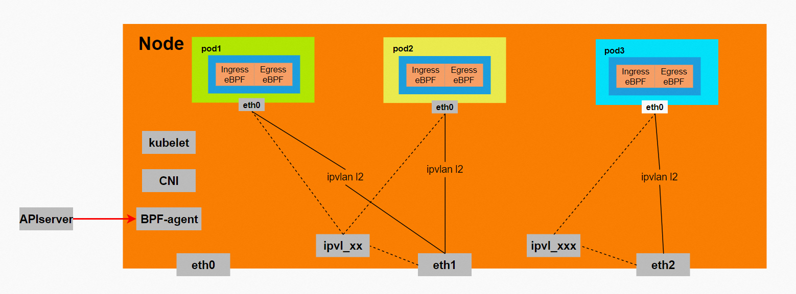
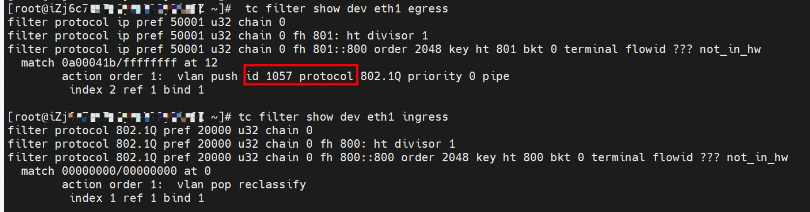

# Terway 网络模式介绍

## VPC

此模式下，集群 Pod 的 IP 从一个全局的虚拟子网分配(不属于任何 VPC 网络), 并需要借助
[CCM](https://github.com/AliyunContainerService/alicloud-controller-manager) 组件配置 VPC 路由以打通 Pod 跨节点通信。

- Pod 对外访问都需要先通过 eth0 转发到主机之后再转发
- 对于同节点不同 Pod 之间互相访问，不需要借助 VPC 网络，直接借助节点上的与 Pod 的直连路由实现
- 对于 Pod 跨节点的访问，需要转发至 VPC 网络。所以需要 CCM 组件完成跨节点的 VPC 路由的配置
- Pod 的 IP 是虚拟的，不属于 VPC 网段，类似与 calico 等 CNI

部署及使用参考 [VPC 模式使用](usage.md#vpc-模式)

## ENI

此模式下，Terway 将 ECS 实例的弹性网卡直接挂载到 Pod 的网络命名空间内，所以 Pod 拥有最佳性能，
但缺点是 Pod 可部署的数量将受到 ECS 实例的限制。此模式下，Pod 的网段与宿主机的网段是一致的。


- Pod 内有两张网卡，分别是 eth0 和 veth1。Pod 的默认路由在 eth0，所以 Pod 访问外部会从 eth0 转发到 VPC 网络。
  而 Pod 内设置有转发 Servcice 的路由从 veth1 转发，所以 Pod 访问 Service 的流量需要先经过 veth1 转发到主机，再经过主机的网络协议栈转发到目标。
- 此模式下 Pod 的可部署数量受到 ECS 实例规格的极大限制: Pod 数量 = ECS 实例的弹性网卡数量
- 此模式下因为 Pod 独占网卡，所以拥有最佳性能

部署及使用参考 [ENI 模式使用](usage.md#使用ENI模式)

## ENIIP

ENI 模式 Pod 独占 ENI，所以性能足够好，但 Pod 部署密度较低。ENI 支持配置多个辅助 IP 的功能，单个 ENI 根据实例规格可以分配 6-20 个辅助 IP，
ENIIP 模式就是利用了这个辅助 IP 分配给容器，从而大幅提高了 Pod 部署的规模和密度。在网络联通的方式上，Terway 支持选择 **veth pair** 策略路由和 **ipvlan** 两种方案。

### Veth-pair

此模式下，Pod 访问外部都会通过 eth0 转发到主机上, 再经过主机转发到 VPC 网络中。Pod 的网卡和 VPC 模式的网卡类似，
都是通过一对 Veth-pair 来联通宿主机和 Pod 的网络空间，但是和 VPC 路由方式区别在于：Pod 的地址是来源于弹性网卡的辅助 IP 地址，
所以节点上需要配置策略路由来保证辅助 IP 的流量经过 Pod 的 IP 所属的弹性网卡转发：


- Pod 的 IP 与节点属于同一网段
- Pod 访问 Service 通过主机转发
- 每一个弹性网卡对应主机的每一个策略路由，这确保了来源于 Pod 流量可以从正确的弹性网卡转发
- 此模式依赖 Calico felix 组件实现网络策略

> 自建集群目前无部署 ENIIP + Veth 模式，暂不推荐

### ipvlan

此模式下，基于 Cilium 的 CNI-chaining 模式，ipvlan 作为 Main CNI ，可以实现单个网卡虚拟出来多个子网卡，
Terway 将弹性网卡的辅助 IP 绑定到 ipvlan 的不同子网卡上来打通网络。Cilium 作为 meta CNI，为 ipvlan 子接口附加 ebpf 程序，
完成 Service 访问加速以及 NetworkPolicy。使用这种模式使 ENIIP 的网络结构足够简单，性能也相对 veth 策略路由较好。需要内核至少大于 4.2。



- 使用的是 ipvlan L2 模式
- 会为每一个用于 Pod 的弹性网卡创建子接口，解决父子接口不通的问题
- Pod 内只有一张 eth0 网卡，并且 Pod 的网关指向 VPC 网络，这意味着 Pod 访问外部时不会经过主机转发
- 依赖 Cilium 实现 Service 解析以及 NetworkPolicy
- 有内核版本要求，必须大于 4.2

> 自建集群不支持运行 ENIIP + ipvlan 模式，有通信问题

## ENI-Trunking(正在公测)

在上述模式中, Pod 可使用的虚拟交换机和安全组都是集群级别，也不支持 Pod 固定 IP。ENI-Trunking 支持通过一组 CRD
来声明 Pod 级别的网络配置，并通过 PodSelector 绑定到 Pod，通过这样可以实现:

- 为一组 Pod 配置独立的虚拟交换机、安全组等
- 支持固定 Pod 的 IP，但仅支持 StatefulSet 类型

限制:

- 目前是公测状态，尚未 GA
- 仅支持[部分机型](https://help.aliyun.com/zh/ecs/user-guide/overview-of-instance-families)
- 只支持在 ENIIP 模式下启用，但可以与之共存

CRD:

- PodNetworking:  trunk 模式下引入的自定义资源，用来描述一个网络平面的配置信息。一个网络平面可以配置独立的
  vSwitch、安全组等信息。集群内可以配置多个网络平面信息。 podNetworking 通过标签选择器来匹配 Pod，被匹配的 Pod 将使用 trunking 模式。

```yaml
apiVersion: network.alibabacloud.com/v1beta1
kind: PodNetworking
metadata:
  name: test-networking
spec:
  allocationType:
    type: Elastic/Fixed # Fixed: 固定 IP 策略, 仅对有状态 Pod 生效
    releaseStrategy: TTL
    releaseAfter: "5m0s"
  selector:
    podSelector:
      matchLabels:
        foo: bar
    namespaceSelector:
      matchLabels:
        foo: bar
  vSwitchOptions:
    - vsw-aaa
  securityGroupIDs:
    - sg-aaa
```

当 CR 实例创建，Terway 会进行状态同步，同步完成后设置状态为 Ready，只有当为 Ready，才能被 Pod 使用:

```yaml
apiVersion: network.alibabacloud.com/v1beta1
kind: PodNetworking
...
status:
  status: Ready   <---- status
  updateAt: "2023-07-19T10:45:31Z"
  vSwitches:
    - id: vsw-bp1s5grzef87ikb5zz1px
      zone: cn-hangzhou-i
    - id: vsw-bp1sx0zhxd6bw6vpt0hbl
      zone: cn-hangzhou-i
```

- PodENI:  用于 Terway 记录每个Pod 使用的网络信息，每个 trunk 模式的 Pod 将有一个同名的资源，自动创建不可修改

```yaml
apiVersion: network.alibabacloud.com/v1beta1
kind: PodENI
...
spec:
  allocation:
    eni:
      id: eni-bp16h6wuzpa9w2vdm5dn     <--- pod 使用的eni id
      mac: 00:16:3e:0d:7b:c2
      zone: cn-hangzhou-i
    ipType:
      releaseAfter: 0s
      type: Elastic                    <--- podIP 分配策略
    ipv4: 192.168.51.99
status:
  instanceID: i-bp1dkga3et5atja91ixt   <--- ecs 实例 ID
  podLastSeen: "2021-07-19T11:23:55Z"
  status: Bind
  trunkENIID: eni-bp16h6wuzpa9utho0t2o
```

数据流:


- 每个 ECS 节点将分配一个弹性网卡用于 Trunking 网卡，类似传统交换机的 Trunk 网口
- Pod 对外所有访问都会通过主机转发。再经过主机的 Trunking 网卡转发到目标弹性网卡。
  注: Terway 插件会在 Trunking 网卡的 TC hook 打上或摘除 Vlan tag，数据包根据 vlan tag 匹配到目标弹性网卡。



> 自建集群不支持运行 ENIIP-Trunking 模式
