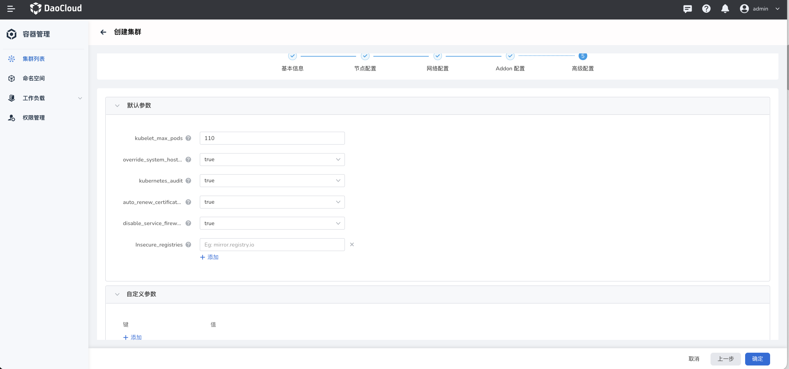

# 安装参数配置

本页说明用 Kubespray 安装 Calico 时各项参数的配置。

## 前提条件

在 DCE 5.0 中安装 Calico，需要在`创建集群`—>`网络配置`页面下，`网络插件`选择 `calico`。关于创建集群，请参阅[创建工作集群](../../../kpanda/07UserGuide/Clusters/CreateCluster.md)。

## 参数配置

如果用户需要为 Calico 配置更多功能，可通过 Kubespray 安装 Calico。关于使用 Kubespray 安装 Calico 时的各项参数配置，请在`高级配置`—>`自定义参数`下根据需要添加并填写。

以下介绍使用 Kubespray 安装 Calico 时的各项参数配置：

- `enable_dual_stack_networks`： 若设置为`true`，将为 pod 和 service 提供 IPv4 和 IPv6 网络。

    > 建议根据实际情况开启，可作为安装配置项。

- `ipv4_pools`：默认 IPv4 地址池。由 `calico_pool_cidr` 指定（默认未设置，由全局变量 `kube_pods_subnet` 指定）。
    > 建议与 `kube_pods_subnet` 保持一致，可在安装时暴露配置项。

- `ipv6_pools`：默认 IPv6 地址池。由 `calico_pool_cidr_ipv6` 指定（默认未设置，由全局变量 `kube_pods_subnet_ipv6` 指定）。

    > 建议与 `kube_pods_subnet_ipv6` 保持一致，可在安装时暴露配置项。

- `calico_pool_blocksize`：默认的 ippool(ipv4) 的 blockSize。

    默认该字段未定义，由全局变量 `kube_pods_subnet` 控制，默认为 24。

    > 使用默认配置即可，但必须根据集群规模来设定，至少每个节点拥有一个 block，可在安装时暴露配置项。

- `calico_pool_blocksize_ipv6`：默认的 ippool(ipv6) 的 blockSize。

    由 `calico_pool_blocksize_ipv6` 定义，默认为 116。

    > 使用默认配置即可，但必须根据集群规模来设定，至少每个节点拥有一个 block，可在安装时暴露配置项。

- `calico_vxlan_mode`：是否启用 VXLAN 隧道模式。

    默认启用。如没特殊要求，默认启用 VXLAN 模式。

    > 可在安装时暴露配置项，默认 always。

- `calico_ipip_mode`：是否启用 IPIP 隧道模式。

    默认关闭。如没特殊要求，默认启用 VXLAN 模式。

    > 可在安装时暴露配置项，默认 Never。

- `calico_felix_prometheusmetricsenabled`：是否暴露 felix metrics。

    默认关闭，可根据需求决定是否打开。

    > 可在安装时暴露配置项，默认 false。

- `nat_outgoing`：跨 ippool 池访问，是否需要 snat。

    默认开启，推荐开启。

    > 可在安装时暴露配置项，默认 true。

- `calico_allow_ip_forwarding`：是否在容器命名空间内开启 `ip_forwarding`。

    默认 false，推荐 false。

    > 不建议作为基础配置项，可作为高级配置项。

- `calico_datastore`：Calico 数据存储引擎、kdd 或 etcd。

    默认 kdd，推荐 kdd。

- `calico_iptables_backend`：CentOS 8.0 下的 `calico iptables backend mode` 需要和主机的 iptables 模式保持一致。

    由 `calico_iptables_backend` 配置，默认为 "Auto"。

    > 只针对 CentOS 8.0。
