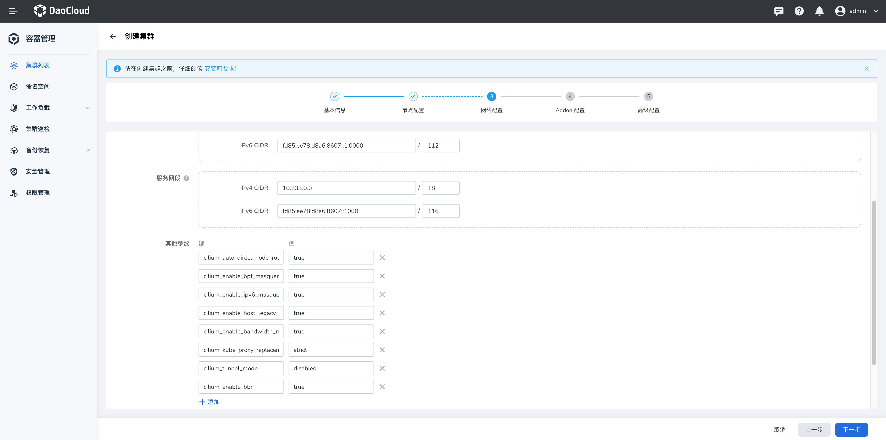

# Cilium 网络通信加速

本章节介绍如何配置 Cilium 通信加速能力，本章节提供 2 种方式配置，可根据需要进行选择。

## 前提条件

请确认操作系统 Kernel 版本号 >= v4.9.17，推荐 v5.10+。查看并安装升级最新的 Linux 内核版本，您可以按照如下命令进行操作：

1. 查看当前内核版本：

    ```bash
    uname -r
    ```

2. 安装 ELRepo 存储库，ELRepo 存储库中提供的最新 Linux 内核版本：

    ```bash
    rpm --import https://www.elrepo.org/RPM-GPG-KEY-elrepo.org
    rpm -Uvh https://www.elrepo.org/elrepo-release-7.el7.elrepo.noarch.rpm
    ```

3. 安装最新的 Linux 内核版本：

    ```bash
    yum --enablerepo=elrepo-kernel install kernel-ml
    ```

    > `kernel-ml` 是最新文档版内核，您可以根据需要选择其他版本。

4. 更新 GRUB 配置，以便在启动时使用新内核版本：

    ```bash
    grub2-mkconfig -o /boot/grub2/grub.cfg
    ```

> 注意手动更新内核可能有风险，生产环境谨慎操作。

## 方式一：创建集群时配置

1. 点击 **容器管理** -> **集群列表** ，点击 **创建集群** ，输入集群 **基本信息** 、 **节点配置** 信息后，进入 **网络配置** 进行如下配置。

    

    - 集群的网络插件选择 **cilium**
    - 添加 **其他参数** 如下：

        ```yaml
        cilium_auto_direct_node_routes: "true"  #路由模式下必须设置为 True, 否则无法路由跨节点流量
        cilium_enable_bpf_masquerade: "true" #设置该参数为 true 之后，如果使用了 masquerading 特性，那么会基于 eBPF 来替代 iptables 的实现，需要内核 5.10 及之后版本，否则就算开启也会降级到 iptables 实现
        cilium_enable_ipv6_masquerade: "false" #对于 POD 访问外界的流量做源地址转换，如果使用 tunnel 模式需要开启，如果是通过 BGP 打通了物理网络则禁用
        cilium_enable_host_legacy_routing: "false" # 关闭可以主机处理数据包时绕过其内核协议栈，加快数据转发。默认情况下打开，但如果主机内核不支持，则回退到传统行为
        cilium_enable_bandwidth_manager: "true # 打开bandwidth_manager，提高tcp、udp的性能
        cilium_kube_proxy_replacement: strict  # 启用 kube_proxy replacement 功能，需要删除 kube_proxy 组件
        cilium_tunnel_mode: disabled # 关闭隧道模式
        cilium_enable_bbr: "true" #（可选） bbr网络阻塞控制，提供更高的带宽及更低的延时。要求内核大于5.18
        ```

    - 其他均使用默认配置项

1. 点击 **创建集群** 完成创建。

## 方式二：修改 Cilium Config 配置

如集群已经创建，需要开启加速参数，可修改 `Cilium-Config` 文件。

点击 **容器管理** -> **集群列表** ，点击已创建的集群名称，进入详情后，点击 **配置与秘钥** ，选择 **配置项** ，找到 **cilium-config** 点击编辑，输入上述加速参数：


参数编写完成后，点击完成。检查 cilium agent Daemonset（cilium-agent 的 containers）是否存在以下 ENV。如果没有，需要手动添加：

```yaml
- name: KUBERNETES_SERVICE_HOST
  value: <YOUR_K8S_APISERVER_IP>
- name: KUBERNETES_SERVICE_PORT
  value: "6443"
```

添加完成后重启 Cilium agent pod。
