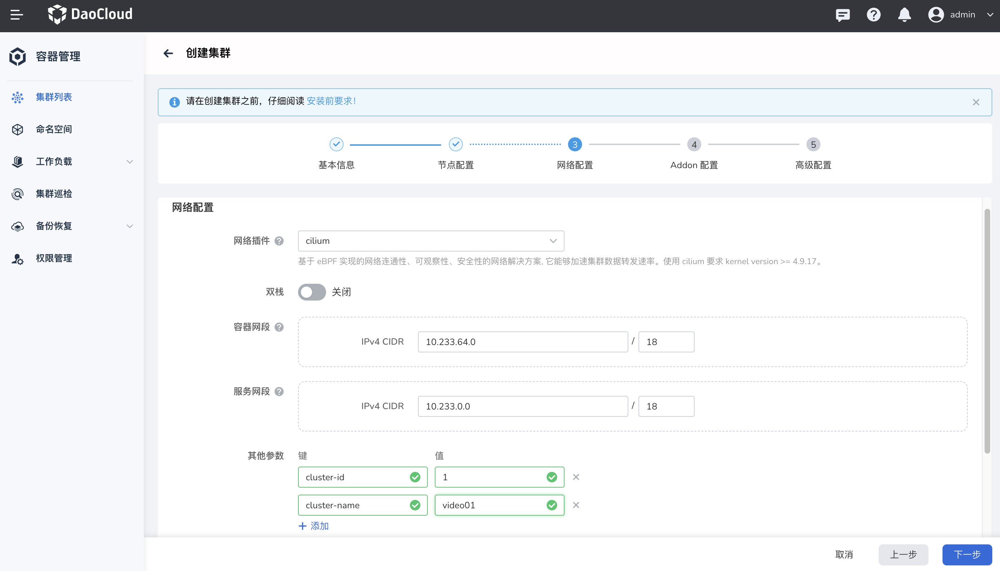
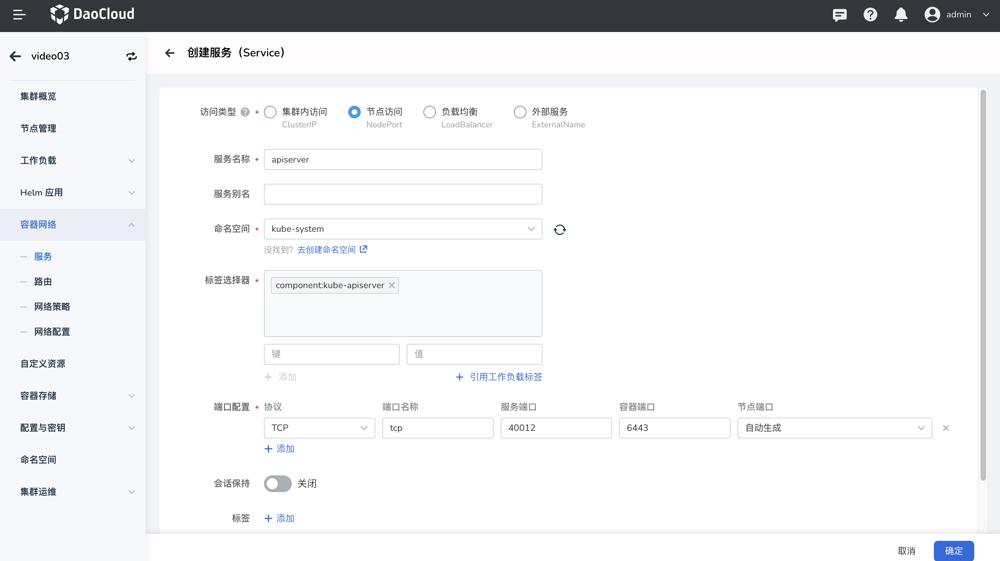
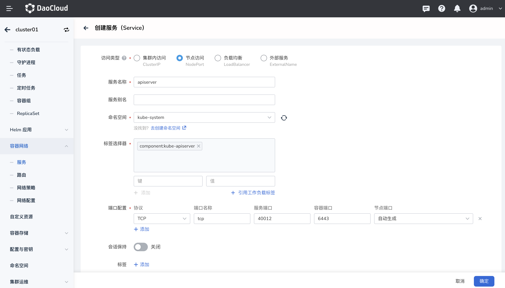
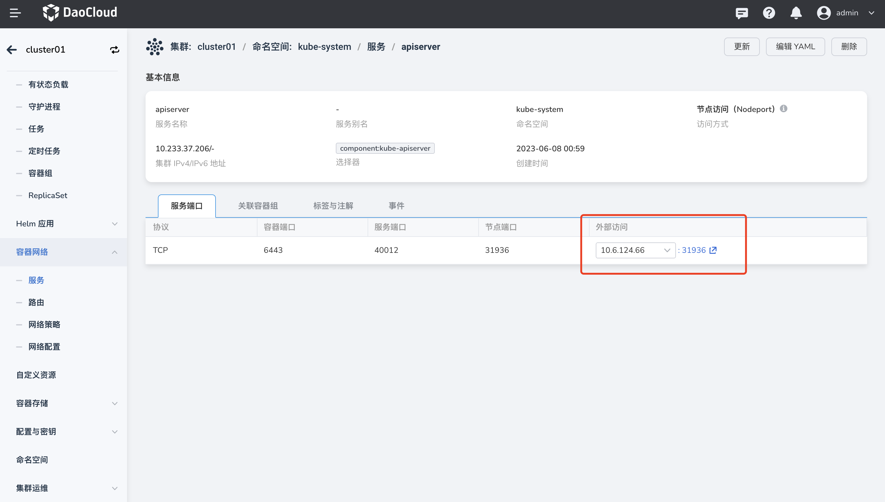
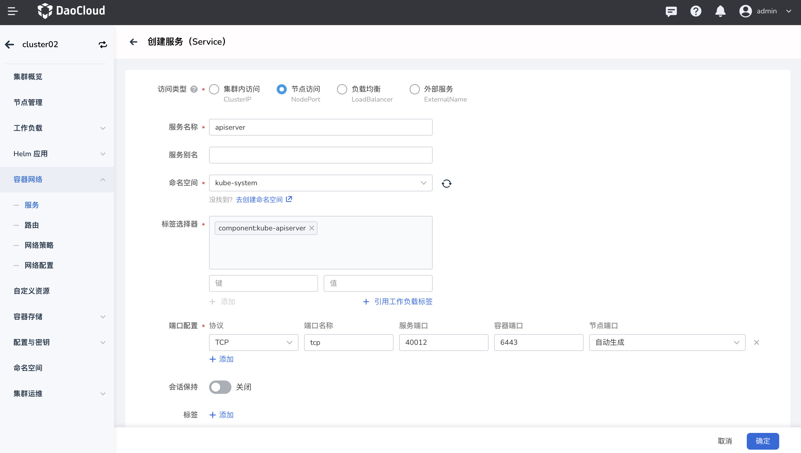
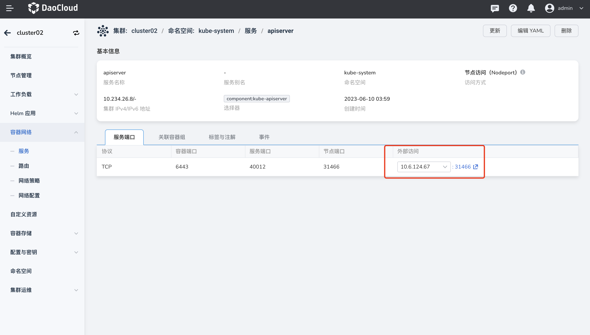
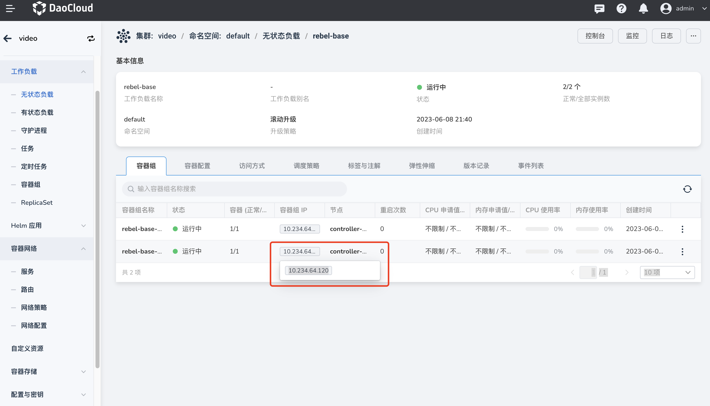
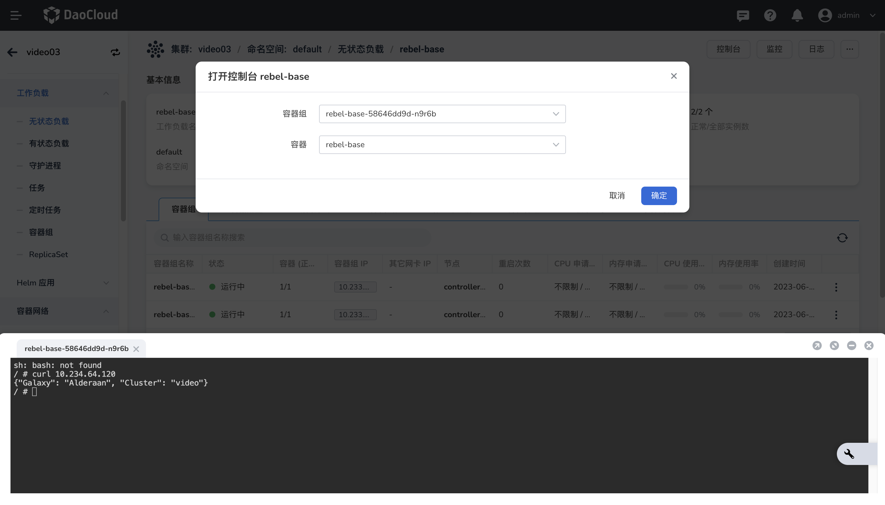
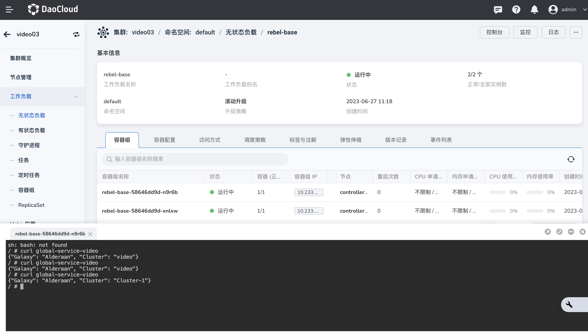

# 应用跨集群通信

## 前提条件

创建集群所有节点上的 kernel 版本升级至少大于 5.0。

## 创建集群

1.创建两个名称不同的集群，集群一的网络插件选择 cilium，添加两个参数 `cluster-id` 和 `cluster-name`，便于标识集群确保唯一性，避免跨集群通信时出现冲突，其他均使用默认配置项。

2.以同样的步骤创建集群二。
注意：两个集群使用的容器网段和服务网段一定不能冲突，两个参数的值不能冲突。



3.集群创建成功后，在两个集群上分别创建一个 Service，对外暴露该集群的API server。

- 选择 NodePort 访问类型便于外部访问
- 命名空间必须选择 kube-system
- 通过标签选择器筛选 API Server组件
- 配置 Service 的访问端口
- 点击该 Service 的外部访问链接



4.再以同样方式在集群二为 API Server 创建 Service，且配置信息完全一致，最后可以从外部成功访问。



## 修改集群配置

1.通过 `vi`命令开始编辑集群一的 `kubeconfig` 文件:

```bash
vi $HOME/.kube/config
```

2.添加两个集群的 API Server 访问地址：

- CA 证书直接复制已有的证书内容
- name 改为集群一的名称
- server 地址改为：集群一 API Server 的 Service 地址，可以从 DCE5.0 的页面查看或复制。注意：需要使用 https 协议。
- 添加集群二的 API Server 访问地址，name 改为集群二的名称，server 地址改为集群二 API Server 的 Service 地址。

```bash
- cluster:
    certificate-authority-data: {{cluster1 ca}}
    server: https://{{api server1}}
  name: {{cluster1 }}
- cluster:
    certificate-authority-data: {{cluster2 ca}}
    server: https://{{api server2}}
  name: {{cluster2}}
```

3.在 context 中分别添加集群一和集群二：

- 将 context 中的 name、user、cluster 三个字段的值均修改为集群一的名称。
- 同样地，将 context 中的 name、user、cluster三个字段的值均修改为集群二的名称。
- 如下为操作过程中的 yaml 示例：

```bash
contexts:
- context:
    cluster: cluster.local
    user: kubernetes-admin
  name: kubernetes-admin@cluster.local
- context:
    cluster: {{cluster1 name}}
    user: {{cluster1 name}}
  name: {{cluster1 name}}
- context:
    cluster: {{cluster2 name}}
    user: {{cluster2 name}}
  name: {{cluster2 name}}
current-context: kubernetes-admin@cluster.local
```

4.在 users 下面分别添加集群一和集群二。

- 集群一复制原有的证书信息，将 name 改为集群一的名称。
- 接着添加集群二，注意：集群二需要复制集群二中 kubeconfig 的证书信息，将 name 值改为集群二的名称。
- 如下为操作过程中的 yaml 示例：

```bash
users:
- name: {{cluster1}}
  user:
    client-certificate-data: {{cluster1 certificate-data}}
    client-key-data: {{cluster1 key-data}}
- name: {{cluster2}}
  user:
    client-certificate-data: {{cluster2 certificate-data}}
    client-key-data: {{cluster2 key-data}}

```

5.进入集群二的控制节点，以同样的步骤修改 kubeconfig 文件：

- 在 clusters 下面分别添加两个集群的 API Server 地址。
- 在 contexts 下面添加集群一和集群二。
- 在 users 下面也要添加两个集群，注意：集群一需要复制集群一中 kubeconfig 的证书信息。

## 配置集群连通性

执行如下命令验证集群的连通性：

1.在集群一上输入：

```bash
cilium clustermesh enable --create-ca --context cluster01 --service-type NodePort
```

2.集群二开启 `clustermesh` 执行如下命令：

```bash
cilium clustermesh enable --create-ca --context cluster02 --service-type NodePort
```

3.在集群一上建立连接：

```bash
cilium clustermesh connect --context cluster01 --destination-context cluster02
```

4.集群一出现 `connected cluster1 and cluster2!` ，集群二出现 `ClusterMesh enabled!`说明两个集群通了。

## 创建演示应用

1.使用 cilium 官方文档中提供的 [rebel-base](https://github.com/cilium/cilium/blob/main/examples/kubernetes/clustermesh/global-service-example/cluster1.yaml) 应用，复制如下 yaml 文件：

```bash
apiVersion: apps/v1
kind: Deployment
metadata:
  name: rebel-base
spec:
  selector:
    matchLabels:
      name: rebel-base
  replicas: 2
  template:
    metadata:
      labels:
        name: rebel-base
    spec:
      containers:
      - name: rebel-base
        image: docker.io/nginx:1.15.8
        volumeMounts:
          - name: html
            mountPath: /usr/share/nginx/html/
        livenessProbe:
          httpGet:
            path: /
            port: 80
          periodSeconds: 1
        readinessProbe:
          httpGet:
            path: /
            port: 80
      volumes:
        - name: html
          configMap:
            name: rebel-base-response
            items:
              - key: message
                path: index.html
---
apiVersion: v1
kind: ConfigMap
metadata:
  name: rebel-base-response
data:
  message: "{\"Galaxy\": \"Alderaan\", \"Cluster\": \"Cluster-1\"}\n" #将 Cluster-1 修改为集群一的名称
---
apiVersion: apps/v1
kind: Deployment
metadata:
  name: x-wing
spec:
  selector:
    matchLabels:
      name: x-wing
  replicas: 2
  template:
    metadata:
      labels:
        name: x-wing
    spec:
      containers:
      - name: x-wing-container
        image: quay.io/cilium/json-mock:v1.3.3@sha256:f26044a2b8085fcaa8146b6b8bb73556134d7ec3d5782c6a04a058c945924ca0
        livenessProbe:
          exec:
            command:
            - curl
            - -sS
            - -o
            - /dev/null
            - localhost
        readinessProbe:
          exec:
            command:
            - curl
            - -sS
            - -o
            - /dev/null
            - localhost
```

2.在 DCE 5.0中通过 yaml 文件快速创建集群一的应用。

（1）修改 ConfigMap 的内容，使得访问集群一中的服务时，返回的数据带有集群一名称的标签。可在 rebel-base 应用中查看容器组标签。


（2）创建集群一 Service，指向创建的 rebel-base 应用：

- Service 类型为 ClusterIP
- 添加应用的容器组标签筛选对应的应用
- 配置端口
- 添加注解，使当前的 Service在全局生效


3.以同样的方式在集群二中创建应用。

（1）修改 ConfigMap，使得访问集群二中的服务时，返回的数据带有集群二名称的标签。

（2）再创建对应的 Service，注意：集群二 Service 的名称必须与集群一中对应 Service 的名称完全一致、并位于相同的命名空间、拥有相同的端口名称和相同的 global 注解。



## 跨集群通信

1.先查看集群二中应用的 Pod IP。



2.在集群一中进入应用 Pod 控制台，`curl`集群二应用的 Pod IP，成功返回集群二的配置项内容，说明两个集群中的 Pod 可以相互通信。



3.查看集群一的 Service 名称，进入集群二的应用 Pod 控制台，`curl`对应的 Service 名称，有些返回内容来自集群一，说明两个集群中的Pod 和 Service 也可以互相通信。


