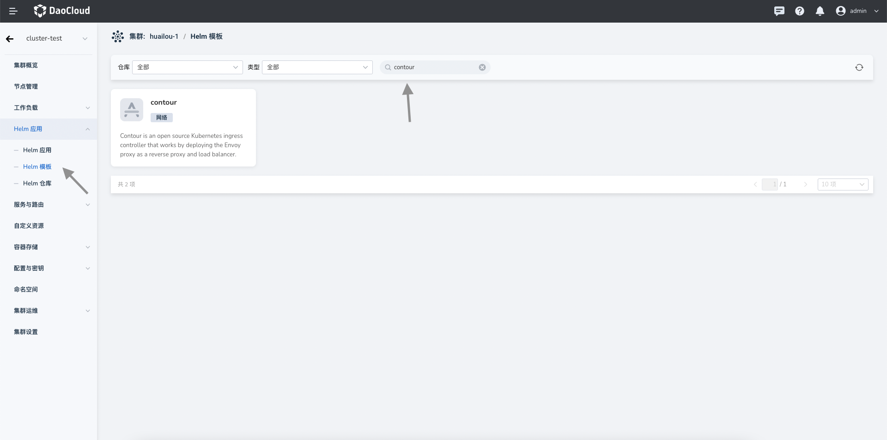
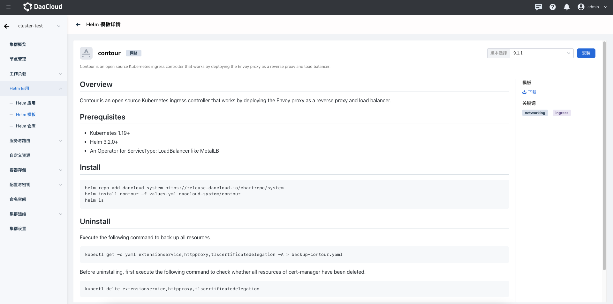
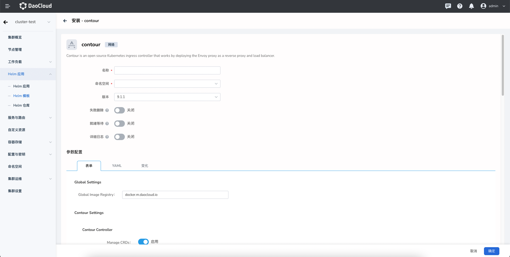
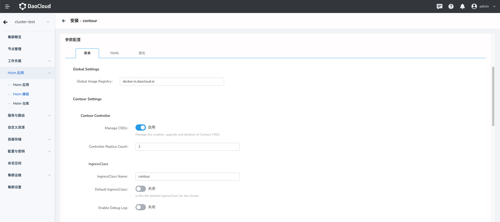
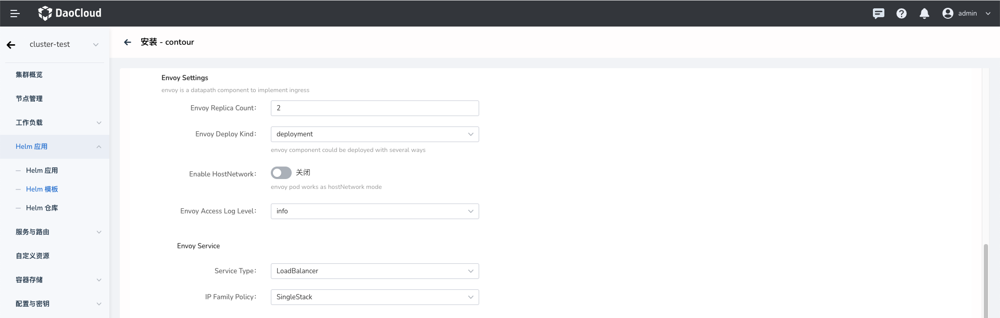
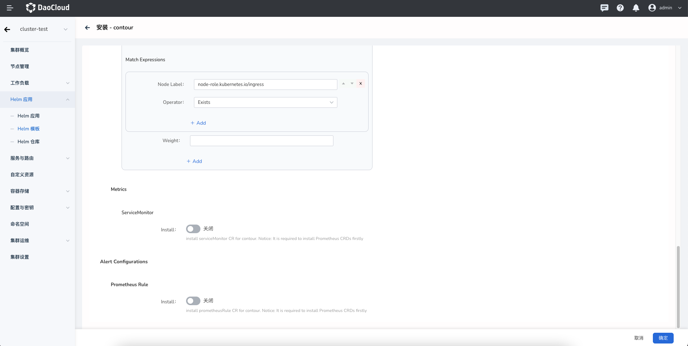

# 安装

1. 在浏览器打开集群的管理界面，点击侧边栏导航的 `Helm 应用`，然后点击 `Helm 模板`。

    

2. 在搜索栏输入 `contour` 关键字，点击 `Contour` 应用选项卡，进入应用预览界面。

    

    在右上角可以通过下拉框选择版本，然后点击`安装`按钮。然后进入安装配置界面。
    依次输入部署后的应用名称、命名空间，以及部署的选项。

    
    
3. 配置参数。

    - `Global Image Registry` 可以统一设置镜像仓库地址。
    - `Manage CRDs` 可以在安装应用的时候创建 Contour 的 CRD。
    - `Controller Replica Count` 可以配置 Contour 控制面的副本数量。
    - "IngressClass Name" 可以配置 Ingress Class 名称，如果集群部署多套 Ingress 的时候，可以使用此 Class 进行区分，这个字段会在创建 Ingres CR 的时候设置。
    - `Default IngressClass` 则设置此套 Ingress 为默认 Ingress。
    - `Enable Debug Log` 选项开启以设置控制面 Debug 级别日志输出。

    

    - `Envoy Replica Count` 配置数据面 Envoy 的副本数量。
    - `Envoy Deploy Kind` 可以配置 Envoy 的部署类型，可以选择部署为 Deployment 或者是 DaemonSet。
    - `Enable HostNetwork` 使用 Host 网络，默认关闭。如没有特殊需求不推荐开启此选项。
    - `Envoy Access Log Level` 可以配置 Envoy 访问日志等级。
    - `Service Type` 可以配置使用的 Service 类型。
    - `IP Family Policy` 为 IP 单双栈设置，可以根据需求开启。

    

    - `Match Expressions` 可以通过软亲和性指定调度规则。
    - `Weight` 可以配置软亲和的规则的权重。
    - `ServiceMonitor` 需要集群部署 Prometheus Operator。
    - `Prometheus Rule` 开启则可以创建包含告警规则 PrometheusRule CR，同样要求集群安装 Prometheus Operator，或者部署 Insight 组件。

    

4. 点击 Tab 选项卡中 YAML 以通过 YAML 方式进行高级配置。点击右下角`确定`按钮即可完成创建。
