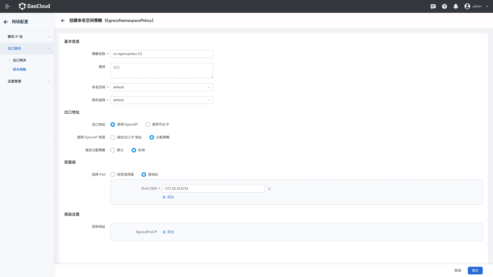

# 创建 Egress 网关策略

Egress 网关策略用于定义哪些 Pod 的出口流量要经过 EgressGateway 节点转发，以及定义其它的配置细节。
当匹配的 Pod 访问任意集群外部的地址（任意非 Node IP、CNI Pod CIDR、ClusterIP 的地址）时，都会被 EgressGateway Node 转发。
当前 Egress 网关策略分为两类：命名空间级别策略、集群级别策略。

- __命名空间级别__ ：创建的策略生效范围为命名空间级别
- __集群级别__ ： 创建的策略生效范围为集群级别

## 创建命名空间 Egress 网关策略

1. 点击 __网关策略__ -> 创建 __命名空间策略__ ，并填入如下参数：

    

    **基本信息** ：
    
    * `策略名称` ：输入待创建的策略名称。
    * `描述`：定义待创建策略描述。
    * `命名空间` ：创建的策略生效的命名空间，此示例中选择的为 __default__ 。
    * `网关选择` ：指定使用哪一个已经创建好的[Egress 网关实例](../egressgateway/create_eg.md)。

    **出口地址** ：

    * `出口 IP 地`址 ：可使用独立的 VIP作为出口 IP。因为 EgressGateway 基于 ARP 生效 VIP，适用于传统网络，
      源 IP 永久是固定的。在不做设置时，则默认使用缺省 VIP， IP 值必须在 EgressGateway 中的 IP 池范围内。可通过如下两种方式选择 IP：
        * `指定出口 IP 地址` ：指定某一个 IP 地址作为 出口 IP。
        * `指定分配策略` ：可使用 默认出口 IP 或者通过轮询方式 选择 IP 池中地址作为出口 IP 。
      
    * `节点 IP 地址` ：使用节点 IP 地址作为出口 IP。适用于公有云和传统网络等环境，缺点是随着网关节点的故障，出口源 IP 可能会发生变化。对应字段信息为 __spec.egressIP.useNodeIP=true__

    **源地址容器组** ：

    `选择容器组` ：支持通过 __标签选择器__ 或者 __源地址__ 方式选择源地址容器组，指定本策略生效的容器范围，
    当匹配的 Pod 访问任意集群外部的地址（任意不是 Node IP、CNI Pod CIDR、ClusterIP 的地址）时，都会被 EgressGateway Node 转发。
      * `标签选择器` ：通过标签指定源地址容器组。
      * `源地址`：通过添加 源地址 CIDR 地址段方式，添加白名单，锁定的 容器组将生效本策略。

    **高级设置** ：

    `目标地址` ：可指定访问目标地址白名单，指定后此策略将对定义的目标地址生效，支持 单个 IP 地址，IP 段，CIDR 等方式输入。默认不定义，对所有目标地址生效。

2. 输入完成后点击 **确定** 完成创建。

## 创建集群 Egress 网关策略

1. 点击 __网关策略__ -> __创建集群策略__ ，基本信息、出口地址、容器组选择等参数请参考[创建命名空间 Egress 网关策略](#egress_1)。
    
    **高级设置** ：
    
    * `命名空间选择器` ：通过 Label 方式选择命名空间，策略生效范围为所选择命名空间。
    * `目标地址` ：同创建命名空间 Egress 网关策略 规则一致。
    
2. 输入完成后点击 **确定** 完成创建。

## 通过 YAML 创建 Egress 网关策略

1. 创建网关策略 YAML

    ```shell
    cat <<EOF | kubectl apply -f -
    apiVersion: egressgateway.spidernet.io/v1beta1
    kind: EgressPolicy
    metadata:
      name: test
      namespace: default
    spec:
      egressGatewayName: default
      appliedTo:
        podSelector:
          matchLabels:
            app: "visitor"
    EOF
    ```

    在以上创建命令中：

    * __spec.egressGatewayName__ 指定了使用哪一组 EgressGateway 的名字。
    * __spec.appliedTo.podSelector__ 指定了本策略生效在集群内的哪些 Pod。
    * 集群的 egress 流量的源 IP 地址有两种选择：
        * 可使用网关节点的 IP。它可适用于公有云和传统网络等环境，缺点是，随着网关节点的故障，
          出口源 IP 可能会发生变化。可设置 __spec.egressIP.useNodeIP=true__ 来生效。
        * 可使用独立的 VIP，因为 EgressGateway 是基于 ARP 原理生效 VIP，所以它适用于传统网络，
          而不适用于公有云等环境，它的优点是，出口源 IP 永久是固定的。在 EgressPolicy 中不做任何设置，
          则默认使用 `egressGatewayName` 的缺省 VIP，或者可单独手动指定 __spec.egressIP.ipv4__ ，其 IP 值务必是符合 EgressGateway 中的 IP 池。

2. 查看 EgressPolicy 的状态

    ```shell
    $ kubectl get EgressPolicy -A
    NAMESPACE   NAME   GATEWAY   IPV4           IPV6   EGRESSTUNNEL
    default     test   default   172.22.0.110          egressgateway-worker2
     
    $ kubectl get EgressPolicy test -o yaml
    apiVersion: egressgateway.spidernet.io/v1beta1
    kind: EgressPolicy
    metadata:
      name: test
      namespace: default
    spec:
      appliedTo:
        podSelector:
          matchLabels:
            app: visitor
      egressIP:
        allocatorPolicy: default
        useNodeIP: false
    status:
      eip:
        ipv4: 172.22.0.110
      node: egressgateway-worker2
    ```

    如上输出中：

    * __status.eip__ 展示了该组应用出集群时使用的出口 IP 地址。
    * __status.node__ 展示了哪一个 EgressGateway 的节点在实时的负责出口流量的转发。
    
    !!! note
    
        EgressGateway 节点支持高可用，当存在多个 EgressGateway 节点时，所有的 EgressPolicy 会均摊到不同的 EgressGateway 节点上实施。

3.  查看 EgressEndpointSlices 的状态

    每个 EgressPolicy 对象，都有一个对应的 EgressEndpointSlices 对象，其中存储了 EgressPolicy select 的 Pod 的 IP 地址集合。
    当应用无法出口访问时，可排查该对象中的 IP 地址是否正常。

    ```shell
    $ kubectl get egressendpointslices -A
    NAMESPACE   NAME         AGE
    default     test-kvlp6   18s
    
    $ kubectl get egressendpointslices test-kvlp6 -o yaml
    apiVersion: egressgateway.spidernet.io/v1beta1
    endpoints:
    - ipv4:
      - 172.40.14.195
      node: egressgateway-worker
      ns: default
      pod: visitor-6764bb48cc-29vq9
    kind: EgressEndpointSlice
    metadata:
      name: test-kvlp6
      namespace: default
    ```

## Egress 网关测试

1. 可在集群外部署应用 nettools，用于模拟一个集群外部的服务，nettools 会在 http 回复中返回请求者的源 IP 地址。

    ```shell
    docker run -d --net=host ghcr.io/spidernet-io/egressgateway-nettools:latest /usr/bin/nettools-server -protocol web -webPort 8080
    ```

2. 在集群内部的 visitor Pod 中，验证出口流量的效果，我们可以看到 visitor 访问外部服务，nettools 返回的源 IP 符合了 EgressPolicy `.status.eip` 的效果。

    ```shell
    $ kubectl get pod
    NAME                       READY   STATUS    RESTARTS   AGE
    visitor-6764bb48cc-29vq9   1/1     Running   0          15m
    
    $ kubectl exec -it visitor-6764bb48cc-29vq9 bash
    $ curl 10.6.1.92:8080
    Remote IP: 172.22.0.110
    ```
