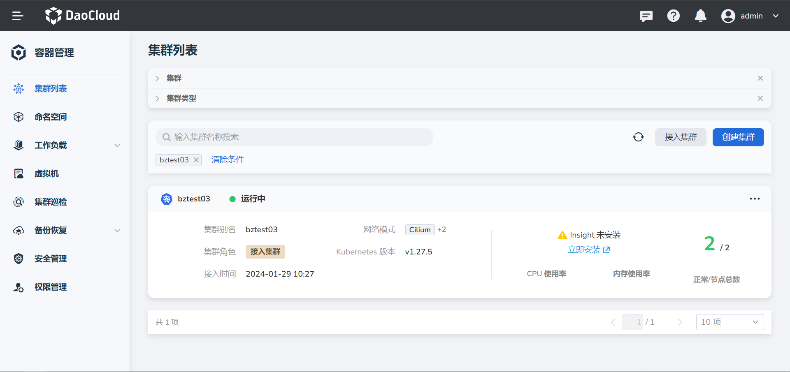
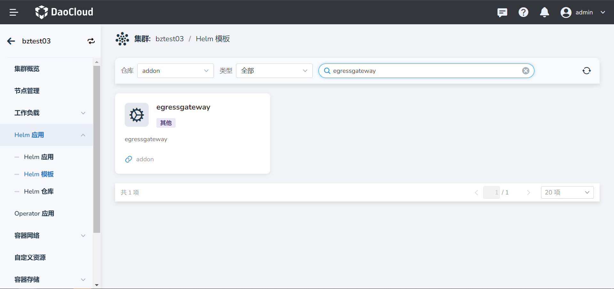
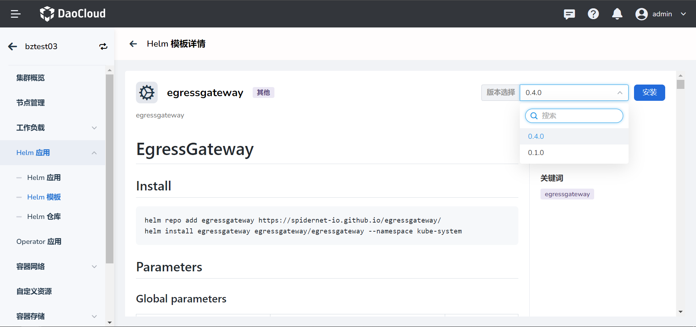
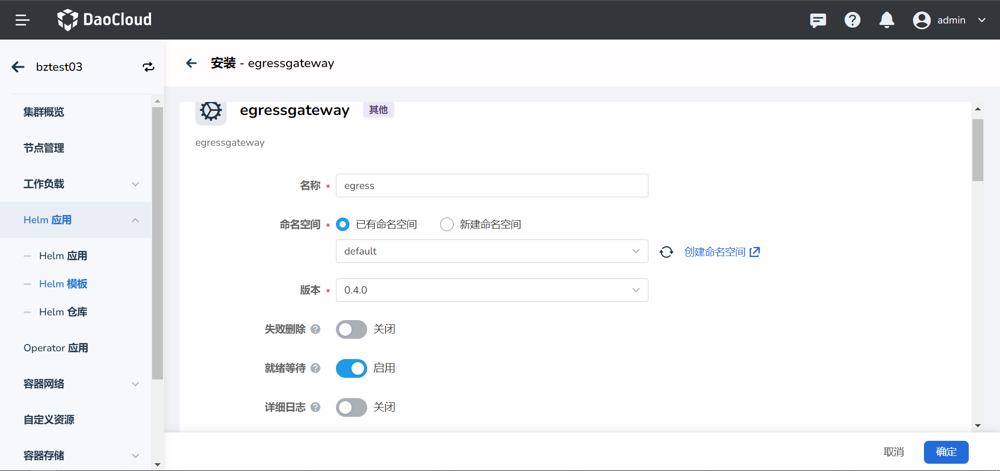
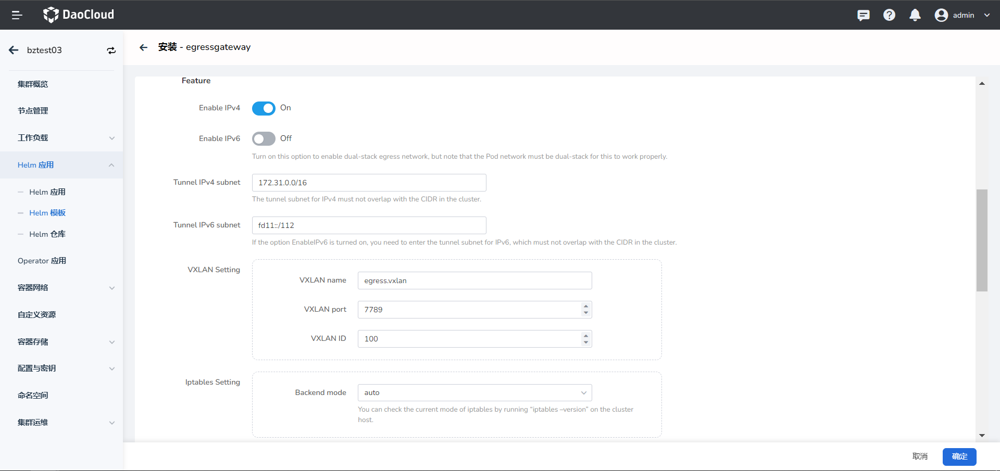
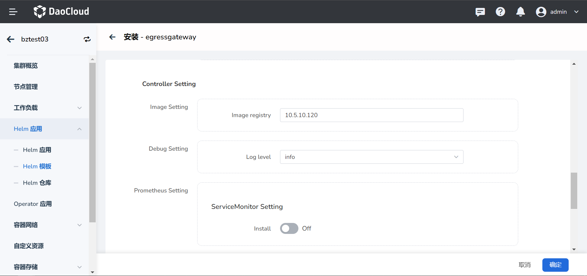
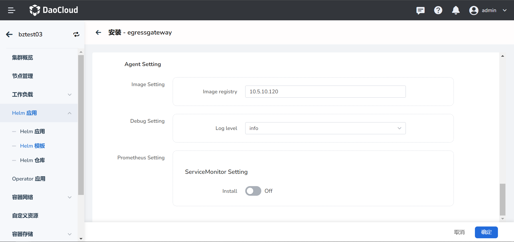

# 在 dce5 中，安装 egressgateway

1. 首先选择要安装 egressgateway 的集群

2. 在 `Helm 模板` 中搜索 `egressgateway`

3. 选择要安装的版本，点击 `安装`

4. 填写 `名称`，`命名空间`，打开 `就绪等待`

5. 设置填写 `参数配置`

6. 参数说明

| 字段 | 含义 |
|---|---|
| `Enable IPv4` | 是否支持 ipv4 |
| `Enable IPv6` | 是否支持 ipv6 |
| `Tunnel IPv4 subnet` | 创建 vxlan 隧道的 ipv4 子网，注意不要和集群中网络冲突 |
| `Tunnel IPv6 subnet` | 创建 vxlan 隧道的 ipv6 子网，注意不要和集群中网络冲突 |
| `VXLAN name` | vxlan 网卡名称 |
| `VXLAN port` | vxlan 端口 |
| `VXLAN ID` | vxlanID |
| Iptables Setting `Backend mode` | 集群中 iptables 的模式 |

