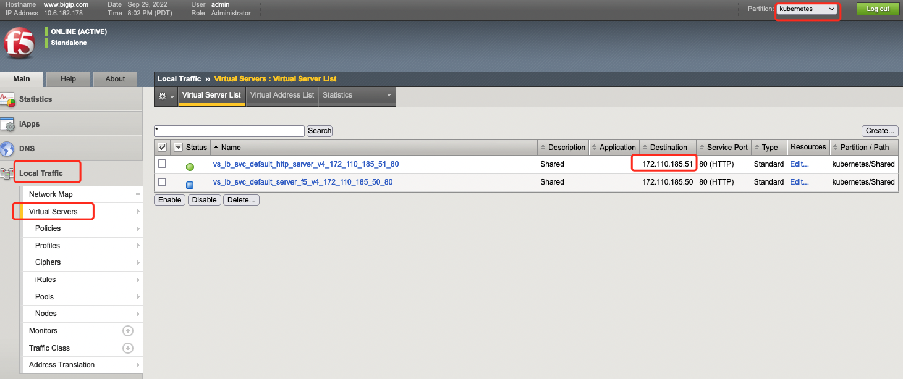
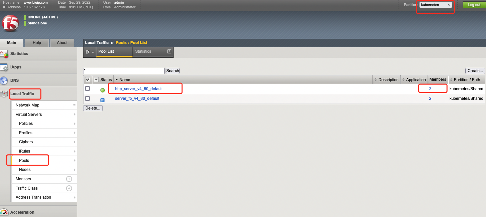
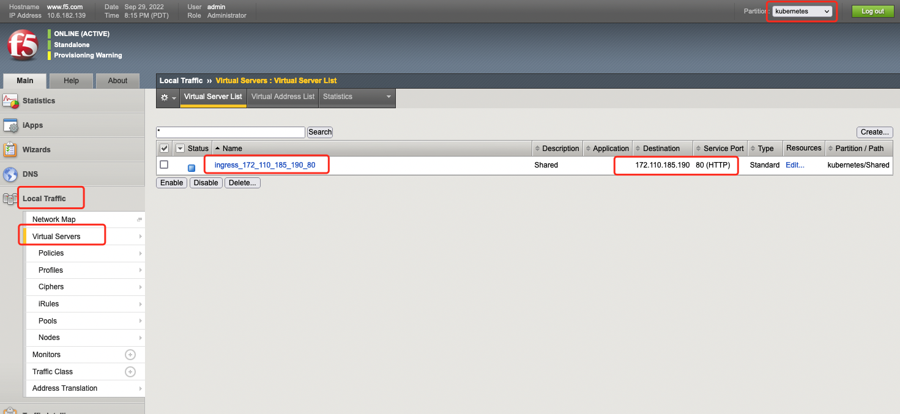
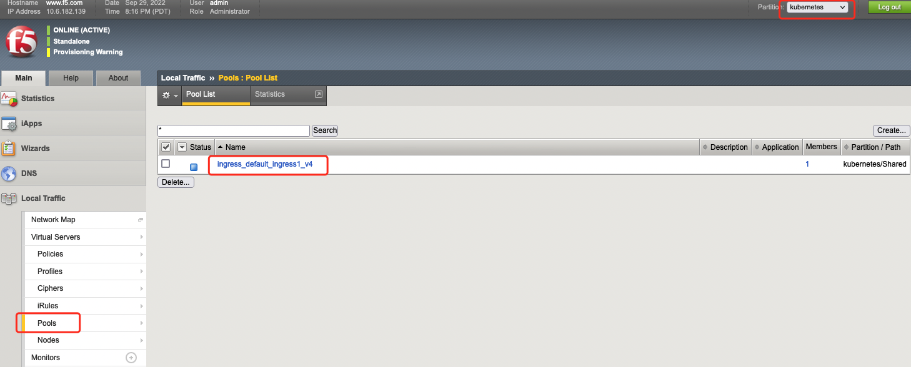

# 使用

本页从 4 层和 7 层负载均衡角度讲述如何使用 f5network

## 4 层负载均衡

当组件安装为 4 层负载均衡模式时，可为集群中的 service 创建 F5 的负载均衡服务，具体用法请参考 [F5 官方文档](https://clouddocs.f5.com/containers/latest/userguide/loadbalancer/)。

以下给出简单的例子：

1. 当以 nodePort 转发方式工作时，必须为应用创建一个 LoadBalancer 类型的 service。

    ```yaml
    apiVersion: v1
    kind: Service
    metadata:
      name: http-server
      annotations:
        cis.f5.com/ipamLabel: LabelName
        cis.f5.com/health: '{"interval": 10, "timeout": 31}'
    spec:
      type: LoadBalancer
      ports:
      - port: 80
        targetPort: 80
        name: http
      selector:
        app: http-server
    ```

    注意如上 YAML 中的 annotation：

    1. 必须打上 "cis.f5.com/ipamLabel"，注意替换该 key 的值，请设置为安装时填写"BIGIP L4 IP Pool"的 LabelName，否则该转发规则不会分配到 VIP。
    2. "cis.f5.com/health" 是可选的。
    3. 更多的 annotation 支持，请参考 [F5 官方文档](https://clouddocs.f5.com/containers/latest/userguide/loadbalancer/#parameters)。

2. 创建 service 后，即可观测到分配到的 EXTERNAL-IP：

    ```shell
    $ kubectl get service -o wide
    NAME             TYPE           CLUSTER-IP     EXTERNAL-IP      PORT(S)        AGE     SELECTOR
    http-server      LoadBalancer   172.21.25.10   172.110.185.51   80:31548/TCP   3d14h   app=http-server
    ```

3. 登录到 F5 Web UI，切换到所使用的 partition，即可观测到下发的转发规则。

    

    

4. 在集群外发，访问 F5 分配到的 VIP，即可访问到服务。

## 7 层负载均衡 http

当组件安装为 7 层负载均衡模式时，可为集群中的 ingress 创建 F5 的负载均衡服务，具体用法请参考 [F5 官方文档](https://clouddocs.f5.com/containers/latest/userguide/ingress.html)。

以下给出简单的例子：

1. 确认 F5 的 ingressClass。

    ```shell
    $ kubectl get ingressClass
    NAME   CONTROLLER                 PARAMETERS   AGE
    f5     f5.com/cntr-ingress-svcs   <none>       41h
    ```

2. 当本组件以 nodePort 转发方式工作时，必须为应用创建一个 nodePort 类型的 service 和 ingress 对象。

    ```yaml
    apiVersion: v1
    kind: Service
    metadata:
      name: http-server
    spec:
      type: nodePort
      ports:
      - port: 80
        targetPort: 80
        name: http
      selector:
        app: http-server
    ---
    apiVersion: networking.k8s.io/v1
    kind: Ingress
    metadata:
      name: http-server
    spec:
      ingressClassName: f5
      rules:
      - http:
          paths:
            - path: /http-server
              pathType: Prefix
              backend:
                service:
                  name: http-server
                  port:
                    number: 80
    ```

    在如上 ingress yaml 中：

    1. ingressClassName 使用 F5 的 ingressClass。
    2. ingress 还支持更多 annotation，请参考 [F5 官方文档](https://clouddocs.f5.com/containers/latest/userguide/ingress.html#supported-ingress-annotations)。

3. 创建 ingress 后，可观测到 ingress 对象分配到的 ADDRESS。

    ```shell
    # kubectl get ingress
    NAME          CLASS   HOSTS   ADDRESS           PORTS   AGE
    http-server   f5      *       172.110.185.190   80      40h
    ```

4. 登录到 F5 Web UI，切换到所使用的 partition，即可观测到下发的转发规则。

   

   

5. 在集群外发，访问 F5 分配到 URL http://VIP/http-server，即可访问到服务。

## 7 层负载均衡 https

1. 创建一组 TLS 证书。

2. 创建 secret（注意：secert 的 key 必须是 tls.key 和 tls.crt）。

    ```shell
    kubectl  delete secret ingress1-ssl
    kubectl create secret generic ingress1-ssl \
        --from-file=./tls.crt --from-file=./tls.key
    ```

3. 创建 ingress 对象。

    ```yaml
    apiVersion: networking.k8s.io/v1
    kind: Ingress
    metadata:
      name: $NAME
      annotations:
        # http 重定向到 https 来访问
        ingress.kubernetes.io/ssl-redirect: "true"
        ingress.kubernetes.io/allow-http: "false"
    spec:
      ingressClassName: ${INGRESS_CLASS}
      tls:
      - hosts:
          - test.example.com
          secretName: ingress1-ssl
      rules:
      ....
    ```
