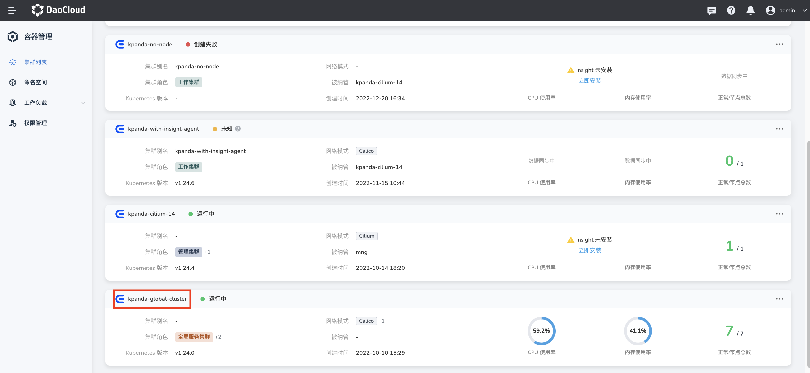
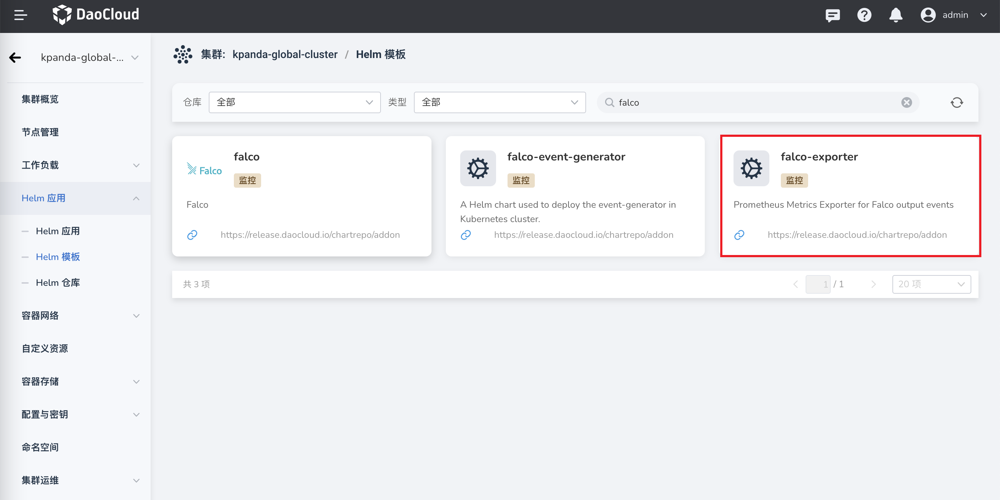
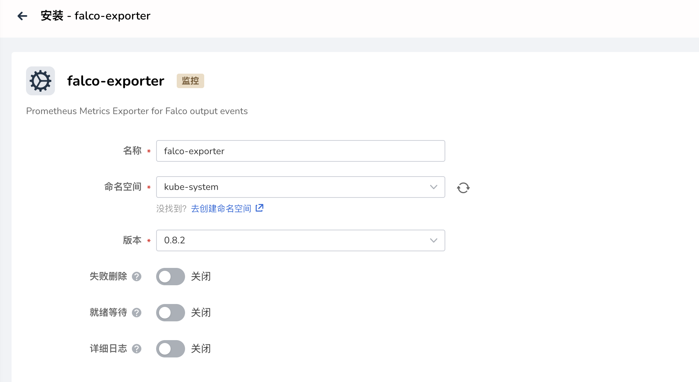

# 安装 Falco-exporter

本页介绍如何安装 Falco-exporter 组件。

!!! note

    在安装使用 Falco-exporter 之前，需要[安装](../falco/install.md)并运行 Falco，并启用 gRPC 输出（默认通过 Unix 套接字启用）。关于启用 gRPC 输出的更多信息，可参阅[在 Falco Helm Chart 中启用 gRPC 输出](https://github.com/falcosecurity/charts/tree/master/falco#enabling-grpc)。

请确认您的集群已成功接入`容器管理`平台，然后执行以下步骤安装 Falco-exporter。

1. 从左侧导航栏点击`容器管理`—>`集群列表`，然后找到准备安装 Falco-exporter 的集群名称。

    

2. 在左侧导航栏中选择 `Helm 应用` -> `Helm 模板`，找到并点击 `falco-exporter`。

    

3. 在`版本选择`中选择希望安装的版本，点击`安装`。
    

4. 在安装界面，填写所需的安装参数。

    

    在如上界面中，填写`应用名称`、`命名空间`、`版本`等。

    

    在如上界面中，填写以下参数:

    - `Falco Prometheus Exporter` -> `Image Settings` -> `Registry`：设置 falco-exporter 镜像的仓库地址，已经默认填写可用的在线仓库。如果是私有化环境，可修改为私有仓库地址。

    - `Falco Prometheus Exporter` -> `Prometheus ServiceMonitor Settings` -> `Repository`：设置 falco-exporter 镜像名。

    - `Falco Prometheus Exporter` -> `Prometheus ServiceMonitor Settings` -> `Install ServiceMonitor`：安装 Prometheus Operator 服务监视器，默认开启。

    - `Falco Prometheus Exporter` -> `Prometheus ServiceMonitor Settings` -> `Scrape Interval`：用户自定义的间隔；如果未指定，则使用 Prometheus 默认间隔。

    - `Falco Prometheus Exporter` -> `Prometheus ServiceMonitor Settings` -> `Scrape Timeout`：用户自定义的抓取超时时间；如果未指定，则使用 Prometheus 默认的抓取超时时间。

    

    

   在如上界面中，填写以下参数:

    - `Falco Prometheus Exporter` -> `Prometheus prometheusRules` -> `Install prometheusRules`：创建 PrometheusRules，对优先事件发出警报，默认开启。

    - `Falco Prometheus Exporter` -> `Prometheus prometheusRules` -> `Alerts settings`：警报设置，为不同级别的日志事件设置警报是否启用、警报的间隔时间、警报的阈值。

5. 点击右下角`确定`按钮即可完成安装。
