# 安装 Higress

本页介绍如何安装 Higress 组件。

请确认您的集群已成功接入`容器管理`平台，然后执行以下步骤安装 Higress。

1. 在左侧导航栏点击`容器管理`—>`集群列表`，然后找到准备安装 Higress 的集群名称。

    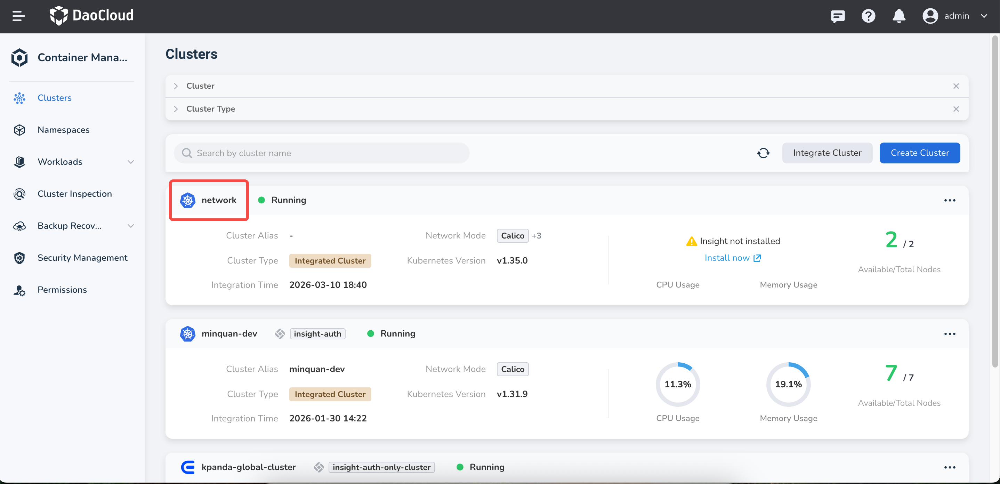

2. 在左侧导航栏中选择 `Helm 应用` -> `Helm 模板`，找到并点击 `higress`。

    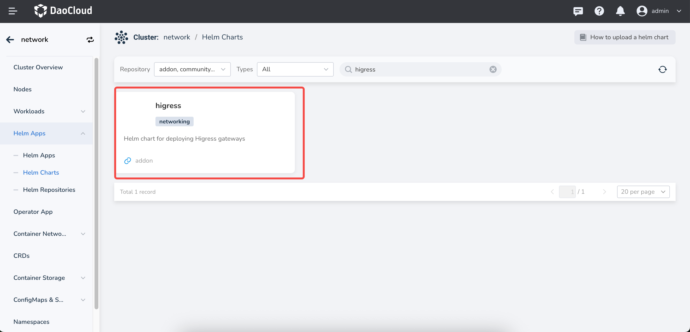

3. 在`版本选择`中选择希望安装的版本，点击`安装`。

    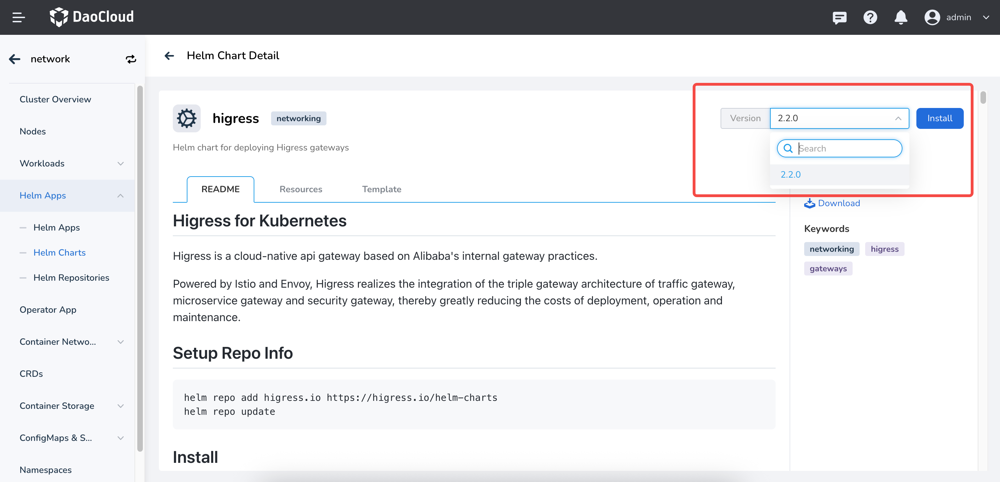

4. 在安装界面，填写所需的安装参数。

    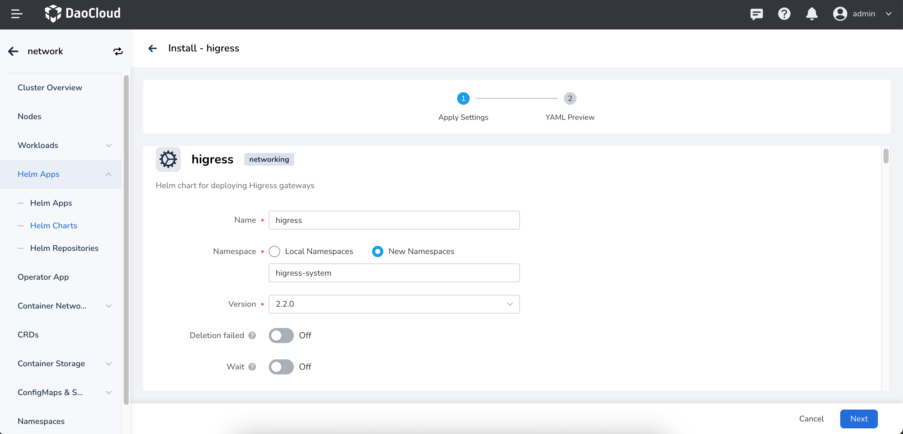

    在以上界面中，输入部署后的应用名称、命名空间以及部署的选项。

    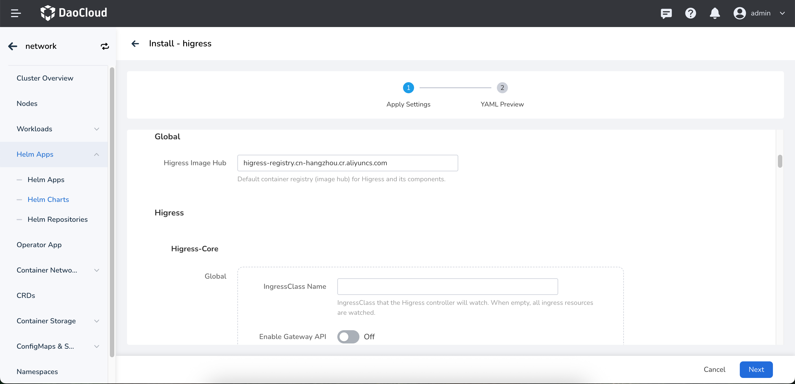

    上图中的各项参数说明：

    - `global` -> `Higress Image Hub`：配置 Higress 全局镜像仓库地址，默认为: `higress-registry.cn-hangzhou.cr.aliyuncs.com`
    - `higress` -> `higress-core` -> `global.IngressClass Name`： 配置 Higress 监听的 Ingress Class 名称，默认为空表示 Higress 将会监听并接管集群中所有 Ingress Class（比如 nginx ingress class）。
    - `higress` -> `higress-core` -> `global.Enable Gateway API`：启用 Gateway API 支持。开启该选项后，Higress 将会监听并接管集群中的 Gateway API 资源, 默认为 false。注意：如果集群中未安装 [Gateway API](https://kubernetes.io/docs/concepts/services-networking/gateway/)，请不要开启此选项, 否则 Higress 无法正常运行。
   
   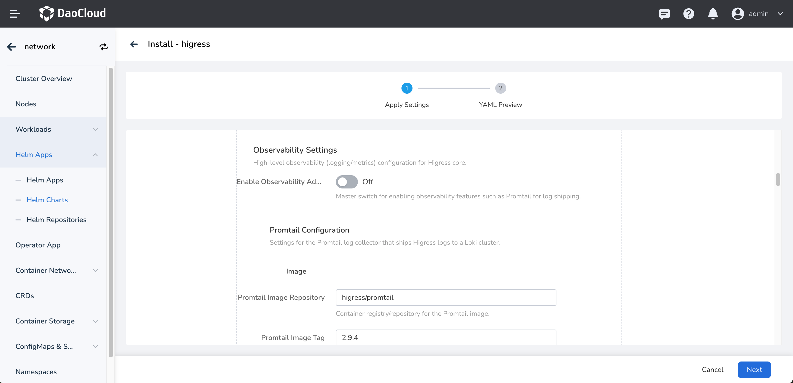

    以上的各项参数说明：

    - `higress` -> `higress-core` -> `global.Observability Settings`：开启 Higress 的可观测性设置，默认为 false。
    - `higress` -> `higress-core` -> `global.Promtail Configuration`：用于配置 Promtail 日志收集器的镜像设置，用于收集 Higress 的日志。

    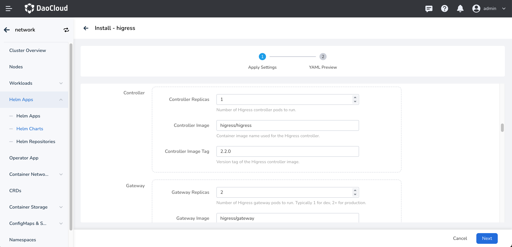

    上图中的各项参数说明：

    - `Higress` -> `Higress Core` -> `Controller`：设置 Controller 的的副本数，镜像配置，以及 tag，这些配置一般不需要变化。
    - `Higress` -> `Higress Core` -> `Gateway`：设置 Gateway 的的副本数，镜像配置，以及 tag，这些配置一般不需要变化。

    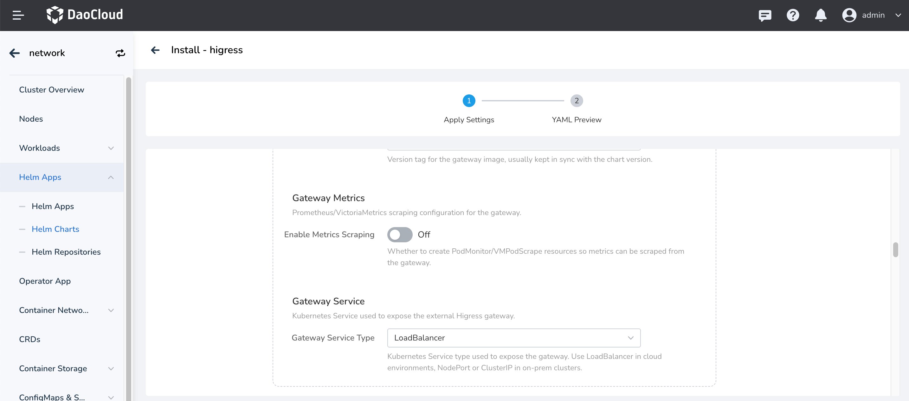
    
    上图中的各项参数说明：

    - `Higress` -> `Higress Core` -> `Gateway.Gateway Metrics`：是否开启 Gateway 的指标收集配置
    - `Higress` -> `Higress Core` -> `Gateway.Gateway Service`：设置 Gateway 的服务类型，默认为 LoadBalancer, 这期望 Gateway 以 LB 方式对外暴露。

    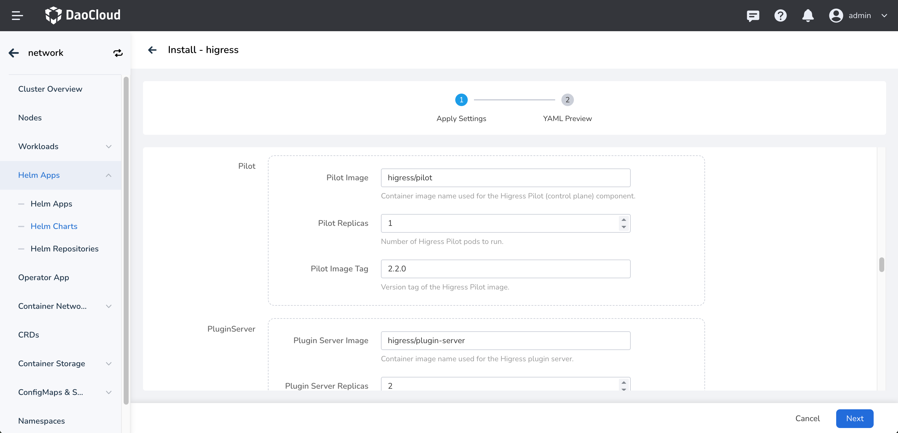
    
    上图中的各项参数说明：

    - `Higress` -> `Higress Core` -> `pilot`: 配置 Istio Pilot 的相关参数，包括副本数、镜像配置等。
    - `Higress` -> `Higress Core` -> `pluginServer`: 配置插件服务器的相关参数，包括副本数、镜像配置等。

    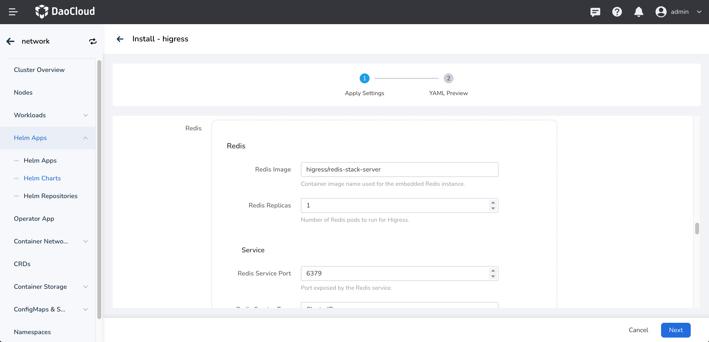
    
    上图中的各项参数说明：

    - `Higress` -> `Higress Core` -> `Redis`：配置 Redis 的相关参数，包括副本数、镜像配置、服务配置，默认不需要修改。

    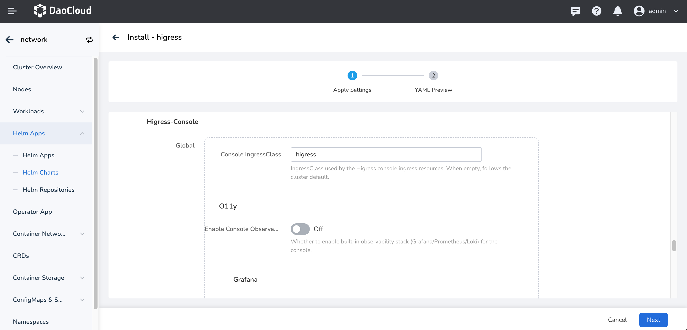
    
    上图中的各项参数说明：

    这部分参数主要是关于 Higress-console 的配置，Higress-console 是 Higress 的管理控制台，可以在 WEB UI 中管理 Higress 的配置，并且可以查看 Higress 的指标数据。参考文档：[Higress Console](https://higress.ai/blog/console-dev)
    - `Higress` -> `Higress-Console`: 包括开启监控配置，镜像配置，副本数量，一般不需要改动，默认即可。

5. 对于更高级的配置可以通过点击 Tab 选项卡中 `YAML` 以通过 YAML 方式进行配置。
    点击右下角`确定`按钮即可完成创建。