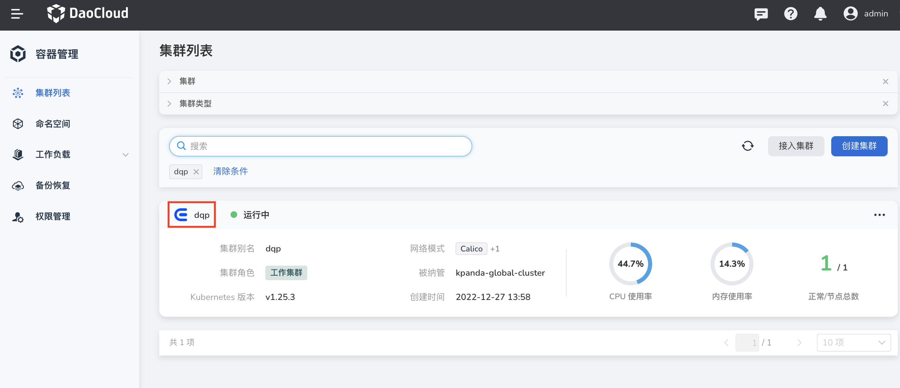
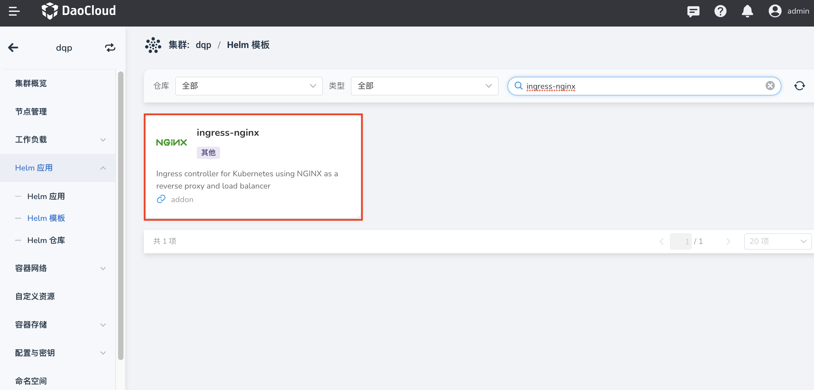
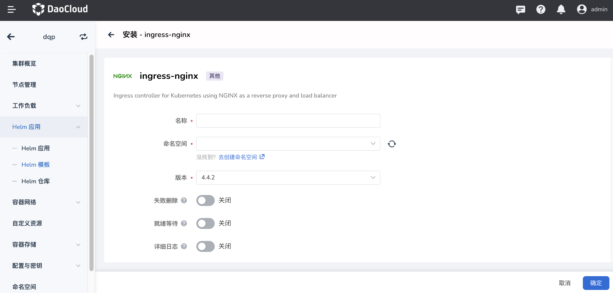
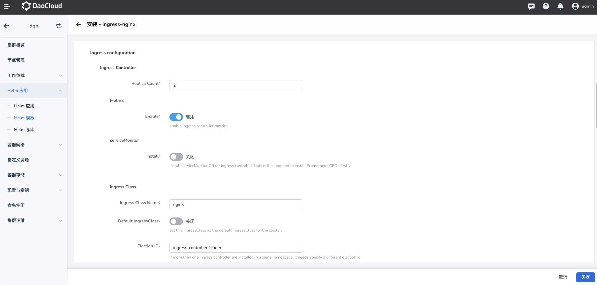
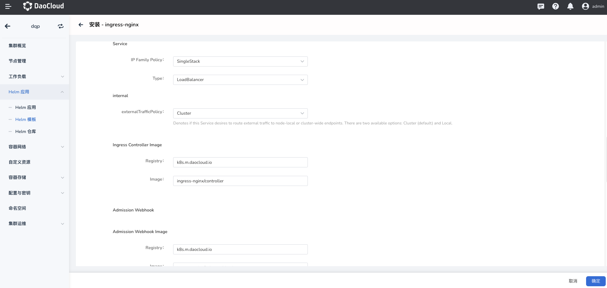
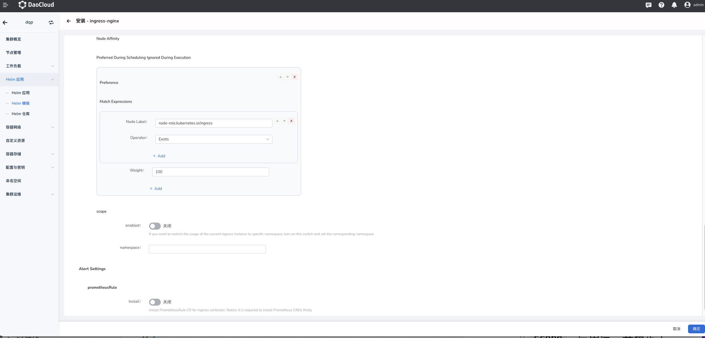

# 安装 ingress-nginx

本页介绍如何安装 ingress-nginx 组件。

请确认您的集群已成功接入`容器管理`平台，然后执行以下步骤安装 ingress-nginx。

1. 在左侧导航栏点击`容器管理`—>`集群列表`，然后找到准备安装 ingress-nginx 的集群名称。

    

2. 在左侧导航栏中选择 `Helm 应用` -> `Helm 模板`，找到并点击 `ingress-nginx`。

    

3. 在`版本选择`中选择希望安装的版本，点击`安装`。

    

4. 在安装界面，填写所需的安装参数。

    

    在以上界面中，输入部署后的应用名称、命名空间以及部署的选项。

    

    上图中的各项参数说明：

    - `Ingress Controller` -> `Replica Count`：配置[副本数量](https://kubernetes.io/zh-cn/docs/concepts/workloads/controllers/replicaset/)，推荐配置为 2，以提高可用性。对于 POC 体验可以配置为 1，以减少资源占用。
    - `Ingress Controller` -> `Metrics`：开启后，Controller Pod 会暴露 metrics 接口，监控的 Agent 可以采集指标数据，通过监控告警提高业务和服务的可靠性。
    - `Ingress Controller` -> `ServiceMonitor`：要求集群内已部署 Insight 组件，或者 [Prometheus Operator](https://github.com/prometheus-operator/prometheus-operator)。开启后会在后端创建对应的 ServiceMonitor CR。
    - `Ingress Controller` -> `Ingress Class` -> `Ingress Class Name`：配置 [Ingress Class](https://kubernetes.io/zh-cn/docs/concepts/services-networking/ingress/#ingress-class) 名称。Ingress CR 则可以通过 ingressClass 字段指定相同的 Class 名称，以选择使用此套 Ingress 实例来生效访问路由。当集群中拥有多套 Ingress 时，甚至在同一租户拥有多套 Ingress 的时候，通过 Ingress Class 来区分 Ingress 非常方便。详细使用方式请参考：[如何使用 Ingress Class](ingressclass.md)
    - `Ingress Controller` -> `Ingress Class` -> `Default IngressClass`：设置 Ingress Class 为默认 Class。开启该选项后创建 Ingress CR 时无需显式指定 ingressClass 字段。Kubernetes 自动更新 Ingress 的字段为默认 Class。同一个集群只能有一个默认 Ingress Class。
    - `Ingress Controller` -> `Ingress Class` -> `Election ID`：同一个租户部署多套 Ingress 时，需要保证此名称不会重复。

    

    上图中的各项参数说明：

    - `Ingress Controller` -> `Service` -> `IP Family Policy`：Service 的 IP [单双栈](https://kubernetes.io/zh-cn/docs/concepts/services-networking/dual-stack/#services)设置，可以根据业务需求开启。
    - `Ingress Controller` -> `Service` -> `Type`：配置 Service 类型。如果设置为 [LoadBalancer](https://kubernetes.io/zh-cn/docs/concepts/services-networking/service/#loadbalancer)，需要集群中安装相应的 LB 组件，例如 [MetalLB](https://metallb.universe.tf/)。
    - `Ingress Controller` -> `Ingress Controller Image`：配置镜像仓库和镜像名称。
    - `Ingress Controller` -> `Admission Webhook Image`：自定义 Webhook Pod 的镜像仓库和镜像名称。

    

    上图中的各项参数说明：

    - `Ingress Controller` -> `Node Affinity` -> `Preferred During Scheduling Ignored During Execution`：通过软亲和性指定调度规则。
    - `Ingress Controller` -> `scope`：该选项启用，并指定了 Namespace 后，创建的 Ingress 实例的使用范围仅限于指定的命名空间。默认关闭，关闭时为集群级 Ingress。更多详情请参考：[Ingress 使用范围（Scope）](scope.md)。
    - `Alert Settings` -> `PrometheusRule`：配置创建告警规则 Prometheus CR。该选项依赖集群部署的 Prometheus Operator。

5. 对于更高级的配置可以通过点击 Tab 选项卡中 `YAML` 以通过 YAML 方式进行配置。
    点击右下角`确定`按钮即可完成创建。
