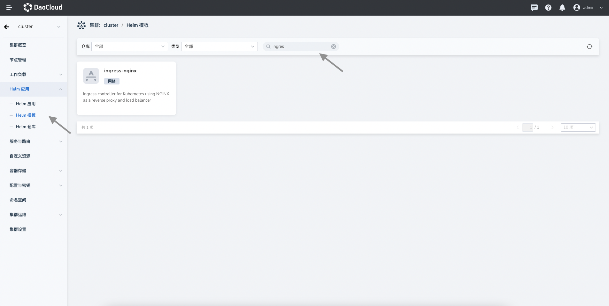
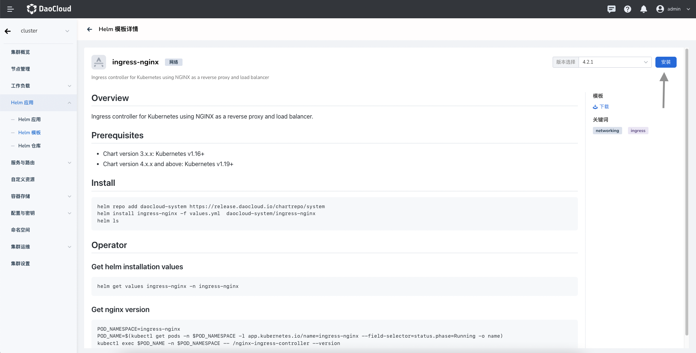
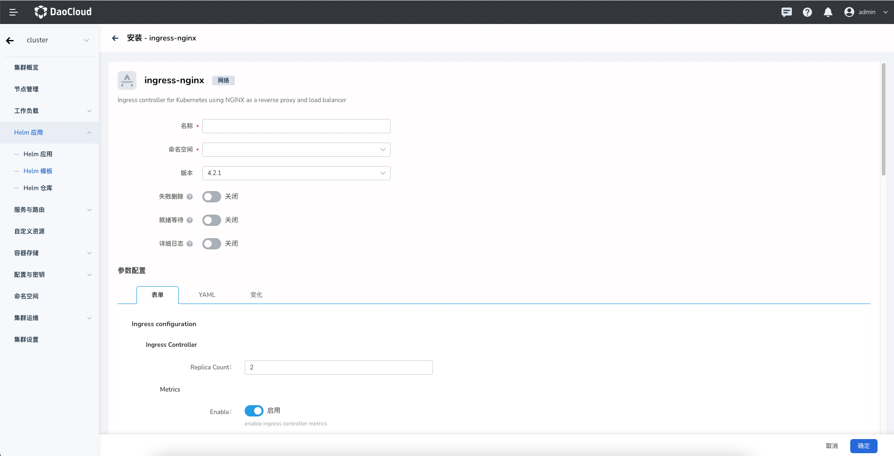
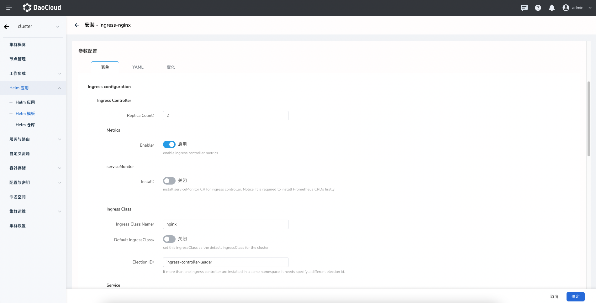
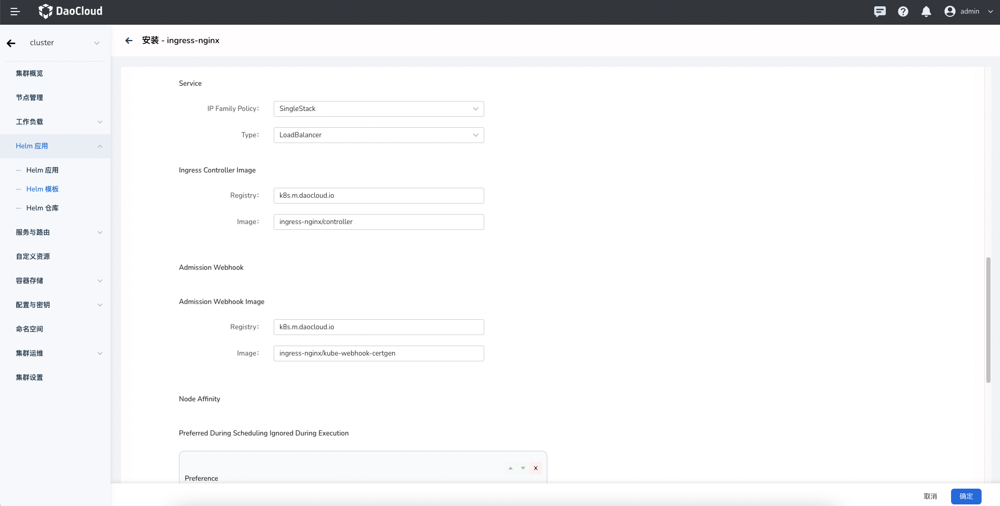
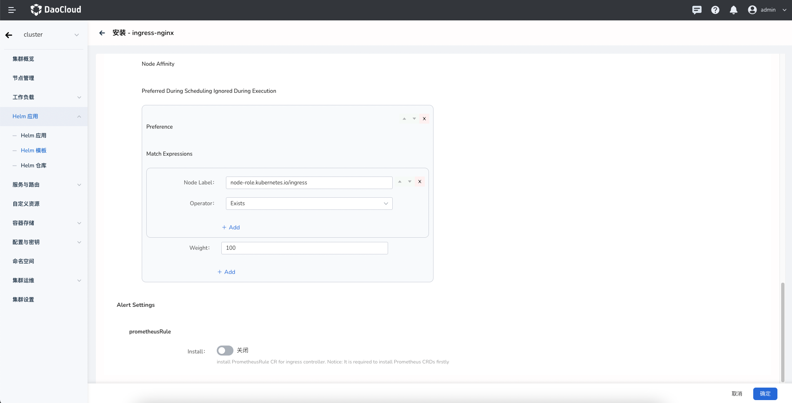

# 安装

1. 在浏览器打开集群的管理界面，点击侧边栏导航的 `Helm 应用`，然后点击 `Helm 模板`。

    

2. 在搜索栏输入 `ingress` 或者 `nginx` 关键字，点击 `ingress-nginx` 应用卡片，进入应用预览界面。

    

3. 在右上角可以通过下拉框选择版本，然后点击`安装`按钮。然后进入安装配置界面。
   依次输入部署后的应用名称，命名空间，以及部署的选项。

    

4. 配置参数。

    - `Replica Count` 配置[副本数量](https://kubernetes.io/docs/concepts/workloads/controllers/replicaset/)，推荐配置为 2，以提高可用性。对于甜品体验可以配置为 1，以减少资源占用。
    - `Metrics` 开启后，Controller Pod 会暴露 metrics 接口，监控的 Agent 可以采集指标数据，通过监控告警提高业务和服务的可靠性。
    - `ServiceMonitor` 选项要求集群部署 Insight 组件，或者 [Prometheus Operator](https://github.com/prometheus-operator/prometheus-operator)。开启会在后端创建对应的 ServiceMonitor CR。
    - "Ingress Class" 选项配置 [Ingress Class](https://kubernetes.io/docs/concepts/services-networking/ingress/#ingress-class) 名称。Ingress CR 则可以通过 ingressClass 字段指定相同的 Class 名称，以选择使用此套 Ingress 实例来生效访问路由。当集群中拥有多套 Ingress 时，甚至在同一租户拥有多套 Ingress 的时候，通过 Ingress Class 来区分非常方便。详细使用方式请参考：[如何使用 Ingress Class](ingressclass.md)
    - `Default IngressClass` 设置 Ingress Class 为默认 Class。开启该选项后创建 Ingress CR 的时无需显式指定 ingressClass 字段。Kubernetes 自动更新 Ingress 的字段为默认 Class。同一个集群只能有一个默认 Ingress Class。
    - `Election ID` 同一个租户部署多套 Ingress 时，需要保证此名称不会重复。

    

    - `IP Family Policy` 配置 Service 的 IP [单双栈](https://kubernetes.io/docs/concepts/services-networking/dual-stack/#services)设置，可以根据业务需求开启。
    - `Type` 可以配置使用的 Service 类型，如果设置 [LoadBalancer](https://kubernetes.io/docs/concepts/services-networking/service/#loadbalancer)，需要集群中安装相应的 LB 组件，例如 [MetalLB](https://metallb.universe.tf/)。
    - `Ingress Controller Image` 可以配置镜像仓库和镜像名称。
    - `Admission Webhook Image` 可以自定义 Webhook Pod 镜像仓库和镜像名称。

    

    - `Preferred During Scheduling Ignored During Execution` 可以通过软亲和性指定调度规则。
    - `PrometheusRule` 可以配置创建告警规则 Prometheus CR。该选项依赖集群部署的 Prometheus Operator。
    - `scope` 启用后，并指定了 Namespace ，创建的 Ingress 实例的使用范围仅限于指定的命名空间，默认为关闭，关闭时为集群级 Ingress 。更多详情请参考：[Ingress 使用范围（Scope）](scope.md)
    
    
    
    对于更高级的配置可以通过点击 Tab 选项卡中 YAML 以通过 YAML 方式进行配置。点击右下角`确定`按钮即可完成创建。
