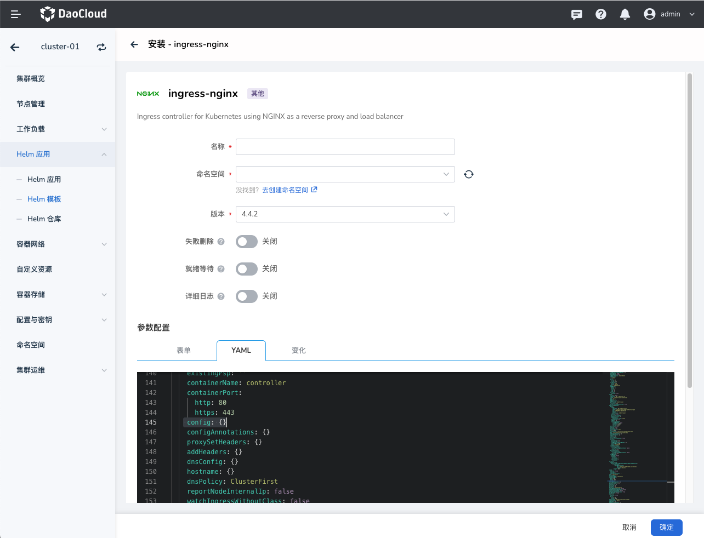

# 负载均衡与流量代理配置指南

本文介绍负载均衡和流量代理的配置方法，包括全局配置、基于域名、路径、Header、Cookie、请求哈希等不同负载均衡策略。

## 负载均衡全局配置

Ingress Nginx 全局配置可以指定默认负载均衡算法，支持 `round_robin` 和 `ewma` 两种，默认为 `round_robin`。
主要区别在于如何选择后端工作负载：`round_robin` 算法会按照事先定义的顺序循环选择，将请求平均地分配到每个后端工作负载。
如果后端工作负载的性能差异较大，可能会导致负载不均衡。`ewma` 算法可以将请求发送到加权平均负载最低的工作负载上，
加权负载指数会随着请求的到来而逐渐变化，使得负载均衡更加均衡。

可以参考安装章节，在 Helm 安装配置 `.Values.yaml` 指定如下内容：

```yaml
ingress-nginx:
  controller:
    config:
      load-balance: ewma
```

 

## 基于域名的流量负载

域名是一个字符串，用于标识互联网上的网站或资源，如 `www.example.com`。它是人类可读的，
而 IP 地址（如 10.6.0.1）是机器可读的。域名通过 DNS 服务器映射到对应的 IP 地址，使人
们可以通过浏览器访问特定网站。

Ingress Nginx 支持转发不同域名的流量。通过将域名系统映射到 Ingress Nginx 的 VIP，
实现域名到 IP 的映射。

通过使用以下配置定义，可以将不同域名的流量转发到相应的后端 Service。例如，将域名 A 的
流量转发到 Service A，域名 B 的流量转发到 Service B。

```yaml
apiVersion: networking.k8s.io/v1
kind: Ingress
metadata:
  name: example-ingress
  annotations:
    nginx.ingress.kubernetes.io/rewrite-target: /
spec:
  rules:
  - host: host-a.example.com
    http:
      paths:
      - path: /
        pathType: Prefix
        backend:
          service:
            name: service-a
            port:
              name: http
  - host: host-b.example.com
    http:
      paths:
      - path: /
        pathType: Prefix
        backend:
          service:
            name: service-b
            port:
              name: http
```

## 基于请求路径的负载

URL 请求路径（URL Request Path）是在 URL 中指定的从域名或 IP 地址到达特定页面或资源的路径。
它是以 / 开头的字符串。
例如：`https://www.example.com/page-hello-world` 其中 `/page-hello-world` 是 URL 请求路径。

Ingress Nginx 支持使用将不同的 URL 请求路径指向不同的 Service。

```yaml
apiVersion: networking.k8s.io/v1
kind: Ingress
metadata:
  name: example-ingress
  annotations:
    nginx.ingress.kubernetes.io/rewrite-target: /
spec:
  rules:
  - http:
      paths:
      - path: /path-a
        pathType: Prefix
        backend:
          service:
            name: service-a
            port:
              name: http
      - path: /path-b
        pathType: Prefix
        backend:
          service:
            name: service-b
            port:
              name: http
```

## 基于 Header 请求头的负载

以下是使用 `nginx.ingress.kubernetes.io/canary-by-header` 注解的示例。
可以在请求中添加版本头以将流量路由到应用程序的稳定版本或金丝雀版本。

```yaml
apiVersion: networking.k8s.io/v1
kind: Ingress
metadata:
  name: example-ingress
  annotations:
    nginx.ingress.kubernetes.io/canary: "true"
    nginx.ingress.kubernetes.io/canary-by-header: "version"
    nginx.ingress.kubernetes.io/canary-by-header-value: "v2"
spec:
  rules:
    - host: example.com
      http:
        paths:
          - path: /
            pathType: Prefix
            backend:
              service:
                name: example-service-v2
                port:
                  name: http
```

在这个示例中，对 `example.com` 的流量将根据 Header 请求头 `version` 的值进行分割。
对于 Header 请求头值为 `v2` 的流量，请求将会路由到 `example-service-v2`。

## 基于 Cookie 会话的负载

基于 Cookie 的负载均衡策略，通过使用 Cookie 将客户端与后端服务绑定在一起，这种方法可以确保每个客户端的请求始终由相同的后端服务处理，从而使得服务变得更加稳定。

Cookie 负载均衡的工作原理如下：

1. 当客户端发送第一次请求时，Ingress Nginx 将使用负载均衡算法选择一个后端服务来处理请求。
2. Ingress Nginx 将一个名为 `example-cookie-name` 的 Cookie 发送回客户端。这个 Cookie 包含了后端服务的标识信息。
3. 客户端再次发送请求时，会带上这个 Cookie。Ingress Nginx 根据 Cookie 中的标识信息，将请求转发到对应的后端服务。

以下是配置示例：

```yaml
apiVersion: networking.k8s.io/v1
kind: Ingress
metadata:
  name: example-ingress
  annotations:
    nginx.ingress.kubernetes.io/affinity: "cookie"
    nginx.ingress.kubernetes.io/session-cookie-name: "example-cookie-name"
    nginx.ingress.kubernetes.io/session-cookie-expires: "172800"
    nginx.ingress.kubernetes.io/session-cookie-max-age: "172800"
spec:
  rules:
    - host: example.com
      http:
        paths:
          - path: /
            pathType: Prefix
            backend:
              service:
                name: example-service
                port:
                  name: http
```

## 基于请求哈希的负载均衡

使用 `nginx.ingress.kubernetes.io/upstream-hash-by` 注解，可以指定客户端于服务器映射的哈希值。
例如可以使用 `$binary_remote_addr` 或 `$http_x_forwarded_for` 完成基于客户端 IP 的映射。

有时候集群中 Ingress Nginx 在多个负载均衡后面代理流量，这时候根据 `$binary_remote_addr` 获取的不是真实
的客户端地址，而是其前置负载均衡器的 IP 地址。这时候可以是使用 `$http_x_forwarded_for` 获取真实 IP。

当然你也可以设置为 `$request_uri`，让其基于请求路径负载均衡。

上面的几种方式是映射到单个上游服务器，你可以添加注解 `nginx.ingress.kubernetes.io/upstream-hash-by-subset: "true"`
开启分组功能，这时候会对上游工作负载进行分组，流量到达分组后再随机分配给组中的工作负载，你可以使用 
`nginx.ingress.kubernetes.io/upstream-hash-by-subset-size` 指定每个分组工作负载的数量。

```yaml
apiVersion: apps/v1
kind: Deployment
metadata:
  name: nginx-deployment
  labels:
    app: nginxhello
spec:
  replicas: 10
  selector:
    matchLabels:
      app: nginxhello
  template:
    metadata:
      labels:
        app: nginxhello
    spec:
      containers:
        - name: nginxhello
          image: registry.k8s.io/e2e-test-images/echoserver:2.3
          ports:
            - containerPort: 8080
          env:
            - name: NODE_NAME
              valueFrom:
                fieldRef:
                  fieldPath: spec.nodeName
            - name: POD_NAME
              valueFrom:
                fieldRef:
                  fieldPath: metadata.name
            - name: POD_NAMESPACE
              valueFrom:
                fieldRef:
                  fieldPath: metadata.namespace
            - name: POD_IP
              valueFrom:
                fieldRef:
                  fieldPath: status.podIP
---
kind: Service
apiVersion: v1
metadata:
  name: nginxhello
  labels:
    app: nginxhello
spec:
  selector:
    app: nginxhello
  ports:
    - name: http
      port: 80
      targetPort: 8080
---
apiVersion: networking.k8s.io/v1
kind: Ingress
metadata:
  annotations:
    nginx.ingress.kubernetes.io/upstream-hash-by: "$binary_remote_addr"
  name: nginxhello-ingress
  namespace: default
spec:
  ingressClassName: nginx
  rules:
  - host: foo.bar.com
    http:
      paths:
        - path: /
          pathType: Prefix
          backend:
            service:
              name: nginxhello
              port:
                number: 80
```