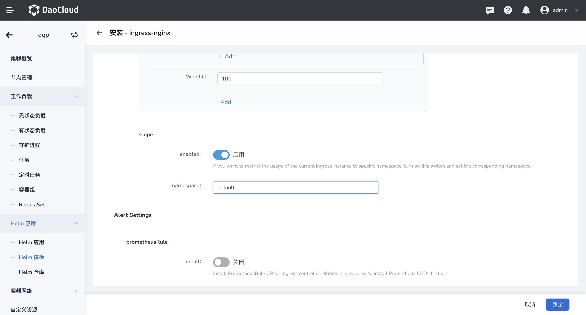
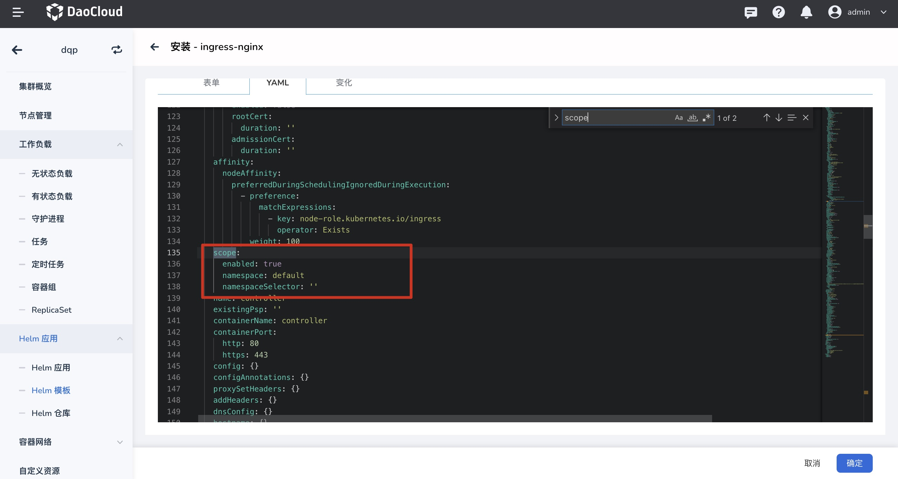

# Ingress 使用范围（Scope）

IngressClass Scope 用于指定 Ingress 实例的使用范围为集群级 或是 命名空间级。

**适用场景**

* 同一个集群中，共享同一个 Ingress 实例，可设置 集群级 Ingress 实例
* 同一个集群不同 Namespace 使用不同的 Ingress 实例实现负载隔离，可设置 命名空间级 Ingress 实例

如果在同一个集群内，同一 Namespace 内有不同应用需要使用不同 Ingress 实例需求，请参考 [IngressClass](ingressclass.md)

## 集群级 Ingress 实例

创建 Ingress 实例时，如果启用`Ingress Scope`，创建后的 IngressClass 资源在以下两种情况下， Ingress 实例使用范围都为`集群级`：

1. 仅设置了`parameters`但是未设置 ` .spec.parameters.scope` 
2. 设置了` .spec.parameters.scope` 为 `cluster`

```yaml
#示例
apiVersion: networking.k8s.io/v1
kind: IngressClass
metadata:
  name: external-lb-1
spec:
  controller: example.com/ingress-controller
  parameters:
    scope: Cluster # 指定 Ingress 实例范围为 Cluster
    apiGroup: k8s.example.net
    kind: ClusterIngressParameter #指定 Ingress 实例 Kind 为 ClusterIngressParameter
    name: external-config-1
```

## 命名空间级 Ingress 实例

当创建 Ingress 实例时，如果启用`Ingress Scope`，IngressClass 设置了`.spec.parameters` 并且同时设置了 `.spec.parameters.scope` 为 `Namespace`，那么 Ingress 实例的 Ingress Class 指向为`命名空间级`，需要指定待使用的命名空间。

命名空间级的 Ingress 实例，相当于管理员将 Ingress 的使用权限下方给到某个命名空间，可以实现资源隔离。

```yaml
#示例
apiVersion: networking.k8s.io/v1
kind: IngressClass
metadata:
  name: external-lb-2
spec:
  controller: example.com/ingress-controller
  parameters:
    scope: Namespace # 指定 Ingress 实例范围为 Namespace
    apiGroup: k8s.example.com
    kind: IngressParameter # 指定 Ingress 实例 Kind 为 IngressParameter
    namespace: default # 指定待使用的 Namespace
    name: external-config
```

## 如何开启 并设置集群/命名空间级 Ingress?

可以通过指定 `--watch-namespace` 的方式，不同的实例 watch 不同的 namespace。
[ingress-nginx 实例通过 Helm 安装](install.md) 时指定 `controller.scope.enabled=true` 和 `--set controller.scope.namespace=$NAMESPACE`

安装时开启并指定 Namespace ，则创建的 Ingress 实例将指定给 命名空间使用，关闭时为全集群共享。



对应的 `valule.yaml` 中的配置信息



更多信息可以参考 [scope](https://kubernetes.github.io/ingress-nginx/deploy/#scope)。
