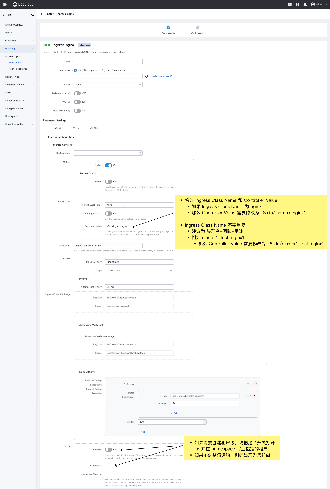

# Ingress 使用范围（Scope）

IngressClass Scope 用于指定 Ingress 实例的使用范围为集群级、命名空间级和工作空间级。

## 集群级/租户级

可以参考下图创建集群级或者租户级 ingress nginx 实例。




## 工作空间 Ingress 实例

当创建 Ingress 实例时，如果启用 `Ingress Scope`，IngressClass 设置了 `.spec.parameters`，并且设置 `.spec.parameters.scope` 为 `namespaceSelector`，并输入的 Label 为 `workspace.ghippo.io/id='12345'`(其中 `12345` 为指定的工作空间 `workspace01`  ID)，那么 Ingress 实例的 Ingress Class 指向为`工作空间`，适用范围为`workspace01`中所有在当前集群的命名空间。

租户级的 Ingress 实例，相当于管理员将 Ingress 的使用权限下发给到某个工作空间，从而实现租户资源隔离。

```yaml
#示例
apiVersion: networking.k8s.io/v1
kind: IngressClass
metadata:
  name: external-lb-2
spec:
  controller: example.com/ingress-controller
  parameters:
    scope: Namespace # 指定 Ingress 实例范围为 Namespace
    apiGroup: k8s.example.com
    kind: IngressParameter # 指定 Ingress 实例 Kind 为 IngressParameter
    namespaceSelector: workspace.ghippo.io/id = 12345 # 指定待使用的工作空间 ID
    name: external-config
```

## 如何部署平台/工作空间级/命名空间级 Ingress 实例?

可以通过指定 `--watch-namespace` 的方式，不同的实例 watch 不同的命名空间。
若[ingress-nginx 实例通过 Helm 安装](install.md)，需通过指定 `controller.scope.enabled=true` 和 `--set controller.scope.namespace=$NAMESPACE` 开启并设置平台/工作空间级/命名空间级 Ingress。

1. `平台级 Ingress 实例`：创建 Ingress 实例时， `scope` 关闭，则创建的 Ingress 实例为 `平台级`。
2. `命名空间 Ingress 实例`：创建 Ingresss 实例时，`scope` 开启，并在 `namespace`中指定对应的命名空间，则创建的 Ingress 为 `命名空间级 `。
   如下示例，创建的 Ingress-nginx 为 Default 独享：

    

    对应的 `value.yaml` 中的配置信息：

    

3. `工作空间 Ingress 实例`：部署 Ingress-Ngnix 时 ,`scope`设置为 `disabled` 并指定在 `Namespace Selector` 中输入 `workspace.ghippo.io/id=12345`,创建后的 Ingress 实例为 `ID`为`12345` 的 工作空间独享。
   对应的 `value.yaml` 中的配置信息：

Ingress 实例部署后，可在对应的命名空间中[创建 Ingress 规则](../../../kpanda/user-guide/network/create-ingress.md)，并选择对应实例的 Ingress Class 进行使用。

更多信息可以参考 [scope](https://kubernetes.github.io/ingress-nginx/deploy/#scope)。
