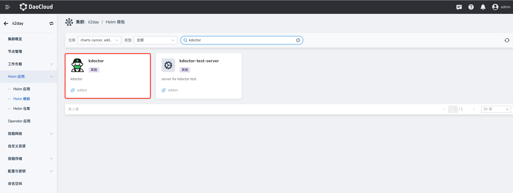
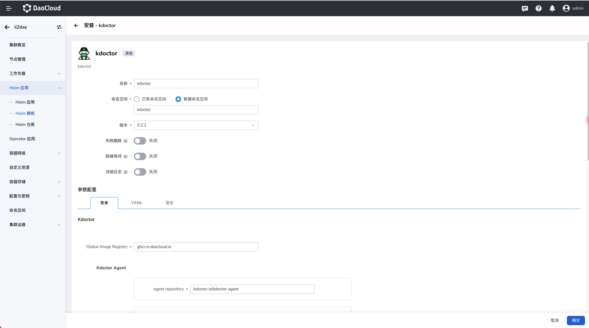
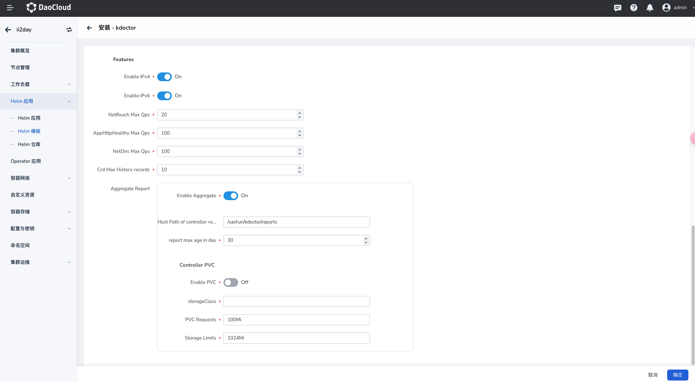

# 安装 kdoctor

本页介绍如何安装 kdoctor 组件。

请确认您的集群已成功接入`容器管理`平台，然后执行以下步骤安装 kdoctor。

1. 在左侧导航栏点击`容器管理`—>`集群列表`，然后找到准备安装 kdoctor 的集群名称。

   

1. 在左侧导航栏中选择 `Helm 应用` -> `Helm 模板`，找到并点击 `kdoctor`。

   

1. 在`版本选择`中选择希望安装的版本，点击`安装`。

   

1. 在安装界面，填写所需的安装参数。

   

   在以上界面中，输入部署后的应用名称、命名空间以及部署的选项。

   

   上图中的各项参数说明：

    - `Features` -> `Enable IPv4`：开启后，kdoctor 会开启 ipv4 相关网络巡检功能。
  
    - `Features` -> `Enable IPv6`：开启后，kdoctor 会开启 ipv6 相关网络巡检功能。
  
    - `Features` -> `NetReach Max Qps`：netreach 任务的最大 qps 限制，避免因使用过大的 qps 而对集群内的资源占用。

    - `Features` -> `AppHttpHealthy Max Qps`：AppHttpHealthy 任务的最大 qps 限制，避免因使用过大的 qps 而对集群内的资源占用。
  
    - `Features` -> `NetDns Max Qps`：NetDns 任务的最大 qps 限制，避免因使用过大的 qps 而对集群内的资源占用。
  
    - `Features` -> `Crd Max History records`：获取任务状态时，最多展示的历史记录数量。
  
    - `Features` -> `Aggregate Report`-> `Enable Aggregate`：开启后， 可以使用 k8s 聚合 api 功能查看 kdoctor 的任务报告。
  
    - `Features` -> `Aggregate Report`-> `Host Path of controller report`：任务报告的 host 存储路径。
  
    - `Features` -> `Aggregate Report`-> `report max age in day`：报告的最大生命周期。
  
    - `Features` -> `Aggregate Report`-> `Controller PVC`-> `Enable PVC`：开启后， 使用 pvc 来存储 kdocotor 的报告。
  
    - `Features` -> `Aggregate Report`-> `Controller PVC`-> `storageClass`：storageClass 名称。
  
    - `Features` -> `Aggregate Report`-> `Controller PVC`-> `PVC Requests`：pvc 的大小容量需求。
  
    - `Features` -> `Aggregate Report`-> `Controller PVC`-> `Storage Limits`：Storage 的最大限制。
  
1. 对于更高级的配置可以通过点击 Tab 选项卡中 `YAML` 以通过 YAML 方式进行配置。
   点击右下角`确定`按钮即可完成创建。
