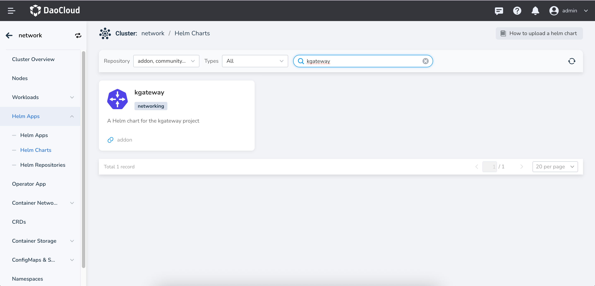
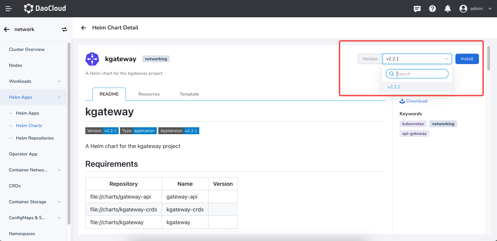
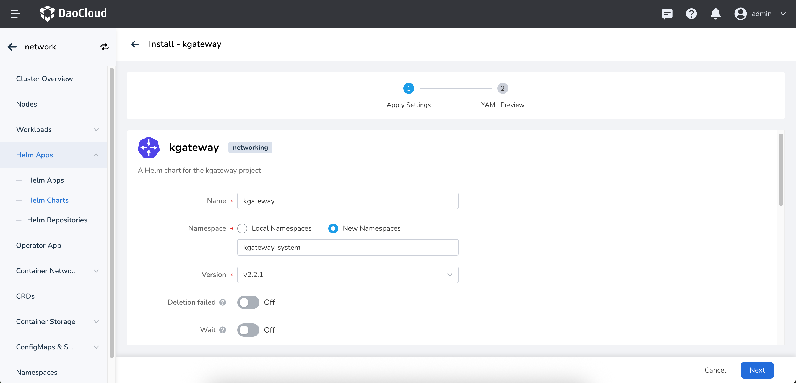
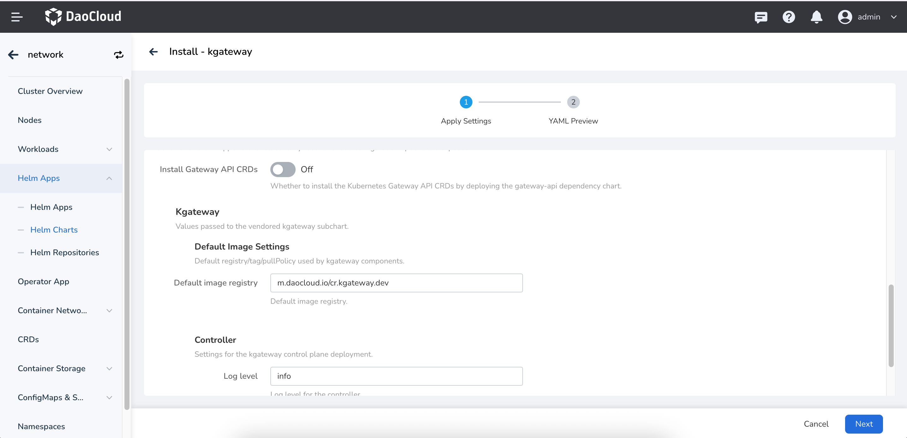

# 安装 Kgateway

本页介绍如何安装 Kgateway 组件。

请确认您的集群已成功接入`容器管理`平台，然后执行以下步骤安装 Kgateway。

1. 在左侧导航栏点击`容器管理`—>`集群列表`，然后找到准备安装 Kgateway 的集群名称。

    

2. 在左侧导航栏中选择 `Helm 应用` -> `Helm 模板`，找到并点击 `kgateway`。

    

3. 在`版本选择`中选择希望安装的版本，点击`安装`。

    

4. 在安装界面，填写所需的安装参数。

    

    在以上界面中，输入部署后的应用名称、命名空间以及部署的选项。

    

    上图中的各项参数说明：

    - `Install Gateway API CRDs`：是否安装 [Gateway API CRDs](https://gateway-api.sigs.k8s.io/concepts/api-overview/)，默认为 false。如果集群中未安装 Gateway API，请开启此选项，否则 Kgateway 无法正常工作。
    - `Kgateway` -> `Default image settings`：配置 Kgateway 默认镜像仓库地址，默认为: `m.daocloud.io/cr.kgateway.dev`。
    - `Kgateway` -> `Controller` -> `Log Level`：配置 Kgateway Controller 的日志级别，默认为: `info`。
    - `Kgateway` -> `Controller` -> `Replicas`：配置 Kgateway Controller 的副本数，默认为: `1`。
5. 对于更高级的配置可以通过点击 Tab 选项卡中 `YAML` 以通过 YAML 方式进行配置。
    点击右下角`确定`按钮即可完成创建。