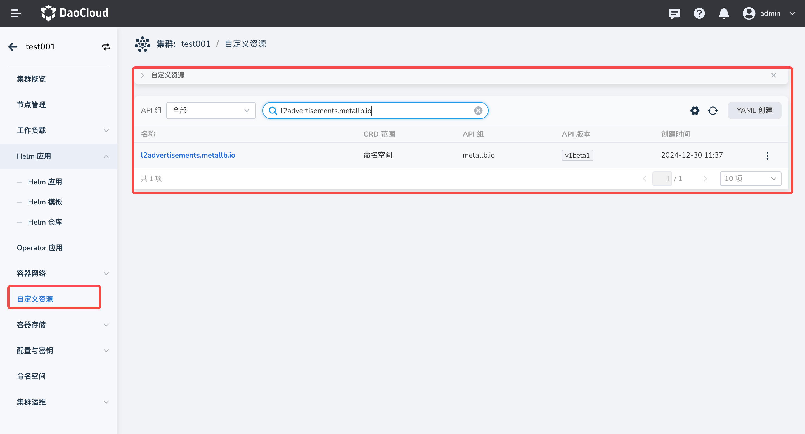
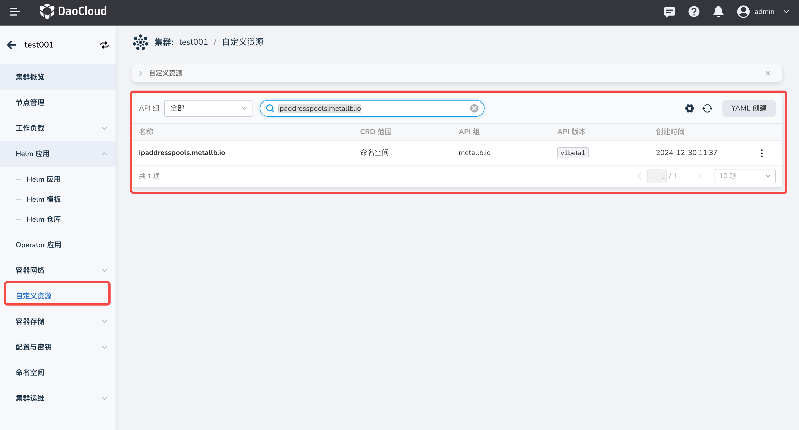

# Metallb 升级及调试

- [Metallb 升级问题](#metallb_1)
- [Metallb Debug](#metallb_2)

## Metallb 升级问题

如果您在安装 Metallb 时未启用 Metallb ARP Mode, 请务必 **不要通过在页面点击升级按钮** 来进行 Metallb 升级，否则会导致 Metallb 无法正常工作。

您需要通过以下的步骤来手动开启 Metallb ARP Mode:

- 前往自定义资源模块创建 L2Advertisement 资源:



点击 `YAML 创建`:

```yaml
apiVersion: metallb.io/v1beta1
kind: L2Advertisement
  metadata:
    name: default
    namespace: metallb-system
```

以上 YAML 表示所有 Metallb IP 池都会通过该 L2Advertisement 资源宣告，如果您的集群同时运行 BGP 和 ARP 两种模式。可以通过以下方式指定特定池进行 ARP 宣告：

```yaml
apiVersion: metallb.io/v1beta1
kind: L2Advertisement
metadata:
  name: default
  namespace: metallb-system
spec:
  ipAddressPools:
  - default-pool
```

以上配置表示只有 `default-pool` 的 IP 池会通过该 L2Advertisement 资源宣告 ARP。

- 前往自定义资源模块创建 L2Advertisement 资源:



点击 `YAML 创建`，创建以下内容:

```yaml
apiVersion: metallb.io/v1beta1
kind: IPAddressPool
metadata:
  name: default
  namespace: metallb-system
spec:
  addresses:
  - 192.168.10.0/24
```

以上 YAML 表示创建一个名为 `default` 的 IP 池，IP 地址为 `192.168.10.0/24`。

## Metallb 调试

如果您使用 Metallb 遇到网络连通性问题，按照以下步骤排查：

- 检查 L2Advertisement 资源是否存在:

    kubectl get l2advertisement -n metallb-system

- 检查 LoadBalaner Service 的注解是否正确

- 检查 LoadBalaner Service 所用的 IP 池是否有充足的 IP

- 获取您的 LoadBalancer Service 的事件，获取关键错误信息:

    kubectl describe svc -n <lb_service_ns> <lb_service_name>

    > 如果未获取到任何事件，请重建服务然后获取。

- 通过服务名称过滤 Metallb 组件日志:

    kubectl logs -n metallb-system controller-xxxx | grep <lb_service_name>

    kubectl logs -n metallb-system speaker-xxxx | grep <lb_service_name>
