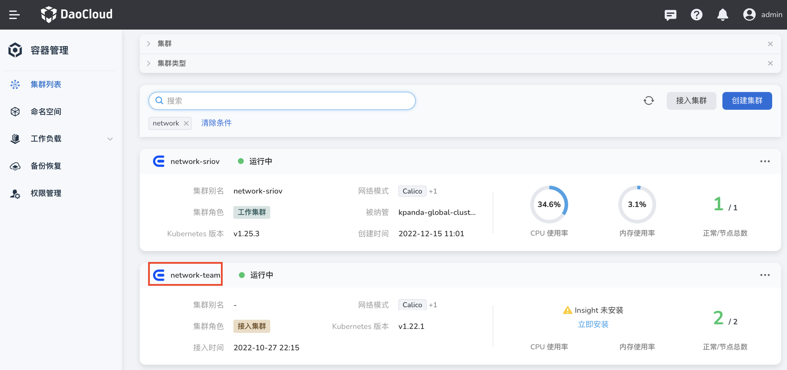
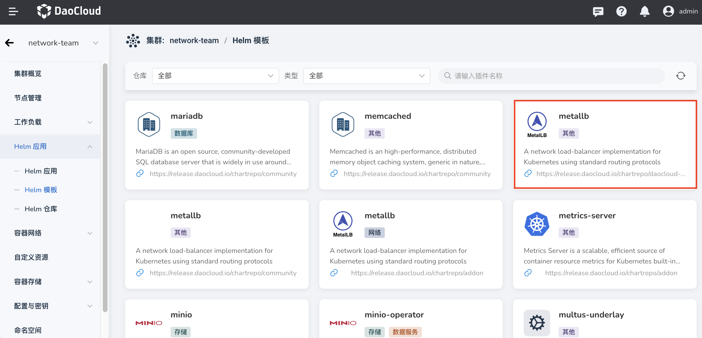
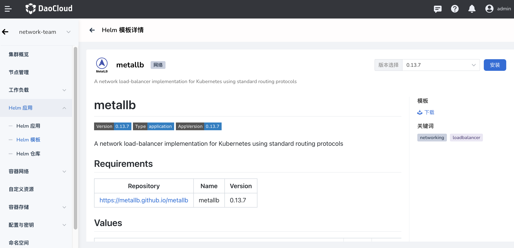
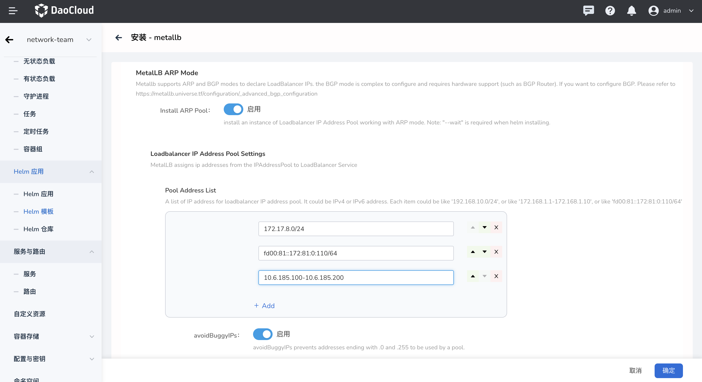
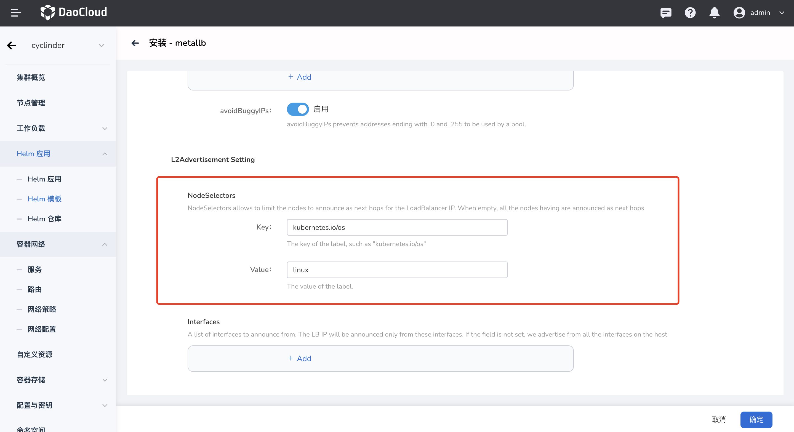
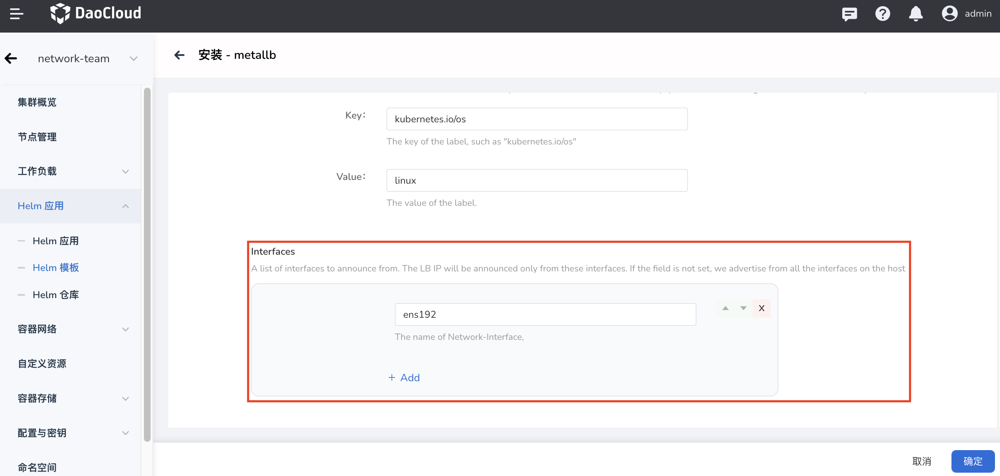
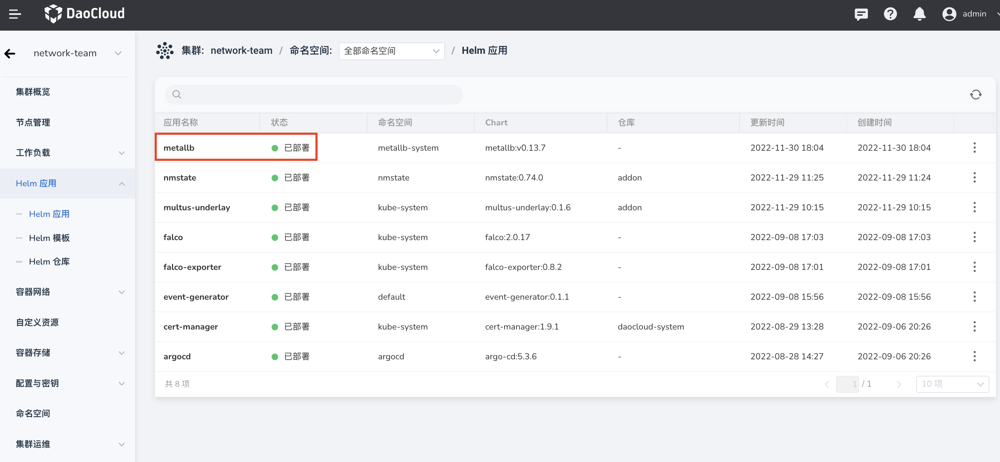

---
hide:
  - toc
---

# 安装 Metallb

本页介绍如何安装 Metallb 组件。

> 若需安装 ARP Pool，需启用 Helm 并使其处于就绪等待状态。

请确认您的集群已成功接入`容器管理`平台，然后执行以下步骤安装 Metallb。

1. 在左侧导航栏点击`容器管理`—>`集群列表`，然后找到准备安装 Metallb 的集群名称。

    

2. 在左侧导航栏中选择 `Helm 应用` -> `Helm 模板`，找到并点击 `metallb`。

    

3. 在`版本选择`中选择希望安装的版本，点击`安装`。

    

4. 在安装界面，初始化 Metallb ARP 模式。

    !!! note

        - 如果安装时开启 ARP 模式, 请开启就绪等待。

        - 安装 Metallb 时, 可选择初始化 Metallb ARP 模式。

        - LoadBalancer Service默认会从这个池中分配 IP 地址, 并且通过 APR 宣告这个池中的所有 IP 地址。

        - 地址池列表可以配置 IPv4 和 IPv6 的地址。

        - 每个地址段输入格式可以为合法的 CIDR（如 192.168.1.0/24），也可以为 IP 范围（如 1.1.1.1-1.1.1.20）。

        - 输入的每个地址段应当属于集群节点某个真实"物理"网段, 但不要与已有的 IP 地址冲突。

    

5. 配置 `L2Advertisement Setting` -> `NodeSelectors`。

    默认情况下, 所有节点都会作为 LoadBalancer IP 的下一跳, 但可以通过 NodeSelector 限制只有某些节点作为 LoadBalancer IP 的下一跳:

    

    如上图配置表示, 只有匹配 Label "kubernetes.io/os: linux" 的节点才会作为 LoadBalancer IP 的下一跳。

6. 指定特定接口宣告 LB IP。

    默认情况下, Metallb 从节点所有网卡宣告 LB IPs, 我们可以配置指定网络接口宣告。

    

7. 安装完成。

    

!!! note

    - Metallb 安装只提供初始化 ARP 模式。BGP 模式配置较为复杂且需要硬件支持,这里并不提供初始化 Metallb BGP 模式。如需配置 BGP 模式, 请参考 [advanced_bgp_configuration](https://metallb.universe.tf/configuration/_advanced_bgp_configuration)。

    - 如果安装时未初始化 ARP 模式, 不能使用 Helm 更新的方式去重新初始化 ARP 模式, 请参考 [Metallb 使用](usage.md)。
